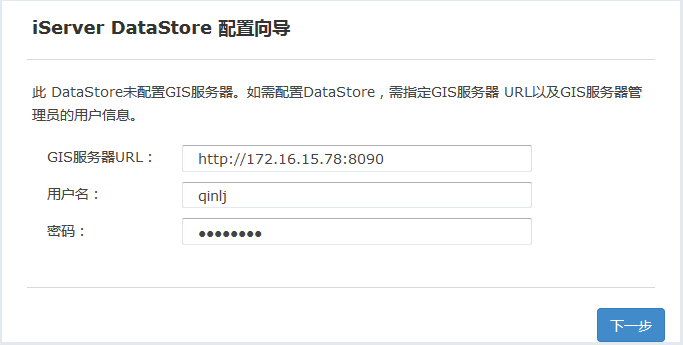
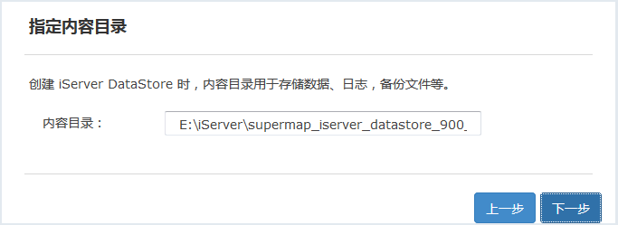
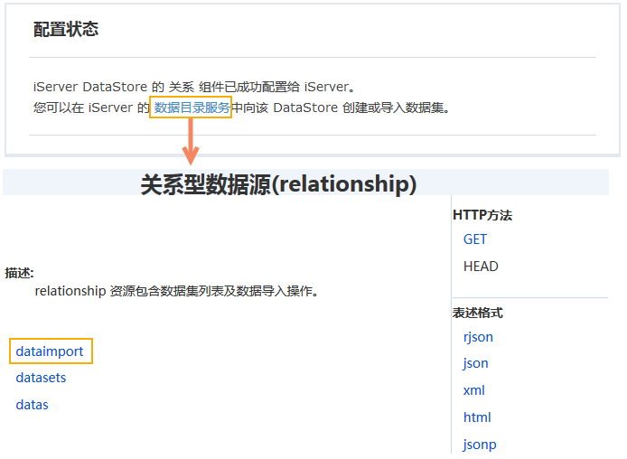
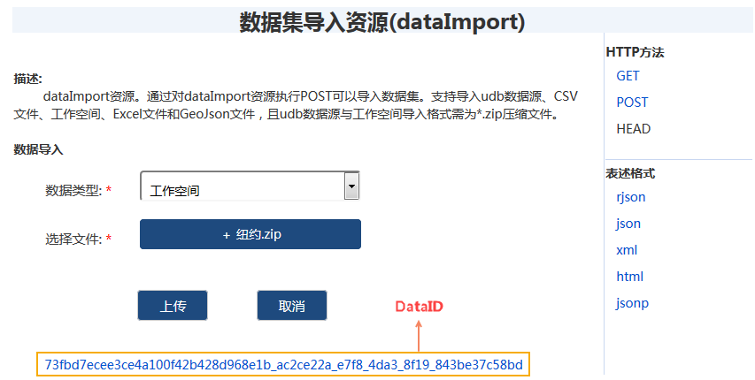
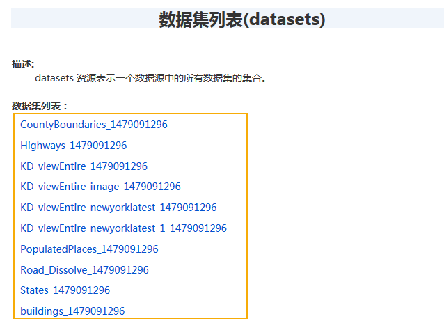
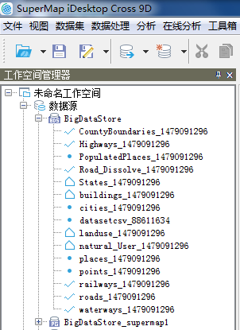
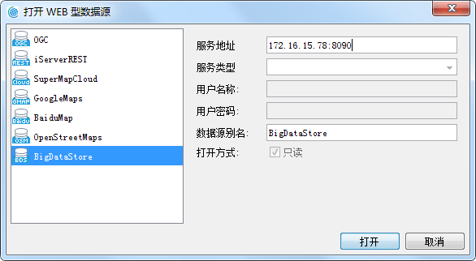
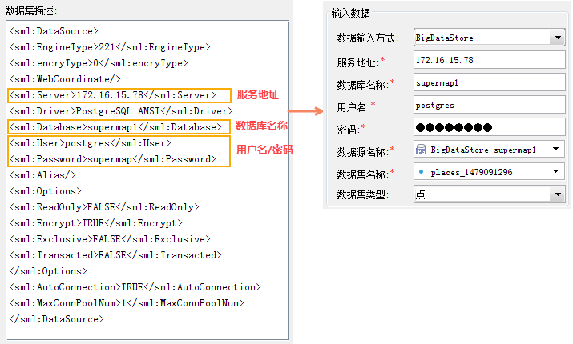
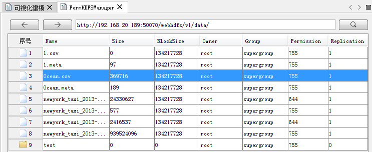

title: 数据准备
---

　　大数据在线分析服务支持的输入数据来源有以下几种。当数据准备就绪后，在创建各类大数据分析任务时，iServer 会自动列出符合分析条件的数据集。

- BigDataStore 中存储的数据集
- 存储在HDFS的数据
- UDB数据

### BigDataStore

　　BigDataStore 是一款应用程序，您可以通过 iServer DataStore 快速创建数据存储，并将数据存储与 iServer 关联起来。在 DataStore 中配置关系型数据存储时，将自动创建一个 PostgreSQL 数据库，可存储数据集。通过 iServer 大数据服务访问数据，进而可下载、上传数据，以及分析这些数据等。

- **环境搭建**

　　DataStore 默认端口为 8020，请先修改防火墙配置，使该端口通过。如果您的 DataStore 将安装在 Windows 系统上，请确认是否安装了 vcredist 2013，如未安装，DataStore 产品包中提供安装文件，位于 DataStore 产品包\support\vcredist\vcredist_x64-2013.exe。

1. 在iServer DataStore 产品包d bin文件夹中，启动服务；
2. 在浏览器中输入地址：http://{ip}:8020 访问 DataStore 配置向导，输入 iServer 管理员用户名、密码；
　　
3. 指定内容目录，用于存储数据、日志，备份文件等。默认为【DataStore 安装目录】\data。注意：DataStore的内容目录暂不支持包含中文和空格的路径；
　　
4. 选择要创建的数据类型，目前支持关系型数据、二进制文件、切片缓存、时空数据；二进制数据和切片数据的存储能力依托于 MongoDB 数据库，需要在本机安装 MongoDB。选择创建二进制数据存储或切片数据存储后，指定本机 MongoDB 的安装路径，例如D:\mongodb；
5. 点击完成后，等待配置成功。
6. 配置成功后，“配置状态”页面会提示iServerDataStore 的关系组件已成功配置给iServer，单击该页面中的“数据目录服务”，在跳转的页面中登录后，单击“dataimport”即可选择数据上传；
　　 
7. 在数据导入界面选择相应的数据，单击“上传”按钮，即可将数据上传至DataStore中。支持导入udb数据源、CSV文件、工作空间、Excel文件和GeoJson文件，且udb数据源与工作空间导入格式需为*.zip压缩文件。
　　 
8. 数据集上传成功后，会返回一个唯一的 dataID，如上图所示，用于代表该上传文件的数据包。单击该DataID，可查看该数据包的详细描述信息。上传成功的数据集，也会出现在 relationship/datasets 资源的“数据集列表”中。
　　 
9. 上传数据之后，在Cross中通过打开刚配置好的 BigDataStore 数据源，即可查看其中上传的数据

　　 

- **使用BigDataStore数据**
　　
　　配置好iServer DataStore之后，可在Cross中通过打开Web数据源的方式打开该数据，打开 BigDataStore 的同时，会将存储了同样数据的 PostgreSQL 数据源打开，便于对数据进行分析。具体的使用方式如下：

1. 打开SuperMap iDesktop Cross，在**工作空间管理器**的**数据源**节点处单击鼠标右键，选择“打开Web型数据源...”；
2. 在弹出的对话框中选择“BigDataStore”，并输入该数据源所在的服务器IP和端口号，如下图所示，单击打开即可打开该服务器中配置好的数据源。
　　
3. 打开BigDataStore数据源的同时，会打开存储了同样数据的 PostgreSQL 数据源，该PostgreSQL 数据源的名称为**BigDataStore_数据库名**，做大数据在线分析时，选择 PostgreSQL 中的数据做源数据即可。
4. 设置大数据在线分析功能的“输入数据”参数时，“数据输入方式”选择**BigDataStore**，并设置数据所在的服务器地址、数据库名称、用户名、密码，这些参数的设置可在**BigDataStore**数据源下，单击数据集右键，选择“属性”查看即可，如下图所示：
　　
5. 参与分析的**源数据**选择对应 PostgreSQL 数据源中的数据集，即可执行在线分析。

### HDFS

　　为更好的适应大规模数据的 GIS 应用，推荐您使用 HDFS（Hadoop Distributed File System），即 Hadoop 分布式文件系统，它具有高容错特性，适合大规模数据集上的应用。HDFS 可用于存储 csv、sci、udb、工作空间等数据。

1. 安装配置并启用 HDFS；
2. 打开 Supermap iDesktop Cross，单击“在线分析”菜单中的“数据管理”，打开**FormHDFSManager**窗口，在窗口的地址栏中输入也配置好的 HDFS 地址，如：http://192.168.20.189:50070/webhdfs/v1/；
3. 在 HDFS中可通过新建文件夹、上传数据等功能，将本地数据上传至HDFS中进行管理；
　　
4. 上传后的scv数据需要生成对应的meta文件，才可进行在线分析操作，操作方式为：选中该scv文件后，单击鼠标右键选择“属性”，在弹出的对话框中设置数据的对象类型、存储格式、编码类型、坐标系名称、字段名称和字段类型等参数之后，单击“保存”按钮，即可生成一个同名的*.meta文件。

### UDB

　　大数据在线分析功能可基于服务器UDB数据中的数据执行，此时，只需要将待分析的数据存储到UDB中即可，在分析过程中，要保证UDB未存在打开、占用的情况。

###  相关主题

　　 [环境配置](BigDataAnalysisEnvironmentConfiguration.html)

