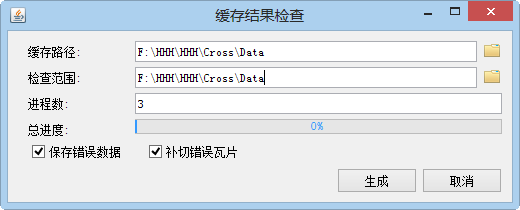

title: 缓存检查
---
　　为方便用户检查切好的缓存中是否存在缺少的瓦片或空白瓦片，Supermap iDesktop 9D提供了缓存检查功能，目前只支持检查紧凑型和MongoDB缓存。检查缓存时也支持多进程检查，检查出有问题的子任务 *.sci 文件，会存放到缓存路径的CacheTask文件夹中的failed目录下，成功的会在checked目录下。缓存检查的具体操作说明如下：

### 操作步骤     　　

  1. 单击“地图”菜单栏中的“缓存检查”，弹出“缓存结果检查”对话框，如下图所示：　　
  
　 　　

　2. **缓存路径**：设置为CacheTask文件夹所在的路径，即拆分任务时设置的缓存路径，如，CacheTask文件夹存放在D:\Data\Cache文件夹中，则此处设置为D:\Data\Cache即可。  
　3. **检查范围**：设置检查范围，单击右侧“选择”按钮，在弹出按钮可直接设置为缓存范围，也支持用户自定义选择缓存范围。  
　4. **进程数**：根据计算机的情况，设置多进程切图结果检查缓存的进程数。   
　5. **保存错误数据**：若用户勾选了该复选框，会把检查出来错的写到前面生成的UDB中。  
　6. **补切错误瓦片**： 若用户勾选了该复选框，检查完之后若存在错误，就启动“多进程切图”功能，此时会在设置的缓存路径/CacheTask/failed文件夹中获取存在错误的子任务，补切存在错误的瓦片，其他参数设置可参见“多进程切图”。   
　7. 设置好以上参数之后，单击“生成”按钮，即可开始检查，检查后正确的子任务会存放到checked文件夹中，有问题的子任务会存放到failed文件夹中。  
　   
  8. 若勾选了“补切错误缓存”复选框，当检查完成后，如果存在错误的缓存切片，会自动弹出“多进程切缓存”对话框，补切错误的缓存即可。 

   
