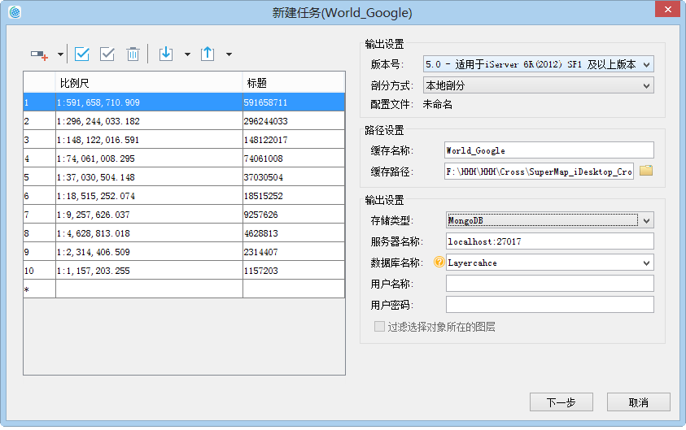
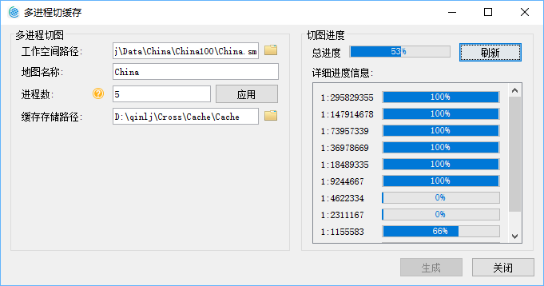

title: 新建地图缓存（多任务)
---
　　“**地图缓存（多任务）**”，新建多进程任务，可在其他电脑上选择该任务协同执行，从而提升切图效率，多进程切图需将地图缓存拆分为多个子任务，便于多个进程获取，可分为两个步骤：新建缓存任务、执行多进程切图，具体说明如下：

### 操作步骤     　　

  1. 配制好待切缓存的地图后，保存地图，在“数据源”节点处单击鼠标右键，选择“重新只读打开”，将数据源设置为只读打开并保存工作空间。此时，在地图窗口中重新打开待切缓存的地图。

  2. 单击“地图”菜单栏，选择“地图缓存（多任务）”选项。弹出”地图缓存切图方式“对话框。可选择三种切图方式：新建切图任务、执行切图任务、更新、追加缓存文件。    
      
  3.  选择“新建切图任务”，单击“下一步”按钮，弹出如下所示“**新建任务**”对话框，在对话框中设置缓存比例尺、路径、存储类型等参数，具体说明如下：  　　  
　
      

  -   **地图比例尺**:切图比例尺默认为地图设置的显示比例尺，用户可在添加、删除切图比例尺，也可对比例尺进行导入、导出等操作。   
     
  -  **输出设置**：不同版本的地图缓存，需要与相应版本的服务器版本匹配，以方便地图切片在服务端进行发布。系统提供了六种版本的地图缓存生成方式，其中，5.0版本的缓存采用了高精度校准方式，对于首次生成地图缓存的用户，推荐使用5.0版本的缓存方案。只有在选择5.0版本的时才可设置剖分方式。剖分方式分为两种：本地剖分和全球剖分。**注意**：全球剖分只有在地图坐标系为 WGS 1984时才可用。  
  -  **路径设置**:路径设置包括缓存名称和缓存路径两个参数，具体说明如下:     
  
      - **缓存名称**：设置缓存名称后，拆分任务会在缓存路径下生成一个缓存名称文件夹，并在这个文件夹中生成地图的缓存配置文件（*.sci）文件，该 *.sci 文件记录了整幅地图生成缓存的相关切图范围、切图比例尺、瓦片存储类型、瓦片设置、数据库信息、缓存路径等参数信息，可在桌面打开该文件浏览整个地图缓存。  
        
      - **缓存路径**：设置地图缓存文件和子任务的存放路径，任务拆分完成后，该路径下会生成一个以缓存名称命名的文件夹，如下图中的China文件夹，用于存放缓存配置文件（*.sci），切完缓存之后直接打开该*.sci文件，即可查看china地图的缓存；缓存路径还会生成一个“CacheTask”文件夹，其中包含check、task两个文件夹，文件夹中的存放内容如下：  
       
       - **check**：存放了check.udb、check.udd，用于缓存检查，检查切图后是否存在白图和空文件等情况。  
       
       - **task**：用于存放地图缓存拆分后的子任务文件（*.sci）。
    
 -   **输出设置**：用于设置地图缓存类型，程序提供了三种缓存类型，包括：原始、紧凑、MongoDB。  
  
       - **原始型**：原始型缓存切片文件以单独的图片文件格式存放在磁盘上，不对数据进行压缩。主要特点为：可以直接读取；占用磁盘空间大，不太易于管理，拷贝和迁移不太方便；对密级较高的数据，不能设置密码。  　　
       - **紧凑**:紧凑型缓存会对原始的切片文件采用一定的压缩和加密机制，在结构上采用一组文件替代原始的图片格式。此时，不同比例尺文件夹下的缓存数据将存储为一组文件，该组文件包括两个部分：索引文件（*.sci）、一组数据文件（*.sc00和*.lock）。与原始型相比，紧凑型存储方式具有以下优势：减少文件数量，有利于大量的缓存数据的传输与拷贝；缩短缓存创建的时间耗费；数据支持加密。  
       
       - **MongoDB 型**:生成的缓存切片文件，以分布式格式存储在服务器的数据库中，本地会生成一个索引文件（*.sci）。若选择 MongoDB 类型，需设置服务器名称、数据库名称、用户名称等参数。**注意**：若MongoDB缓存需要用多机进行切图，而服务器就是拆分任务的机器，则服务器地址须写IP地址，其他机器才可正常访问到MongoDB所在的服务器。  
       - **MongoDB 型存储方式有以下优势**：切片存储于服务器中，地图切片的存取速度较快；以分布式格式进行存储，瓦片数据支持直接进行拷贝分发，有利于数据传输与备份。  
       
       - **注意**：如果使用多进程切图并且缓存输出到MongoDB数据库中，需要先创建一个MongoDB库，创建MongoDB数据库的信息由命令行传入的缓存配置文件中的MongoDB信息指定；同时会根据指定的缓存配置文件（*.sci）在同级目录下生成一个新的 *.sci 文件。    
        

4.设置好以上参数后，单击“下一步”按钮，在对话框中设置缓存范围、索引范围、图片参数等，参数描述参见“地图缓存（单任务）”：   
  　  
5. 设置好上述参数后，单击“生成”按钮，即可执行地图缓存任务拆分操作，拆分好的子任务存放路径为：缓存路径/task。注意：若需多机切图，子任务需存放在共享目录中。   
6. 任务拆分成功之后，会自动弹出“多进程切缓存”对话框，并且根据拆分任务时参数自动设置相关参数，自动填写工作空间路径、地图名称、缓存存储路径这几个参数。单击对话框中的“生成”按钮，即可在本机执行多进程切图操作。若不需再本机执行切图操作，将该对话框关闭即可。  

   

   
   
　　 　　
   
 
   
