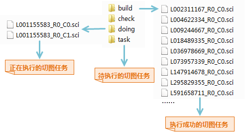
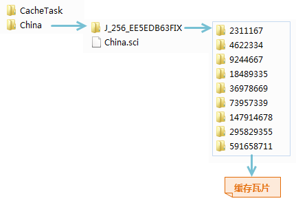

title: 执行切图任务
---
　　地图缓存切图任务拆分为多个子任务之后，即可在单个机器或多个机器中执行多进程切图任务。合理利用计算机资源，提高切图效率。具体操作步骤如下：

### 操作步骤     　　

  1. 在“地图”选项卡的”制图“组中，单击”多任务“按钮，弹出”地图缓存切图方式“对话框。选择“执行切图任务”。 

  2. 单击“下一步”按钮，即可弹出的“多进程切缓存”对话框中，在如下对话框中设置工作空间路径、地图名称、进程数、缓存存储路径等参数。
   - **工作空间路径**：选择待切缓存地图所在的工作空间。注意：用户需确保该工作空间中的待切地图与拆分任务时的地图一致，若不一致，会导致结果无法正确浏览，此时建议用户对更新后的地图重新拆分任务后，再切缓存。
   - **地图名称**：设置待切缓存的地图名称。
   - **进程数**：设置切图的进程数，即在当前机器上开启几个进程来执行切图任务。进程数需要根据机器的配置和进程使用情况来设置。进程数可根据机器使用情况，随时进行调整，若输入的进程数比当前进程数多，单击“应用”按钮，即可及时增加一条进程执行切图；若输入的进程数比当前进程数少，单击“应用”按钮，即可及时减少一条正在执行切图的进程。
   - **缓存路径**：设置为拆分任务对话框中所设置的缓存路径，如拆分任务时设置为：D:\Data\Cache\文件夹中，则此处的缓存路径也设置为D:\Data\Cache即可。
    
  3.  设置好以上参数之后，单机对话框中的“生成”按钮，对即可在对话框右侧查看缓存的切图进度，包括总进度信息和每个比例尺层级的进度信息。单击“刷新”按钮，可即时刷新查看当前的切图进度。  　　
　
    

  4. 执行多进程切图时，会在CacheTask目录下生成一个doing文件夹，每个进程获取到的子任务会从task移至doing文件夹中。当子任务切图完成后，会将该任务从doing文件夹移至同级的build文件夹中，切图失败的子任务会保留在doing中，若任务全部执行完成后，doing文件夹中仍然有*.sci文件，则可能是切图未成功的的任务，可将其移至task中再次切图。
  
     
  5. 切好的缓存瓦片会保存在总sci文件同级目录文件夹中，如下图所示，瓦片分别保存在对应的比例尺文件夹中，切图成功后通过加载China.sci总缓存文件即可查看所有切好的缓存。　　
  
　 　　

　6. 将地图缓存文件添加到SuperMap iDesktop中，即可查看地图结果缓存。　　
　  

   
