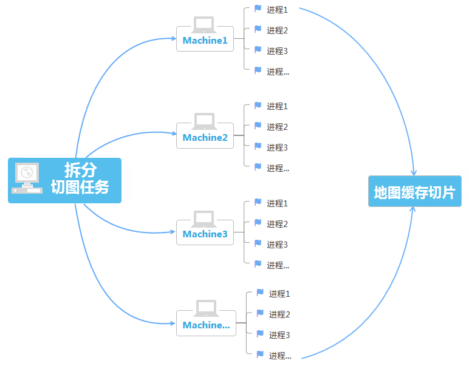

title: 多进程切图
---
　　地图缓存是指按照指定范围和比例尺生成地图切片文件，通过在桌面或web端加载地图缓存切片来提高地图的加载、浏览效率。传统的地图缓存是在单线程或单进程中执行的，而用于生产缓存的地图数量和范围都比较大，图层和比例尺层级也较多，包含的地图信息丰富，切地图缓存通常都会耗费很长的时间。例如，在普通的工作机上，对中国范围、几十个图层的地图生成数十级比例尺的缓存，可能需要十几天。为了提高用户的切图效率，合理的利用了计算机系统资源，SuperMap iDesktop 9D提供了多进程切图功能，及地图缓存检查和补切工具，使地图缓存生成操作更加可控。

##### 多进程切图原理
　　进程是系统进行资源分配和调度的一个独立单位，通常具有一定独立功能的程序会分配一条进程。多进程切图需将地图缓存的切图任务拆分成多条子任务，同时开启多条进程，每条进程会到指定的目录获取并执行切图任务，并将切图结果保存到同一个文件夹中。　　

　　多进程切图支持在一台计算机上开启多条进程执行切图任务，也支持在多个机器开启多条进程，分别获取子任务执行切。　　　　

　　

##### 多进程切图要点

　　多进程切图需注意以下几个要点：　　

　　**拆分任务**：执行多进程切图前，需要将地图缓存拆分为多个切图任务，便于每个进程获取独立、不重复的任务，拆分的子任务为 *.sci缓存配置文件，拆分任务是将整体的缓存配置文件拆分为多个 *.sci，根据设置的切图比例尺和范围，按照每个子任务的缓存瓦块数为128*128进行拆分。　　

　　**只读**：多进程切图时每条进程会同时访问地图中图层所在的数据源，此时数据源就会存在被占用的问题，所以在执行多进程切图之前，须通过数据源右键菜单中的“重新只读打开”选项，将数据源设置为只读打开，并保存工作空间。　　　

　　**共享目录**：若要执行多机多进程切图，则需要在任务所在机器中设置一个共享目录，确保其他机器对该共享目录有读写权限，并且没有设置密码。需存放在共享目录的内容有：拆分后的子任务、切图所需的工作空间和数据源、切图结果。便于每台切图的机器获取切图任务和所需数据，也方便切图结果的存放和汇总。　　

　　**地图**：拆分任务前，需确定并保存待切的地图，确保拆分任务时的地图与切图时工作空间的地图一致。若切图时地图与拆分时不一致，可能会导致缓存无法正常显示，若拆分任务后更新了待切地图，建议用户保存地图和工作空间之后重新拆分任务再切地图缓存。　　

　　**多机切图**：　若要执行多机多进程切图，需检查其他机器是否能连接host主机，如windows系统下，可以在资源文件夹中输入 \\198.168.1.20（主机ip），进入共享目录。linux系统下，如果要访问windows下的共享文件夹，可以使用挂载方式。以ubuntu为例，可以使用命令：mount -t cifs -o username=root,password=map //198.168.1.20（主机ip）/testdata /mnt将共享目录挂载到mnt目录下，具体挂载操作因系统而异，用户根据自己的环境进行设置，使得其他机器可以访问共享目录，并能够通过桌面打开目录下的工作空间即可。（注：直接以smb:\\ip也可以用资源管理器查看到共享目录，但是桌面无法以这个地址直接打开工作空间，仍需要挂载）。　　

##### 切图效率对比　　

　　多进程切图可以合理的利用计算机资源，提高切图的效率，多进程切图比单进程切图效率要高得多，通过以下实例对比单进程和多进程的切图时间：　　

　　**切图数据**：SampleData中China地图，比例尺：1:144448。　　

　　**硬件环境**：CPU：Intel Core(TM) i5-4440 ，内存：8GB，4核CPU。  　　

　　**系统**：Windows10 x64，Ubuntu。　　　　

　　**缓存类型**：MongoDB型缓存。　　

　　分别在Windows操作系统和Linux操作系统中对比单进程和多进程切图的时间，得到结果如下表所示：　　

　　

　　由上表可知，单机多进程切图比单进程切图效率更高。随着进程数增多，切图效率有明显提高，当进程数增加到一定数量时，切图耗时趋于稳定，再增加进程数对效率的提升不多。而在 Ubuntu 系统下切图的效率要高于Windows系统，如下对比图所示：　　

　　
　　

  

　　

　　

　

　　
　　　

　　
　　
　　　　　　　　　

