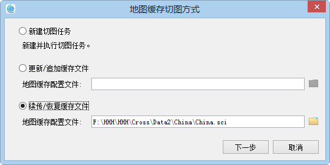

title: 续传缓存
---
　　若切图过程中遇到了断电、程序意外退出等导致切图中断的情况，此时，在缓存配置文件*.sci的同级目录下，会生成一个*.log文件，通过导入*.sci文件，并判断同级目录下是否有log文件，即可开始续切缓存。

### 操作步骤     　　

  1. 单击“地图”菜单栏中的“地图缓存（单任务）”按钮。弹出”地图缓存切图方式“对话框,勾选“续传/恢复缓存文件”，选择需续传的缓存配置文件（*.sci）。 
  
  

　2. 打开*.sci文件后，判断同级目录下是否有resume.log文件，若没有则会弹出一个massageBox提示用户缺少log文件，不能进行缓存续切；若存在log文件则弹出以下对话框。 
　  
   
 
　3.在对话框中设置切图比例尺，并显示缓存配置文件*.sci中的相关参数信息，单击“生成”即可续切缓存 。

   

　

   
