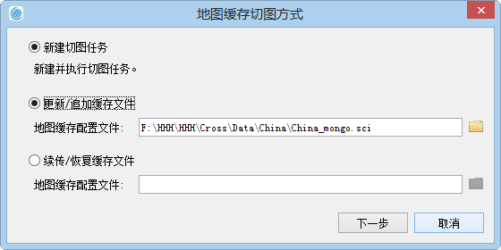
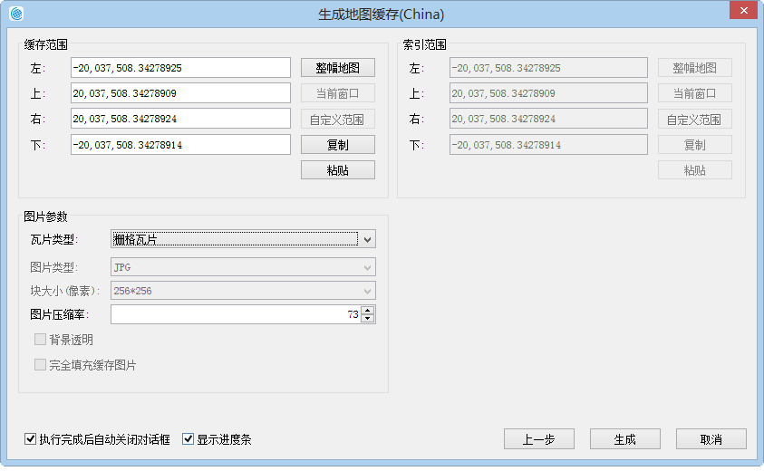

title: 更新缓存
---
　　更新缓存功能是指更新指定缓存范围内、特定比例尺的缓存瓦片。适用于：某地区的地图已切好缓存，其中，某一块区域内的地物要素有变更，需要更新该区域范围内的缓存。此时，通过“更新缓存”功能，根据sci缓存文件，重新指定待更新的缓存范围、比例尺、图片压缩率即可更新缓存。

### 操作步骤     　　

  1. 单击“地图”菜单栏中的“地图缓存（单任务）”按钮。弹出”地图缓存切图方式“对话框,勾选“更新/追加缓存文件”，选择待更新的sci缓存文件：  
  
  

　2. 单击“下一步”按钮之后，在随后弹出的"生成地图缓存"对话框中，通过添加、删除比例尺的功能，设置需更新的缓存比例尺。  
　  
    
　3.单击“下一步”按钮之后， 重新指定缓存范围，设置为待更新范围的即可。注意：索引范围不可更新，与原*.sci缓存文件的索引范围一致，便于索引到指定范围内的缓存瓦片。可重新指定瓦片的图片压缩率，图片压缩率的范围为0-100。  

  
　4.完成上述设置后，拆分任务成功，可直接点击“生成”，执行缓存任务。  

   
