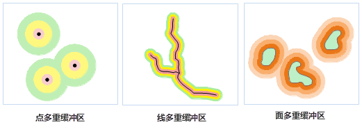

title: 缓冲区分析原理
---

　　缓冲区分析是根据指定的距离，在点、线、面几何对象周围建立一定宽度的区域的分析方法。缓冲区分析在GIS空间分析中经常用到，且往往结合叠加分析来共同解决实际问题。缓冲区分析在农业、城市规划、生态保护、防洪抗灾、军事、地质、环境等诸多领域都有应用。例如，在环境治理时，常在污染的河流周围划出一定宽度的范围表示受到污染的区域；又如扩建道路时，可根据道路扩宽宽度对道路创建缓冲区，然后将缓冲区图层与建筑图层叠加，通过叠加分析查找落入缓冲区而需要被拆除的建筑，等等。

　　缓冲区分析是基于点、线、面对象进行分析的，支持对二维点、线、面、网络数据集进行缓冲区分析。其中，对网络数据集进行缓冲区分析时，是对其中的弧段作缓冲区。缓冲区的类型可以分析单重缓冲区和多重缓冲区。下面以简单缓冲区为例分别介绍点、线、面的缓冲区的实现方式：

### 点缓冲区

　　点的缓冲区是以点对象为圆心，以给定的缓冲距离为半径生成的圆形区域。当缓冲距离足够大时，两个或多个点对象的缓冲区可能有重叠。选择合并缓冲区时，重叠部分将被合并，最终得到的缓冲区是一个复杂面对象。

   

### 线缓冲区

　　线的缓冲区是沿线对象的法线方向，分别向线对象的两侧平移一定的距离而得到两条线，并与在线端点处形成的光滑曲线（或平头）接合形成的封闭区域。同样，当缓冲距离足够大时，两个或多个线对象的缓冲区可能有重叠。合并缓冲区的效果与点的合并缓冲区相同。

  

　　当线数据的缓冲类型设置为平头缓冲时，线对象两侧的缓冲宽度可以不一致，从而生成左右不等缓冲区；也可以只在线对象的一侧创建单边缓冲区，如下图所示：

   

### 面缓冲区

　　面的缓冲区生成方式与线的缓冲区类似，区别是面的缓冲区仅在面边界的一侧延展或收缩。当缓冲半径为正值时，缓冲区向面对象边界的外侧扩展；为负值时，向边界内收缩。同样，当缓冲距离足够大时，两个或多个线对象的缓冲区可能有重叠。也可以选择合并缓冲区，其效果与点的合并缓冲区相同。

  

### 多重缓冲区

　　多重缓冲区是指在几何对象的周围，根据给定的若干缓冲区半径，建立相应数据量的缓冲区。对于线对象，还可以建立单边多重缓冲区，如下图所示：

   

###  相关主题

[生成单重缓冲区](SingleBuffer.html)

[缓冲区分析应用实例](BufferAnalyst_Example.html)

