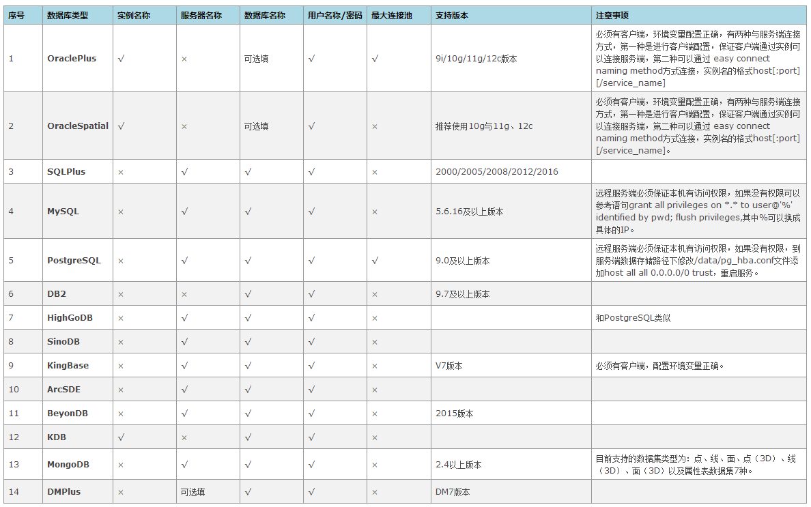
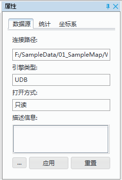

　　数据源用于存储空间数据，独立于工作空间。我们可以按照数据的用途，将不同的空间数据保存于数据源中，对这些数据统一进行管理和操作。

数据源类型分为四大类：文件型数据源、数据库型数据源、内存数据源和 Web 数据源。  
    
* **文件型数据源**：将数据源存储为扩展名为 *.udb 的文件；   
* **数据库型数据源**：将数据源存储在数据库中，目前桌面产品提供 OraclePlus、Oracle Spatial、SQLPlus、PostgreSQL、DB2、KingBase、MySQL、BeyonDB、HighGoDB、KDB 和 MongoDB 等十余种数据库型数据源功能；  
* **内存数据源**：为临时数据源，不支持保存；   
* ** Web 数据源**：将数据源存储在网络服务器中；

### 打开数据源

打开数据源的方式有三种：  
  
+   “文件“菜单中单击“打开”按钮提供打开文件型、数据库型、Web 型数据源。   
+   ”开始“选项卡”数据源“组提供”文件“、”数据库“和“ Web 型”三个按钮以打开不同类型的数据源。其中下拉按钮包含两个部分，一是按钮部分，单击该部分将执行下拉菜单中第一项的功能；二是下拉按钮部分，单击该部分将弹出下拉菜单，通过选择下拉菜单中的项来实现打开相应类型的数据源。  
+    在工作空间管理器中数据源节点单击右键，可在右键菜单中选择打开各类型数据源选项。    
   
**打开文件型数据源**       
1. 以上述任一方式执行打开操作，会弹出“打开文件型数据源”对话框。  
2. 在“打开文件型数据源”对话框中，选择要打开的文件型数据源文件,单击“打开”按钮即可打开选择的文件型数据源。    
  
-  **注**：打开的数据源文件可以是 *.udb，还支持打开外部影像文件和矢量文件。  
-  影像文件为*sit、*.bmp、*.jpg、*.jpeg、*.*.png、*.tif、*.tiff、*.img、*.sci、*.gif、*.gci、*.sct、*.xml、*.ecw、*.sid、*.bil、*.jp2、*.j2k。等格式。工作空间对于作为数据源打开的影像数据文件的管理方式为，在工作空间中建立一个与影像数据文件同名的数据源，影像数据文件则为该数据源中的影像数据集。因此，当将影像数据文件作为数据源打开后，工作空间管理器中将增加一个数据源结点，结点的显示名称与影像数据文件的文件名称相同，打开的影像文件作为影像数据集添加到这个数据源结点下。需要特别注意，单波段16位和32位浮点型的影像文件，直接打开后为栅格数据集。   
-  矢量文件为 *.shp、*.mif、*.tab、*.dwg、*.dxf、*.dgn、*.kml、*.kmz、*.gml、*.wal、*.wan、*.wap、*.wat、*.csv、*.e00 等格式。工作空间对于作为数据源打开的外部矢量文件的管理方式为，在工作空间中建立一个与外部矢量文件同名的数据源，外部矢量文件则为该数据源中的CAD数据集。因此，当将外部矢量文件作为数据源打开后，工作空间管理器中将增加一个数据源结点，结点的显示名称与外部矢量文件的文件名称相同，打开的矢量文件作为 CAD 数据集添加到这个数据源结点下。 
 

   
**打开数据库型数据源**       
1. 以上述任一方式执行打开操作，会弹出“打开数据库型数据源”对话框。  
2. 在“打开数据库型数据源”对话框中，可在左侧数据库类型列表中切换数据库类型，在右侧输入要打开的数据源的必要信息，然后单击“打开”按钮即可打开相应类型的数据库型数据源。针对不同数据库类型参数设置各有不同，下表将分别介绍如何打开不同类型的数据库型数据源所需设置的参数及其注意事项：

      
  
-  **连接池最大连接数**：在打开OraclePlus、PostgreSQL数据库数据源时，支持设置数据库连接池的最大连接数。数据库连接池负责分配、管理和释放数据库连接。最大连接数是连接池能申请的最大连接数，如果数据库连接请求超过此数，后面的数据连接请求将被加入到等待队列中。  
-  **加载数据链接信息**：提供了加载和保存数据库数据源的链接信息，数据库链接文件为 *.dcf 文件， *.dcf 文件中记录有数据库数据源服务器、数据库、用户名等信息。  
  
 **打开 Web 型数据源**       
1. 以上述任一方式执行打开操作，会弹出“打开 Web 型数据源”对话框。  
2. 在“打开 Web 型数据源”对话框中,可在左侧 Web 类型列表中切换类型，在右侧输入要打开的数据源的必要信息，然后单击“打开”按钮即可打开相应类型的数据库型数据源。不同数据源设置参数的要求不同，下面对每个数据源的设置参数进行单独描述：  
  
- **OGC**： 输入服务地址，并选择该服务的服务类型，SuperMap GIS 9D桌面支持四种类型：WMS、WFS、WCS 和 WMTS。WMS、WCS 和 WMTS 打开后均为只读数据源，WFS 服务打开后可以进行简单的编辑。对于 WMTS 服务，打开 WMTS 服务以后会在本地生成一个缓存文件夹。路径为：安装路径：SuperMap iDesktop 9D\Bin\Cache\WebCache\WMTS 文件夹下。在该文件夹下按照发布服务的地址建立文件夹，保存不同地图的瓦片文件以及请求文件（*.xml）。 有关 OGC 相关概念和服务介绍的内容请参见：OGC 标准服务（W*C）。  
- **iServerREST**： 用户须填写服务地址即可打开该数据源。有关 REST 服务的介绍内容请参见：REST 服务。   
- **GoogleMaps** ：服务地址、服务类型、用户名称和打开方式等参数为系统默认参数，用户不需要设置。有关 GoogleMaps 的介绍内容请参见：谷歌地图服务（GoogleMaps）。  
-  **SuperMapCloud**：服务地址、服务类型、用户名称、密钥和打开方式等参数为系统默认参数，用户不需要设置。有关超图云服务的介绍内容请参见：超图云服务（SuperMapCloud) 。  
-  **OpenStreetMaps**:服务地址、服务类型、用户名称、密钥和打开方式等参数为系统默认参数，用户不需要设置。单击“打开”即可。有关 OpenStreetMaps 的介绍内容请参见：开放街道图（OpenStreetMap）。 

### 新建数据源  
  
可新建文件型数据源、数据库型数据源和内存数据源三种类型，且新建数据源的方式有三种：  
  
+   “文件“菜单中单击“打开”按钮提供新建文件型、数据库型、内存型数据源。   
+   ”开始“选项卡”数据源“组提供”文件“和”数据库“两个按钮以新建不同类型的数据源。  
+    在工作空间管理器中数据源节点单击右键，可在右键菜单中选择新建各类型数据源选项。   
  
**新建文件型数据源**  

1.以上述任一方式执行新建文件型数据源操作，选择“新建文件型数据源…”选项，将弹出“新建文件型数据源”。  
2. 在“新建文件型数据源”对话框中，设置新建数据源的保存路径、文件名、保存类型，然后单击“保存”按钮即可创建相应类型的文件型数据源，该文件型数据源将保存到 *.udb 文件中。  
  
**新建数据库型数据源**  
1. 以上述任一方式执行新建数据库型数据源操作，选择“新建数据库型数据源…”选项，将弹出“新建数据库型数据源”。  
2. 在“新建数据库型数据源”对话框中，可在左侧数据库类型列表中切换数据库类型，在右侧输入创建数据源的必要信息，然后单击“创建”按钮即可创建相应类型的数据库型数据源。   
3. 针对不同数据库类型参数设置各有不同，参数描述、参数设置及注意事项同“打开数据库型数据源”，详细信息请参考"打开数据库型数据源"。  

**新建内存数据源**  
 以上述任一方式执行新建内存型数据源操作，选择“新建内存数据源...”项，即可在工作空间管理器中数据源节点下，新增“MemoryDatasource”数据源，可重命名该数据源名称，该类型数据源为临时数据源，不支持保存。  
  
**注意事项**    
1. 成功建立数据源之后，新的数据源会在当前的工作空间中打开，此时，工作空间管理器也会随之发生变化，工作空间管理器的树状结构中的数据源集合结点下会增加一个数据源结点，该结点对应打开的数据源，并且结点的显示名称为该数据源的别名。  
2. 新建 Oracle Spatial 数据库型数据源时，由于sys、system 这两个系统用户的表空间较小，为防止空间被占满，不支持这两个系统用户创建数据源。

### 查看数据源的属性 

当在工作空间管理器中选择了一个数据源后，右键单击该数据源，在弹出的右键菜单内选择“属性”选项，在工作空间右侧弹出“属性”窗口，初始显示的是当前选中的数据源的相关信息，称为数据源属性窗口。数据源属性窗口当前有三类信息：“属性信息”、“统计信息”和”坐标系信息“。    

      
    
+   **数据源** ： 数据源结点下显示该数据源的连接路径、引擎类型、打开方式，可编辑数据源的描述信息，且更改打开数据源的密码。
+   **统计**  ：统计结点下显示该数据源所包含的数据集的统计信息。 “总计”中显示数据源的所包含的数据集的总个数。另外，表格列出了应用程序所支持的所有数据集的类型，每种数据集类型对应的单元格将显示相应的数据源所包含的这种类型的数据集的数目。
+   **坐标系** ：坐标系结点下显示数据源的坐标系名称、地理单位以及数据源坐标系的详细信息。可以在此重新设定坐标系或者进行投影转换，具体设置方法，参见“投影设置”页面。 

**注意**：“属性”窗口是一个浮动窗口，该窗口不仅可以用来显示工作空间管理器中选中的数据源的信息，工作空间、数据集等属性信息也通过该“属性”窗口来显示，通过右键单击选中的数据源或工作空间，在弹出的右键菜单内选择“属性”选项，就可以调出该“属性”窗口，并且初始显示的内容为当前选中的数据源信息，如果用户选中工作空间管理器中的工作空间，那么该“属性”窗口将显示该工作空间的相关信息；如果用户选中工作空间管理器中的数据集，那么该“属性”窗口将显示选中的数据集的相关信息。  
  
### 紧缩数据源    
“紧缩数据源”功能，提供了对单个数据源进行压缩的功能，使其减少数据量，占用较少的磁盘空间。该功能只对 UDB 文件型数据源有效。在工作空间管理器中选中要紧缩的数据源，单击鼠标右键，在弹出的右键菜单中选择“紧缩数据源”项，即可对选中数据源进行紧缩操作，输出窗口会在执行完毕后给出紧缩成功/失败的提示。如若数据源中的数据集处于打开状态，必须将其关闭之后才能继续处理。

### 重命名数据源  
“重命名”命令，用来修改选中的数据源的名称。  
1. 右键单击选中工作空间管理器中的一个数据源结点，在弹出右键菜单中选择“重命名”命令。或选中要修改名称的数据源，在键盘上按住 F2 键，数据源结点的显示名称变为可编辑状态，键入要修改的名称即可。   
2. 修改名称后，在应用程序界面中任意位置单击鼠标，完成数据源名称的修改。  

**注**：当进行重命名数据源操作时，程序会弹出提示框提示用户“重命名数据源会引发地图引用它的数据集的图层无法显示！是否继续？”，单击“确定”按钮则执行重命名操作，反之则放弃重命名操作。  
  
### 关闭数据源  
在工作空间管理器中选中要关闭的数据源，单击鼠标右键，在弹出的右键菜单中选择“关闭”项，即可关闭当前选中数据源。输出窗口会在执行完毕后给出关闭数据源成功/失败的提示。

  

