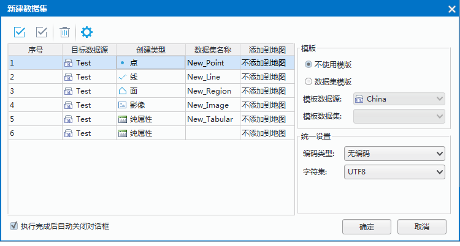
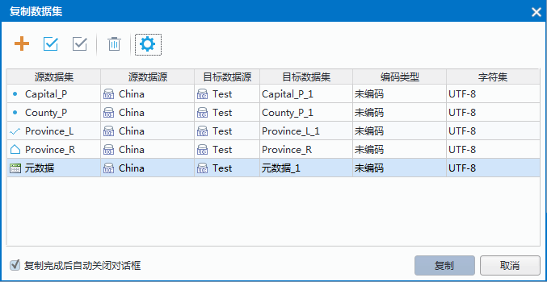
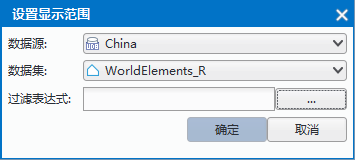

　　数据集用来存储相同类型的空间对象，是 SuperMap GIS 空间数据的基本组织单位之一。目前支持点数据集、线数据集、面数据集、纯属性数据集、网络数据集、复合数据集、文本数据集、路由数据集、影像/栅格数据集等多种类型。  
　　数据集的管理包括数据集的新建、复制、删除、关闭、重命名等操作，也包括对多个数据集进行排序、查看数据的属性、设置数据集的编码方式等。　

### 新建数据集

　　可新建点、线、面、文本、CAD、影像、栅格、属性表、三维点、三维线、三维面等11种类型的数据集。并且支持新建矢量集合，矢量集合是用来存储具有相同数据类型，相同投影坐标系的矢量数据集。

　　新建数据集入口有两处：  
  
+   单击“开始”选项卡“新建数据集”组提供“新建数据集”和“新建矢量集合”。
+    单击右键工作空间管理器中数据源节点，可在右键菜单中选择”新建数据集“和”新建矢量集合“。    
   
**操作步骤**       
1. 以上述任一方式执行新建数据集操作，会弹出“新建数据集”对话框。  
2. 在弹出的“新建数据集”对话框左侧，可选择新建数据集类型，并设置数据集名称、目标数据源以及是否添加到地图等。　　  
        
  
+ **创建类型**：点击“创建类型”项的下拉按钮，在弹出的下拉菜单中可选择其它类型的数据集，设为目标数据集类型。  
+ **目标数源集**：目标数据源可选择文件型数据源和数据库型数据源。  
  
3.设置好列表中的相关参数之后，需在“模板”区域选择数据集是否使用模板进行创建，具体参数说明如下：    
  
+ **不使用模板**：若不使用模板创建，则需要设置数据集的编码类型和字符集。  
**编码类型**：该项只当新建的数据集类型为线、面数据集时，才出现在对话框右侧的参数设置区域。编码类型列用来指定新建的数据集采用的编码类型，编码类型列中的每个单元格有一个下拉按钮，单击下拉按钮弹出下拉列表，列表中列出了应用程序所支持的所有编码类型。数据集的编码类型就是数据集存储时的压缩编码方式，具体内容请参见：数据集压缩编码方式。  
**字符集**：对新建的数据集可以选择适合的字符集。有关支持的字符集及其介绍，请参见：字符集列表。   
  
+ **数据集模板**：若选择“数据集模板”方式新建数据集，指定模板数据集后即可根据模板创建数据集，创建的数据集属性表结构及大部分属性都与模板数据集一致，例如投影信息、字符集、值域等。注意：新创建的数据集范围为0，空间索引为无空间索引，对象个数为零。  
  
4. 完成新建数据集的各项设置后，单击“新建数据集”对话框底部的“创建”按钮，即可完成新建数据集的操作。   
  
**注意事项**    
  
+ 在创建点数据集、纯属性数据集以及 CAD 数据集时，不支持编码类型，默认编码方式为未编码，用户不得修改。  
+ 数据集命名规则：  
  1. 由汉字、字母、数字和下划线组成，但不能以数字、下划线开头。  
  2. 字段长度不能为0，当数据集存储在UDB中时，不得超过59个字符，即59个英文字母或者29个汉字。当数据集存储在 Oracle 数据库中时，数据库本身内部是按照字节来存储,不得超过59个字节，即59个英文字母；由于根据服务器的字符集进行换算，字符集不同，1个汉字大概占用2~3个字节，所以 oracle 长度为20~29个汉字。超出部分会自动截断。  
  3. 不能有非法字符，如空格、括号等。  
  4. 不能与各个数据库的保留字段冲突。   

  
### 复制数据集  

“复制数据集”功能，用来将一个或者多个数据集复制到目标数据源中。当前有选中的数据集时，可以直接将选中的数据集添加复制窗口，快速实现数据集的复制。   
  
　　复制数据集入口有两处：  
  
+   单击“开始”选项卡“新建数据集”组中提供“复制数据集”。
+   在工作空间管理器中选择复制数据集，单击右键在菜单中选择“复制数据集”。    
   
**操作步骤**       
1. 在工作空间管理器中，选中要进行复制的数据集，可以配合使用 Shift 键或者 Ctrl 键同时选中多个数据集。只能选中同一个数据源下的多个数据集，不能跨数据源选择多个数据集。  
2. 右键单击选中的数据集，在弹出的右键菜单中选择“复制数据集...”项，弹出“数据集复制”对话框，如下图所示：  
　  
    
3. 对话框中设置复制数据集的所必要的信息，对话框中的每条记录对应一个要复制的数据集的复制信息，包括：将数据集复制到的目标数据源、复制得到的新数据集的名称、复制得到的新数据集采用的编码类型及字符集类型。 有关编码类型和支持的字符集，请参照数据集压缩编码方式和字符集列表。   
4. 当设置完表格中所有要复制的数据集的复制信息后，就可以单击表格下方的“复制”按钮，根据所指定的信息完成数据集的复制。 
         
### 删除数据集   
在工作空间管理器中，选中要删除的数据集，可以配合使用 Shift 键或者 Ctrl 键同时选中多个数据集。右键单击选中的数据集，在弹出的右键菜单中选择“删除数据集”项，即可执行删除数据集的操作。当选择多个矢量数据集时，只能选择同一个数据源下的多个数据集，不能跨数据源选择多个数据集。   
 
### 重命名数据源  
“重命名数据集”命令，用来修改选中的数据集的名称。  
1. 右键单击选中工作空间管理器中的一个数据集结点，在弹出右键菜单中选择“重命名数据集”命令。或选中要修改名称的数据集，在键盘上按住 F2 键，数据源结点的显示名称变为可编辑状态，键入要修改的名称即可。   
2. 修改名称后，在应用程序界面中任意位置单击鼠标，完成数据集名称的修改。   
**注意事项** ：重命名数据集会引发地图中引用它的数据集的图层无法正常显示。   
  
### 查看数据集的属性信息 

<<<<<<< HEAD
　　当在工作空间管理器中选择了一个数据集后，右键单击该数据源，在弹出的右键菜单内选择“属性”选项，在工作空间右侧弹出“属性”窗口，显示的为当前选中的数据集的相关信息。 数据集属性面板信息会根据所选择的数据集的类型的不同而有所差异，主要分为三种形式：矢量数据集、栅格数据集和影像数据集。  
=======
当在工作空间管理器中选择了一个数据集后，右键单击该数据源，在弹出的右键菜单内选择“属性”选项，在工作空间右侧弹出“属性”窗口，显示的为当前选中的数据集的相关信息。 数据集属性面板信息会根据所选择的数据集的类型的不同而有所差异，主要分为三种形式：矢量数据集、栅格数据集和影像数据集。  
>>>>>>> 48734635d96e921df8d6bbc0a5ea43672b4fce39
  
　　**矢量数据集**：若工作空间管理器中选中的是矢量数据集，数据集属性窗口中会显示：数据集、矢量、字段、坐标系四个面板，每个面板都显示了属性面板数据结点中选中的数据集信息。  
　　**栅格数据集**：若工作空间管理器中选中的是栅格数据集，数据集属性窗口中会显：数据集，栅格、坐标系三个面板，每个面板都显示了属性面板数据结点中选中的数据集信息。  
　　**影像数据集**：若工作空间管理器中选中的是影像数据集，数据集属性窗口中会显：数据集，影像、坐标系三个面板，每个面板都显示了属性面板数据结点中选中的数据集信息。  　　

<<<<<<< HEAD
### 公共参数面板  
=======
#### 公共参数面板  
>>>>>>> 48734635d96e921df8d6bbc0a5ea43672b4fce39

+   **数据集**：“数据集”面板中将显示该数据集的属性信息，包括数据集的基本信息（名称、类型、编码等）、数据集范围信息以及数据集的详细描述信息。
+   **坐标系**：“坐标系”面板中显示数据集的坐标系名称、地理单位以及数据集坐标系的详细信息。可以在此重新设定坐标系或者进行投影转换，具体设置方法，参见“投影设置”和“数据集投影转换”页面。  
  
    
<<<<<<< HEAD
### 矢量数据集属性参数 
=======
#### 矢量数据集属性参数 
>>>>>>> 48734635d96e921df8d6bbc0a5ea43672b4fce39

+   **矢量**：“矢量”面板中显示矢量数据集中对象个数、索引类型以及字符集等信息；并显示数据集相关容限信息，包括节点容限、短悬线、颗粒容限、长悬线容限以及多边形容限。   
     
	 **矢量数据集**  
	+ **对象个数**：显示矢量数据集中所有对象的数目。 
	+ **字符集**：显示矢量数据集所使用的字符集，单击下拉按钮弹出下拉菜单，下拉菜单中列出了所支持的所有字符集，用户可以选择其中的字符集来改变矢量数据集当前使用的字符集。有关支持的字符集及其介绍，请参见：字符集列表。   
	+ **索引类型**：显示矢量数据集的空间索引类型。有关矢量数据集的空间索引类型，请参见：空间索引类型。   
	+ **只读**：显示矢量数据集的只读状态，如果复选框为选中状态，表示数据集为只读的，只读状态的数据集不允许进行编辑操作，如添加、编辑、删除对象等，用户可以编辑数据集的只读状态，即通过选中和取消选中复选框的方式来改变数据集的只读状态。   
	+ **用户缓存**：显示矢量数据集是否使用了缓存机制，如果复选框为选中状态，表示数据集使用了缓存，用户可以编辑该项，通过选中和取消选中复选框的方式来改变数据集是否使用缓存。注意：只能对建立了图库索引的 Orcale Plus 数据源中的数据集有效。   
	+ **清除缓存**：单击“清除缓存”按钮，会清除矢量数据集的缓存文件。  
   
 	**数据集容限**    
	+ **节点容限**：显示和设置工作空间管理器中当前选中的矢量数据集中两个节点间的最小距离，当两个节点之间的距离小于节点容限时，在拓扑处理中两个节点将合并为一个节点。数值的单位与数据集的单位相同。     
	+ **短悬线容限**：显示和设置工作空间管理器中当前选中的矢量数据集的短悬线容限，该容限用于判断悬线是否为过头线，如果悬线的长度小于此容限，则其为过头线，在拓扑处理中会可以设置去除过头线。数值的单位与数据集的单位相同。    
	+ **长悬线容限**：显示和设置工作空间管理器中当前选中的矢量数据集的长悬线容限，该容限用于判断长悬线是否需要延伸到节点。如果长悬线的悬点到另一条线或弧段的距离小于此容限，通过拓扑处理，可以将长悬线延伸，并在与另一条线或弧段相交处生成一个节点。数值的单位与数据集的单位相同。    
	+ **颗粒容限**：显示和设置工作空间管理器中当前选中的矢量数据集的颗粒容限，该容限用于控制圆、弧线或曲线上节点之间的距离，主要用在参数化对象转为线对象时的控制生成的节点间的距离。 数值的单位与数据集的单位相同。    
	+ **多边形容限**：显示和设置工作空间管理器中当前选中的矢量数据集的最小多边形容限，又称为碎多边形容限，对封闭的线对象和面对象有效。该容限定义了拓扑处理时的碎多边形的大小，若多边形的面积与周长的比值小于该容限值，则被认为是碎多边形。在拓扑处理时，可以设置将碎多边形删除。 
 
+   **字段**：“字段”面板中显示矢量数据集的属性表的结构，即属性表的字段结构，主要以表格的形式显示。表格中的每一行（每一条记录）为属性表中一个属性字段的相关信息，表格中的每一列代表属性字段的一类信息，这些信息包括：字段类型、字段长度等。并可通过“添加”和“删除”按钮，对属性结构进行属性字段进行添加和删除。还可对已有属性字段进行修改，对于字段修改需注意以下问题：  
　　1. 对于已经创建成功的字段，只可以对字段的“别名”和“类型”进行修改，目前仅支持修改Oracle、SQLServer、MySQL、PostGreSQL、KingBase五种数据库引擎的数据集字段类型，UDB数据源不支持修改字段类型。对于数据库型数据源中的数据集，由于数据库本身的限制，修改已有字段的类型，请详见:“修改数据集属性字段类型的支持情况”。  
　　2. 对于从数据集中得到的属性字段信息，除属性字段的别名外，名称和其他信息都是不可以修改的；对于用户新建的属性字段，并且还未保存到数据集或数据库中，其中属性字段的所有信息（包括属性字段的名称）都是可以被修改的，但修改后的属性字段的名称也不可以跟其他字段重名；属性字段的别名可以不唯一，即不同的属性字段可以有相同的别名，而名称是用来唯一标识一个字段的，所以不可重名。   
　　3. 当建立一个新的属性字段时，可以设置属性字段的名称，当属性字段创建成功后，属性字段的名称不可以被修改。字段命名必须遵循一定的命名规：  
　　（1）只能以汉字、字母、数字和下滑线命名，不能以数字，下划线及“sm”开头；  
　　（2）长度不得为0，不得超过30个字节；  
　　（3）不能有非法字符；  
　　（4）不能与各个数据库的保留字段冲突。有关字段和数据集的命名规则，请参见数据库的保留关键字列表。   
  
<<<<<<< HEAD
### 栅格数据集属性参数  
=======
#### 栅格数据集属性参数  
>>>>>>> 48734635d96e921df8d6bbc0a5ea43672b4fce39
  
**栅格**：“栅格”面板中显示该栅格数据集的图像属性和数据极值信息。  
   
+   **图像属性**：
	+ 像素格式：显示栅格数据存储的像素格式，即每个像素值采用多少字节来表示。   
	+ X/Y 分辨率：显示栅格数据集 X/Y 方向上的分辨率。    
	+ 空值：显示栅格数据集中没有数据的像元的栅格值。   
	+ 行/列数：显示栅格数据集像元阵列的行数/列数。   
	+ 列数：显示栅格数据集像元阵列的列数。   
	+ 颜色方案：用于设置所选栅格数据集中像元的显示颜色。该设置是针对栅格数据集本身的颜色表进行修改，若只想对当前地图中栅格数据集的颜色表进行修改，请参见设置栅格图层的颜色表。设置后的颜色方案可在新打开的地图窗口中看到。   
	+ 栅格分块：显示了当前栅格数据集栅格分块的大小，如上图所示，每256*256个象素会存储为一个栅格块，进行数据处理时一个栅格块一起处理。 
 
+ **极值**：显示栅格数据集中栅格值的最大值和最小值。  
+ **颜色表** ：用于设置所选栅格数据集中像元的显示颜色。该设置是针对栅格数据集本身的颜色表进行修改，若只想对当前地图中栅格数据集的颜色表进行修改，请参见设置栅格图层的颜色表。设置后的颜色方案可在新打开的地图窗口中看到。  
+ **显示范围**：用于设置栅格数据集在地图中的显示范围。对选中的栅格数据集设置显示范围后，该栅格数据集将仅显示所设范围内的信息，而其余部分是不可见的。  
　　1. 单击右侧的“设置”按钮，会弹出“设置显示范围”对话框，可以将当前工作空间的某一面数据集作为所选栅格数据集的显示范围；也可以单击过滤表达式右侧的  按钮，则弹出 SQL 表达式对话框，在该对话框中设置过滤表达式，以此控制栅格数据集的显示范围，具体内容请参见SQL 表达式对话框。　　

　　　　　　  
　　　　2. 单击“重置”按钮，可将数据集显示范围重置为完整显示数据集。
 
<<<<<<< HEAD
### 影像数据集属性参数   
 
**影像**：“影像”面板中显示该影像数据集的图像属性和波段信息。    
=======
#### 影像数据集属性参数   
 
**影像**：“影像”面板中显示该影像数据集的图像属性和波段信息。    

+ **图像属性**：  
	+ 波段数：显示多波段影像数据集所包含的波段的数目。   
	+ X/Y 分辨率：显示影像数据集 X/Y 方向的分辨率。   
	+ 栅格分块：显示了当前影像数据集栅格分块的大小，如上图所示，每256*256个象素会存储为一个栅格块，进行数据处理时一个栅格块一起处理。   
	+ 空值：显示影像数据集指定波段的无值。   
	+ 行/列数：显示影像数据集像元阵列的行数/列数。 

+ **波段信息**：  
	+ 索引：显示多波段影像数据集当前所显示的波段的索引值。   
	+ 名称：显示影像数据集各个波段名称。   
	+ 像素格式：显示影像数据集的影像数据存储的像素格式，即每个像素采用多少比特（bit）进行表示。  
	 
+ **其他** 
	+ **金字塔**：显示影像数据集是否已创建金字塔。 
	+ **显示范围**：用于设置影像数据集在地图中的显示范围。对选中的影像数据集设置显示范围后，该影像数据集将仅显示所设范围内的信息，而其余部分是不可见的。设置方法同栅格数据集显示范围设置。   
	+ **清除**：单击“清除”按钮，可将数据集显示范围重置为完整显示数据集。
>>>>>>> 48734635d96e921df8d6bbc0a5ea43672b4fce39

+ **图像属性**：  
	+ 波段数：显示多波段影像数据集所包含的波段的数目。   
	+ X/Y 分辨率：显示影像数据集 X/Y 方向的分辨率。   
	+ 栅格分块：显示了当前影像数据集栅格分块的大小，如上图所示，每256*256个象素会存储为一个栅格块，进行数据处理时一个栅格块一起处理。   
	+ 空值：显示影像数据集指定波段的无值。   
	+ 行/列数：显示影像数据集像元阵列的行数/列数。 

+ **波段信息**：  
	+ 索引：显示多波段影像数据集当前所显示的波段的索引值。   
	+ 名称：显示影像数据集各个波段名称。   
	+ 像素格式：显示影像数据集的影像数据存储的像素格式，即每个像素采用多少比特（bit）进行表示。  
	 
+ **其他** 
	+ **金字塔**：显示影像数据集是否已创建金字塔。 
	+ **显示范围**：用于设置影像数据集在地图中的显示范围。对选中的影像数据集设置显示范围后，该影像数据集将仅显示所设范围内的信息，而其余部分是不可见的。设置方法同栅格数据集显示范围设置。   
	+ **清除**：单击“清除”按钮，可将数据集显示范围重置为完整显示数据集。
