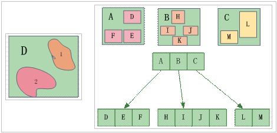
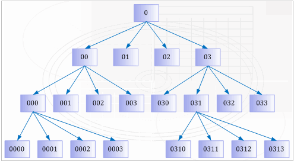
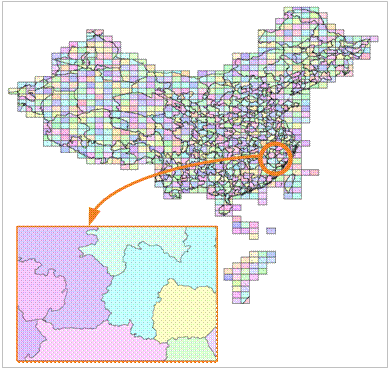
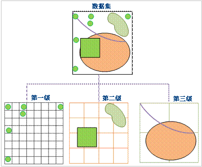
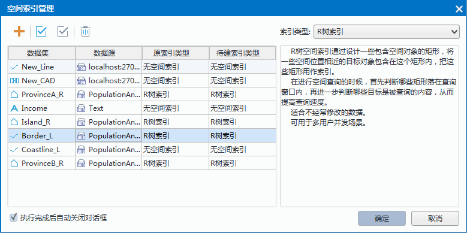

　　随着GIS的发展，GIS的数据量逐渐增大，使得空间数据的访问速度降低，而空间索引就是用来提高数据的空间查询效率的数据结构。  
　　地理信息系统中的空间索引是相对于字段索引而言的。字段索引是数据库系统或者其他计算机系统中提供键值快速定位的数据结构。字段索引提供了对特定键值的数据快速访问的能力。字段索引一般采用B树或者B树的衍生数据结构。由于空间数据特有的位置相关性，传统的字段索引不能满足空间数据快速定位的需求，因此需要空间索引提供位置相关的数据的快速访问能力。  
　　SuperMap 提供了四叉树索引、R 树索引、图库索引和动态索引，并且这几种索引仅适用于矢量数据集。  
　　四叉树采用改良的希尔伯特编码，对空间数据进行编码，采用数据和索引的一体存储方式。R 树索引的数据结构是 B 树在多维空间的扩展，索引查询效率较高，索引数据和空间数据分开存储。图库索引针对分幅数据效果很好，比如国家标准比例尺地形图中按标准图幅分幅的数据，适合于按照图幅编号建立图库索引。动态索引是 SuperMap GIS 针对数据库引擎新开发的索引，极大地发挥了数据库的查询能力。   
　　一个数据集在一种时刻只能使用一种索引，但是索引可以切换，即当对数据集创建完一种索引之后，必须删除旧的索引才能创建新的。数据集处于编辑状态时，系统自动维护当前的索引。特别地，当数据被经过多次编辑后，索引的效率将会受到不同程度的影响，需要重新建立空间索引。　  
　
### 各引擎对空间索引的支持情况   
 
引擎类型 | R 树索引 | 四叉树索引 | 动态索引 | 图库索引  
-|-|-|-|-
UDB|Y（支持所有数据集类型）| N | N | N  
SQLPlus|Y（不包括二三维点和属性表数据集）|Y（不包括二三维点和属性表数据集）|Y（不包括CAD数据集)|Y（不包括路由数据集)
PostgreSQL|Y（不包括二三维点和属性表数据集）| N | N | N
OraclePlus|Y（不包括二三维点和属性表数据集）|Y（不包括二三维点和属性表数据集）|Y（不包括CAD数据集)|Y（不包括路由数据集)  
OracleSpatial| Y（支持所有数据集类型）| N | N | N
KingBase |Y（不包括二三维点和属性表数据集）|Y（不包括二三维点和属性表数据集）|Y（不包括CAD数据集)|Y（不包括路由数据集)  
MySQL | Y（不包括二三维点和属性表数据集）|Y（不包括二三维点和属性表数据集）|Y（不包括CAD数据集)|Y（不包括路由数据集)
DB2 | N |Y（不包括二三维点和属性表数据集）|Y（不包括CAD数据集)| N
BeyonDB |Y（不包括二三维点和属性表数据集）| N | N | N
GBase |Y（不包括二三维点和属性表数据集）|Y（不包括二三维点和属性表数据集）|Y（不包括CAD数据集)|Y（不包括路由数据集)
Altibase |Y（不包括二三维点和属性表数据集）| N | N | N  
HighGoDB|Y（不包括二三维点和属性表数据集）| N | N | N   
SinoDB | N| N | N | Y（不包括二三维点和属性表数据集）    
MongoDB | N| N | N | Y（不包括二三维点和属性表数据集） 

### R树索引　　  
  
　　R树是基于磁盘的索引结构，是B树(一维)在高维空间的自然扩展，易于与现有数据库系统集成，能够支持各种类型的空间查询处理操作，在实践中得到了广泛的应用，是目前最流行的空间索引方法之一。

　　R树空间索引方法是通过设计虚拟的矩形目标，将一些空间位置相近的目标对象，包含在这个矩形内，如下左图所示，把这些矩形作为空间索引，它含有所包含的空间对象的指针。例如，A中包含空间对象D、E、F，B中包含空间对象H、I、J、K，C中包含空间对象L、M。如下右图所示为R树索引的例子。　　

   　　  
  
　　在进行空间检索的时候，首先判断哪些矩形落在检索窗口内，再进一步判断哪些目标是被检索的内容。这样可以提高检索速度。  
  
**特点**   
 
+ R树索引的空间检索效率非常高，检索精度也很高。  
+ R树索引的索引数据和地理数据不存储在一起，且R树索引的更新涉及到R树的平衡和分裂，比较复杂，更新速度较慢，大规模编辑后的查询效率降低，需要重建空间索引，适用于只读数据或者不经常进行空间数据编辑的数据。  
+ R树索引支持文件型数据源和数据库型数据源，具体类型见本页表一。 
  
**适用情况**   
  
+  R树索引比较适合静态数据，例如用作底图的数据和不经常编辑的数据（属性数据的编辑除外）推荐建立R树索引。  
+  支持建立R树索引的引擎类型包括：UDB、SQLPlus、PostgreSQL、OraclePlus、OracleSpatial、KingBase、MySQL、BeyonDB、GBase、Altibase。  
  
**四叉树索引**   
 
四叉树是一种有效的二维空间索引，其基本思路是：把整个工作空间编码为0，用水平线和垂直线划分为将工作空间相等的四部分，各每一部分按顺序分别编码为00、01、02和03，左上角为00，右下角为03；对划分后的格子按照同样的方式继续划分，比如对第00格继续划分，划分后的四个小格子分别编码为000、001、002和003。根据需要，还可以继续划分，比如第031格子继续划分为0310、0311、0312和0313，如下图所示。以此类推，可以一直划分下去，划分的层数取决于研究区域对象的数量和平均大小。   
 
     
    
假设上图所示的对象为整个数据集包含的空间对象，则据此建立的四叉树结构如下图所示：  
 
    
    
**适用情况**  
    
+ 四叉树索引适用于小数据量的高并发编辑。  
+ 支持建立四叉树索引的引擎类型包括：SQLPlus、OraclePlus、KingBase、MySQL、DB2、GBase。

### 图库索引  
  
在 SuperMap SDX + 中根据数据集的某一属性字段或根据给定的一个范围（图幅的长和宽），将空间对象进行分类，通过索引进行管理已分类的空间对象，以此提高查询检索速度。如下图所示为中国市级行政边界图的分幅合成地图，根据给定范围创建图库索引后，显示h4708的场景。图库索引在海量数据（即对象数超过百万个的数据）的显示和查询时优势尤其明显。建立图库索引后，在显示的时候，只显示你需要查看的那一幅或几幅地图，大大缩短显示时间。  
 
     
  
图库索引还可以被缓存到本地（以二进制文件形式体现），这样可更进一步提高查询检索的速度。文件缓存是 SuperMap SDX+ 为均衡网络和服务器负载、提高应用整体性能而提供的智能分布式存储方案。开启文件缓存选项后，应用程序在访问存储在空间数据库中的数据时，会首先检查本地缓存库中是否已经有相应数据的最新版本，如果没有相应的缓存数据或是缓存数据不是最新版本，则从服务器端读取数据并更新本地缓存数据，这样下次访问的时候就可以直接读取本地缓存数据；如果本地缓存中已经有了相应数据的最新版本，则不必通过网络向服务器请求数据，而是直接读取本地缓存数据来完成显示或分析的功能。通过这种解决方案，可以大幅降低数据库服务器负载和网络负载，从而大幅提高应用程序的整体性能。    
  
**适用情况**  
  
对于按标准比例尺分幅存储(如1:25万数据、1:10万数据、1:5万数据等)的数据合并到数据库中后生成的数据集，图库索引有着优异的效果，可以提供非常好的查询性能，与 SuperMap 提供的缓存选项搭配使用可以达到更好的地图浏览速度。  
  
**备注**   
 
+ 建立图库索引的算法根据数据量大小不同，建立索引耗时可减少4-10倍，对于记录数较多(大于5万)的数据集要建图库索引的话建议使用5.3及以后的版本来建立。  
+ 图库索引目前仅支持的是数据库型数据源中的点、线、面、文本和 CAD 数据集。   
+ 支持建立图库索引的引擎类型包括：SQLPlus、OraclePlus、KingBase、MySQL、GBase。   
   
### 动态索引      
  
采用划分多层网格的方式来组织管理数据。动态索引的基本方法是将数据集按照一定的规则划分成相等或不相等的网格，记录每一个地理对象所占的网格位置。在GIS中常用的是规则网格。当用户进行空间查询时，首先计算出用户查询对象所在的网格，通过该网格快速查询所选地理对象。可以优化查询操作。如图所示:  
 
     
  
当前版本中，定义网格的索引为一级，二级和三级。每一级都有各自的划分规则，第一级的网格最小，50%以上的数据都会落在第一级网格里，第二级和第三级的网格要相应得比前一级大。  
  
**特点**  
  
+ 当数据集在进行浏览操作的时候，动态索引方式的速度会比较快；  
+ 索引更新和并发的能力好；   
+ 索引的空间检索准确度高。   
+ 索引类型支持数据集的动态并发编辑，支持数据库型数据源。  
  
**适用情况**    

动态索引它结合了R 树索引与四叉树索引的优点，提供非常好的并发编辑支持，具有很好的普适性，为当前版本及以后版本中建立空间索引的默认类型。若不能确定数据适用于哪种空间索引，推荐建立动态索引。  
  
**备注**  
  
+ 支持建立动态索引的引擎类型包括：SQLPlus 和 OraclePlus。  
+ 建立动态索引后，用户可以按图幅进行本地缓存，可以大大提高查询和浏览的速度，对于GB级数据的影响尤其明显。对于分图幅存储的数据，如国家基本比例尺地形图，可以按照图幅大小建立动态索引。    
  
### 空间索引管理  
  
“空间索引”按钮，用来管理当前工作空间管理器中被选中的数据集的空间索引，包括查看数据集的空间索引信息和为数据集建立空间索引等功能。   
  
**操作步骤**  
  
1. 在工作空间管理器中，选中要查看空间索引信息或者要建立空间索引的数据集，可以配合使用 Shift 键或者 Ctrl 键同时选中多个数据集。  
2. 在“开始”选项卡的“数据处理”组中，单击“空间索引”按钮，弹出“管理空间索引”对话框，如下图所示，对话框中每一条记录对应一个数据集的信息。     
  

     
   
+ **原索引类型**：显示矢量数据集当前的空间索引类型。  
+ **待建索引类型**：如果想为数据集重新建立空间索引，可以通过该列指定重新建立的空间索引类型，该项默认值等于数据集的“原索引类型”值，应用系统在为数据集重新建立空间索引时将依据“待建索引类型”列的值，为相应的数据集重建指定类型的空间索引。  
+ **索引类型**：对话框的右侧区域中，“索引类型”组合框与左侧表格中某条选中记录的“待建索引类型”项的值关联绑定，即两者同步变化；如果左侧表格中没有选中的记录或者有多条选中的记录，“索引类型”组合框中内有任何显示内容。 “索引类型”组合框下方，将显示“索引类型”组合框中当前显示的空间索引类型的描述信息。  
  
当索引类型为“图库索引”时，该类型索引需设置字段索引或范围索引参数，具体说明如下：  
 
+ 字段索引：表示根据数据集某一指定字段的字段值，将数据集中的空间对象进行分类，建立图库索引。   
+ 范围索引：表示根据指定的宽度和高度将数据集划分为多个单元，再在此基础上建立索引，范围的宽度和高度单位与数据集单位一致。   
  
当索引类型为“动态索引”时，该类型索引需设置字段索引或范围索引参数，具体说明如下：  
  
+  基准点：设置网格索引的中心点。一般为数据集的中心点。  
+  第一层格网宽度：设置动态索引的第一层网格的大小。此参数不能为 0。单位与数据集的单位一致。  
+  第二层格网宽度：设置动态索引的第二级索引网格的大小。单位与数据集的单位一致。   
+  第三层格网宽度：设置动态索引的第三级索引网格的大小。单位与数据集的单位一致。   
+  注意：支持建立动态索引的引擎类型包括：SQLPlus、OraclePlus、DB2、MySQL。    
  
3. 单击对话框中的“确定”按钮，应用程序将根据对话框中的“待建索引类型”列的值，重建对话框中所有的数据集的空间索引。 

  
### 重建空间索引  
  
“重建空间索引”命令，用来对该数据集重新建立空间索引。一个数据集在一种时刻只能使用一种索引，但是索引可以切换。例如，数据集在前期进行的编辑操作比较多，可以对数据集创建动态索引，在编辑结束后，只用来静态的展示，就可以将空间索引重建为R树索引。  

数据集处于编辑状态时，系统自动维护当前的索引。特别地，当数据被经过多次编辑后，索引的效率将会受到不同程度的影响，需要重新建立空间索引。    
  
**操作步骤**  
  
1. 右键单击选中工作空间管理器中的一个矢量数据集结点，在弹出右键菜单中选择“重建空间索引”命令，弹出“空间索引管理”窗口。   
2. “待建索引类型”中，选择合适的空间索引类型，对数据集进行重建空间索引的操作。 

  

 

 

 
  
  

  

    
  

    
 

     
    

 
　　  

 

  

