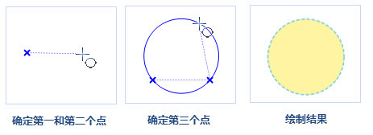
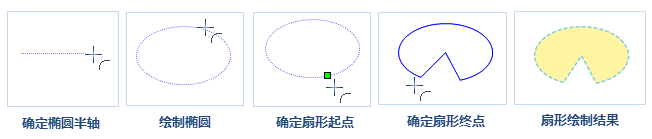

面对象的绘制常应用于数字化、宗地图、地理国情普查等相关数据生产中，面对象包括多边形、圆、扇形等，具体绘制如下所述：

### 绘制矩形

   1.  在“**对象操作**”菜单中，选择“**多边形**”子菜单中的“**矩形**”选项，出现矩形光标。
   2.  将鼠标移动到地图上，确定矩形的起始位置，移动鼠标地图窗口中会实时显示矩形，在合适位置再次单击鼠标左键即可完成矩形绘制。

    **注意**：如此时按住 Shift 键，将得到宽度和高度相等的正方形。

   3.  单击鼠标右键可取消当前绘制操作。

### 绘制圆角矩形

1.  在“**对象操作**”菜单中，选择“**多边形**”子菜单中的“**圆角矩形**”选项，出现圆角矩形的光标。
2.  将鼠标移动到地图窗口中，确定圆角矩形的起始位置。移动鼠标，在地图窗口中会实时显示矩形，在合适位置再次单击鼠标左键确定矩形的长度和宽度。

   **注意**：如此时按住 Shift 键，将得到宽度和高度相等的正方形。

3.  移动鼠标，可以看到圆角矩形的四个角弧度随之发生变化，确定圆角半径后单击鼠标即可完成圆角矩形的绘制。
4.  单击鼠标右键可取消当前绘制操作。

　　

### 绘制平行四边形

   1.  在“**对象操作**”菜单中，选择“**多边形**”子菜单中的“**平行四边形**”选项，出现平行四边形光标。
   2.  将鼠标移动到地图窗口中，确定平行四边形一个顶点的位置。
   3.  移动鼠标确定第二个控制点的的位置，即确定平行四边形一条边的长度和方向。
   4.  移动鼠标地图中会根据鼠标所在位置实时显示平行四边形的预览效果，再次单击鼠标左键确定平行四边形第三个控制点的位置，此时平行四边形绘制完毕。
   5.  单击鼠标右键可取消当前绘制操作。
   

### 绘制多边形

   1. 在“**对象操作**”菜单中，选择“**多边形**”子菜单中的“多边形”选项，出现多边形光标。 
   2. 将鼠标移动到地图窗口中，确定多边形的起始位置，再次移动鼠标并依次确定多边形其它节点的位置，可绘制任意形状的多边形。
   3. 单击鼠标右键，闭合多边形，结束当前绘制操作。 

### 绘制园

可以使用多种方法创建圆。可以通过指定圆心、半径、直径、圆周上的点等方式实现。应用程序提供了5种绘制圆的方式。默认绘制方式是指定圆心和半径。

**通过圆心和半径绘制圆**

1.  在“**对象操作**”菜单中，选择“**椭圆**”子菜单中的“**圆心圆**”选项，出现圆心圆光标。
2.  将鼠标移动到地图窗口中，在合适位置单击鼠标左键确定圆心。
3.  再次移动鼠标并确定圆的半径，完成圆的绘制。

**通过圆周上两点绘制圆**

1.  在“**对象操作**”菜单中，选择“**椭圆**”子菜单中的“**两点圆**”选项，此时出现圆光标。
2.  将鼠标移动到地图窗口中，在适当的位置单击鼠标确定圆周上的一个点，即直径的起点。
3.  移动鼠标，根据鼠标所在位置地图上会实时显示圆的预览效果，以圆周上这两点之间的距离作为圆的直径，确定圆周上另外一个点的位置，即直径的长度和方向，单击鼠标左键即可完成圆的绘制。

**通过圆周上三点绘制圆**

1.  在“**对象操作**”菜单中，选择“**椭圆**”子菜单中的“**三点**”选项，此时出现三点圆光标。
2.  将鼠标移动到地图窗口中，确定圆上第一个点的位置。
3.  继续移动鼠标，确认圆上第二个和第三个点的位置，根据三个点绘制的圆为三个点确定的三角形外接圆。

　　

### 绘制椭圆

**绘制矩形内切的椭圆**

1.  在“**对象操作**”菜单中，选择“**椭圆**”子菜单中的“**椭圆**”选项，出现椭圆光标。
2.  该选项通过外接矩形来绘制椭圆，将鼠标移动到地图窗口中，在合适位置单击鼠标左键确定椭圆外接矩形的起始点。
3.  移动鼠标，可以看到蓝色的临时椭圆随着鼠标的移动大小发生变化，再次单击鼠标左键即可确定椭圆的位置。

   **注意**：此时如按住 Shift 键，将得到矩形宽度和高度相等的正圆。

4.  单击鼠标右键取消当前绘制操作。

**绘制斜椭圆**

1.  在“**对象操作**”菜单中，选择“**椭圆**”子菜单中的“**斜椭圆**”选项，此时出现椭圆光标。
2.  该选项通过长半轴和短半轴来绘制椭圆，确定斜椭圆一个半轴（长半轴或者短半轴）的起始位置。
3.  移动鼠标，确定斜椭圆一个半轴的长度和方向，继续移动鼠标，根据鼠标所在位置确定另外一个半轴的长度，地图窗口中会实时显示斜椭圆，在合适位置单击鼠标左键即可完成斜椭圆的绘制。
5.  单击鼠标右键取消当前绘制操作。

### 绘制扇形

绘制的扇形对象是（椭）圆对象的一部分，所以在绘制扇形对象之前，需要首先绘制一个（椭）圆对象。

**椭圆扇形**

1.  在“**对象操作**”菜单中，选择“**椭圆**”子菜单中的“**扇形**”命令，出现扇形光标。
2.  将鼠标移动到地图窗口中，通过确定长半轴和短半轴的方式绘制椭圆，移动鼠标确定椭圆的起始位置。
3.  继续移动鼠标，确定斜椭圆一个半轴，再确定椭圆另外一个半轴的长度，单击鼠标完成斜椭圆的绘制。
4.  在椭圆上确定扇形的的起始角度，移动鼠标，地图上会根据鼠标位置实时显示椭圆扇形的大小，单击鼠标确定扇形的大小即可完成椭圆扇形的绘制。
5.  单击鼠标右键取消当前绘制操作。

　　

