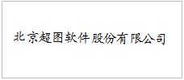
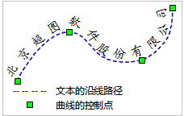

　　文本绘制提供了两种操作方式，一种是绘制普通文本，一种是绘制沿线标注文本，文本绘制适用于可编辑的文本图层或复合图层。

### 绘制普通文本

　　在工具栏中单击“**文本**”下拉按钮，选择“文本”选项，将鼠标移至地图上出现普通文本光标，在地图上需要添加文本的位置单击鼠标左键，输入文本，按下 Enter 键可另起一行继续输入文本。

　　

### 绘制沿线标注

　　绘制沿线标注即沿着某一条曲线创建文本。具体操作步骤如下：
1. 在工具栏中单击“**文本**”下拉按钮，选择“沿线文本”选项。
2. 在地图上单击鼠标左键，确定沿线标注文本的起始点，然后按照绘制曲线的方式绘制文本的沿线路径，单击鼠标右键完成沿线路径绘制，在弹出的“沿线注记”对话框中输入沿线标注文本内容。
3. 点击“确定”按钮，完成绘制沿线标注文本操作。结果示例如下图所示：

　　

### 备注

- 结束文本绘制有以下两种方式：
    -   在地图窗口中任意非文本框所在区域单击鼠标右键。
    -   或者再次点击“对象操作”选项卡的“对象绘制”组中的文本绘制按钮。

- 沿线文本是由若干个子文本对象组成的，其中单个汉字、连续字母、连续数字都被看作是一个子文本对象，空格占字符位但不计为子对象，主要用来分开连续的字符或数字。例如“中国北京BeiJing　China”有六个子对象，分别为中、国、北、京、BeiJing、China，字符　BeiJing 和 China　之间就是使用空格隔开的。如果输入连续的字母或者数字，则会视为单个子对象，不会对其进行沿线标注。如需要达到沿线标注的效果，请在适当的位置使用空格进行分割。可以在对象“属性”对话框的文本信息选项卡中查看/修改每一个子对象的内容。
-  沿线文本走向为曲线方向，因此创建沿线文本时，要注意所绘制的曲线的方向。

