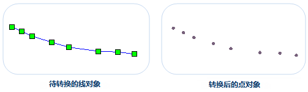
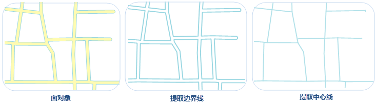

### 线对象转点对象

　　将选中线对象转换成点对象，并保存在点数据集或CAD数据集中。线对象转换成点对象时，会将线对象中的所有节点直接保存为点对象，如下图所示，左图为待转换的线对象，右图为转换后保存在点或 CAD 数据集中的点对象。

  

**操作步骤**

1.  在当前地图窗口中选中一个或多个待转换为点的线对象，在“**对象操作**”菜单或工具栏中，选择“**类型转换**”中的“**线转点**”选项，弹出“线转点”对话框。
2. 在对话框中选择存放新生成点对象的目标数据源与数据集，结果数据的保存方式有两种：保存到已有的数据集或新建一个点数据集来保存。
    -  保存到已有数据集：在“目标数据集”处选择已有的点数据集或 CAD 数据集，用于存放新生成点对象。
    -  保存到新建数据集：勾选“新建数据集”复选框，设置新建数据集的名称，将新生成的点对象保存到新建点数据集中。
    
3. 若选中线对象所在图层为可编辑状态，则可勾选“删除源对象”复选框，在源数据集中将选中对象删除。

4. 单击“确定”按钮，完成线对象转换为点对象的操作。

### 线转面

- 将选中线对象转换成面对象，并保存在面数据集或CAD数据集中。

- 线对象转换成面对象时，闭合线对象转换为面对象的边界；未闭合的线对象则会首尾相连之后，转换为面对象的边界。如下图所示，图1
是将闭合线对象转换为面对象，图2 是将非闭合线对象转换为面对象。

  

**操作步骤**

1.  在当前地图窗口中选中一个或多个待转换为面的线对象，在“**对象操作**”菜单或工具栏中，选择“**类型转换**”中的“**线转面**”选项，弹出“线转面”对话框。
2.  在对话框中选择存放新生成面对象的目标数据源与数据集，结果数据的保存方式有两种：保存到已有的数据集或新建一个面数据集来保存。

    - 保存到已有数据集：在“目标数据集”下拉选项中选择已存在的面或CAD数据集，用于存放新生成的面对象。
    - 保存到新建数据集：勾选“新建数据集”复选框，设置新建数据集的名称，将新生成的面对象保存到新建面数据集中。

3. 若选中线对象所在图层为可编辑状态，则可勾选“删除源对象”复选框，在源数据集中将选中的面对象删除。

4.  单击“确定”按钮，完成线对象转换为面对象操作。

**注意事项**

1.  一个线对象生成一个面对象，组合的线对象生成组合的面对象。
2.  直线不能转换为面对象，若选择的线对象中有直线，则输出窗口会提示直线对象转换失败。

### 面转线

　　面对象转线对象功能，支持将选中面对象的边界线或中心线转换成线对象，并保存在线数据集或CAD数据集中。面对象转换成线对象时，支持轮廓线和中心线两种方式的转换，具体说明如下：

- 提取边界线：是指将面对象的边界线转为线对象。 
- 提取中心线：是指将面对象的中心线转为线对象。选择提取中心线方式时，需设置最大宽度和最小宽度值，面对象宽度在最大最小宽度值之间的提取其中心线，面对象宽度小于最小宽度则不提取中心线，面对象宽度大于最大宽度时提取边界线。

　　

　　面提取边界线可应用于提取湖泊、道路、河流等对象的边界线；面提取中心线适用于提取道路面的中心线，**注意**：对于道路中比较复杂的交叉路口，如立交桥、五叉六叉等情况，提取的结果可能不理想。

**面提取边界线**

1. 在当前地图窗口的可选择图层中，选中一个或多个面对象。
2. 根据用户需要可在“**对象操作**”菜单或工具栏中，选择“**类型转换**”中的“**面提取边界线**”选项。
3. 在弹出的“面提取边界线”对话框中设置目标对象所要保存到的数据集，可保存到已有的线或CAD数据集中，或勾选“新建数据集”复选框，设置数据集名称，将结果对象保存在新建的线数据集中。
4. 若选中对象所在图层开启可编辑，可勾选“删除源对象”复选框，将选中的面对象删除。
5. 单击“确定”按钮即可执行提取边界线操作。

**面提取中心线**

1. 在当前地图窗口的可选择图层中，选中一个或多个面对象。
2. 根据用户需要可在“**对象操作**”菜单或工具栏中，选择“**类型转换**”中的“**面提取中心线”**选项。
3. 提取中心线的结果将保持在新建的线数据集中，在弹出的“面提取边界线”对话框中，设置“目标数据集”名称。
4. 面对象边界线间最大、最小宽度的设置会影响结果数据的准确性，用户需准确输入最大、最小宽度值，具体说明如下：

 - 最大宽度：需提取中心线的面对象边界线之间最大宽度值（大于0）。当面对象边界线之间距离大于最大宽度时，提取该处边界线，默认值为30，单位与源数据集相同，最大宽度应大于最小宽度。用户可通过“地图”选项卡“量算”组中的“距离”选项，量算面对象的最大宽度。 

   **建议**：设置的最大宽度可略大于实际量算的距离，这样提取的结果会更准确。

 - 最小宽度：需提取中心线的面对象边界线之间的最小宽度值（大于或等于0），当面对象边界线之间距离小于最小宽度时，不提取该处中心线，默认值为0，单位与源数据集相同，最小宽度应小于最大宽度。

  **注意**：面对象宽度在最大和最小宽度之间时会提取其中心线；面对象宽度小于最小宽度时不提取中心线；面对象宽度大于最大宽度时提取其边界线。

5. 单击“确定”按钮即可执行提取中心线操作。
