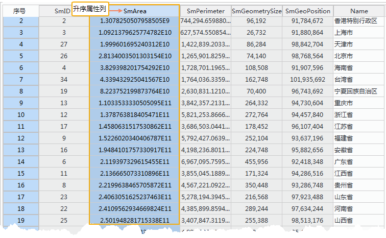
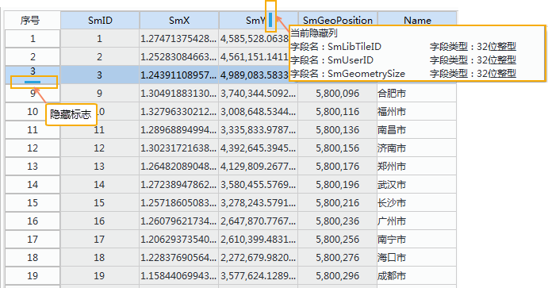

　　用户可通过属性表查看矢量数据集或纯属性数据集的属性表。并通过“属性表”选项卡功能对属性信息进行浏览、编辑和统计分析。  
“属性表”选项卡是上下文选项卡，其与矢量数据集的属性表或纯属性数据集进行绑定，只有应用程序中当前活动的窗口为矢量数据集的属性表或为纯属性数据集时，该选项卡才会出现在功能区上。
  
“属性表”选项卡的“浏览”组，组织了浏览矢量数据集的属性表以及纯属性数据集的功能，分别对应该组中的“升序”按钮、“降序”按钮、“隐藏列/行”按钮、“取消隐藏列、行”按钮、“定位”按钮。下面详细介绍如何通过这些按钮实现属性表以及纯属性数据集的浏览操作。  
  
### 升序/降序  
  
“升序/降序”按钮，用来对属性表中的记录按照选中的列的值进行升序或降序排序。  
  
**操作方式**  
  
1. 在工作空间管理器中，右键点击某个矢量数据集，在弹出的右键菜单中选择“浏览属性表”，或双击纯属性表数据集。  
2. 在打开的属性表中，单击升序或降序排列的属性列的字段名称来整列选中该列，单击“升序”按钮或“降序”，即可按所选字段中的值的升序/降序序列排列属性表中的记录；也可在选中排序属性列右键，选择“升序”或“降序"按钮。  
  
     

**注意事项**   
 
+  若同时选中了多个属性列（配置 Ctrl 或 Shift 键），系统默认会按照所选中字段中最靠前（即所有选中属性列的最左边）的字段的属性值进行升序/降序排列。  
+  只有在当前属性表中有选中的列时，“升序”和“降序”按钮才可用。   
+  一旦对属性表进行排序后，无法取消排序操作。  

### 隐藏列/隐藏行  
  
隐藏列、隐藏行按钮，用来隐藏属性表中选中的列或选中的行。 

  
**操作方式**  
  
1. 在打开的属性表中，选中需要隐藏的一个或多个列或者行，通过点击相应的字段名称，或配合使用 Shift 或 Ctrl 键点击多个字段名称，即可选中相应字段的整列数据。 
  
2. 单击“隐藏列/隐藏行”按钮。 选中的列或行将不再显示在属性表窗口中，同时在被隐藏列的左侧第一列的字段名称右侧（或序号行的下侧）出现隐藏列/行的标志。     
3. 当鼠标移动到隐藏列/行的标志时，弹出隐藏列/行的提示框信息。
  
     

**注意事项**   
 
+  只有在当前属性表中有选中的列/行时，“隐藏列”或“隐藏行”按钮才可用。  
+  隐藏列/行操作并不会删除被隐藏的属性列/行，只是让数据暂时不可视，可以使用“取消隐藏”按钮显示隐藏的属性列/行。   
+  关闭属性表后再次打开，将不会保留前一次的隐藏行或隐藏列操作，会显示属性表中所有的行、列信息。
   
### 取消隐藏列/取消隐藏行  
  
取消隐藏列、取消隐藏行按钮，用来显示属性表中被隐藏列或行。 

  
**操作方式**  
  
1. 在有隐藏列/行的属性表中，根据隐藏标志的位置（隐藏标志的相关内容参见“隐藏列/行”按钮）：   
  +  可选择隐藏列的前一列，单击“取消隐藏列”按钮，显示被选择列后的所有被隐藏列。 也可以选择隐藏列的前一列和后一列，单击“取消隐藏列”按钮后，显示被选择的两个列之间的被隐藏列。   
  +  可选择隐藏行的前一行，单击“取消隐藏行”按钮，显示被选择行后的所有被隐藏行。 也可以选择隐藏列的前一行和后一行，单击“取消隐藏行”按钮后，显示被选择的两个行之间的被隐藏行。   
  +  若当前属性表中无可选择的列/行，则说明所有属性列/行都被隐藏，则单击“取消隐藏列/取消隐藏行”按钮后，显示所有隐藏列/行。 
   
2. 隐藏标志对应的隐藏列/行显示后，隐藏标志消失。 
 

  
     

**注意事项**   
 
+  只有在当前属性表中有选中的列/行时，“隐藏列”或“隐藏行”按钮才可用。  
+  隐藏列/行操作并不会删除被隐藏的属性列/行，只是让数据暂时不可视，可以使用“取消隐藏”按钮显示隐藏的属性列/行。   
+  关闭属性表后再次打开，将不会保留前一次的隐藏行或隐藏列操作，会显示属性表中所有的行、列信息。

### 定位 
  
属性表中的“定位”功能，用来在当前打开的属性表中定位到某一行或首末行。 

  
**操作方式**  
  
1. 在“属性表”选项卡的“浏览”组中，单击“定位”下拉按钮，选择“定位”，或直接单击“定位”按钮，弹出的“定位到”对话框中，显示出了当前光标所确定的属性行的位置，同时，根据当前位置，系统自动计算了可设置的相对位置和绝对位置的数值范围。 用户可以通过相对位置、绝对位置和定位条件三种设置方式的任一种，定位到目标记录位置。 具体使用相对位置、绝对位置还是定位条件来进行定位，用户可以通过选择相应方式的单选框来指定定位的方式。  
  + 相对位置： 输入要定位的目标记录距离当前记录的行数。可用正值或负值表示目标记录距离当前记录的前后位置，正值表示，目标记录在当前记录前面，距离其一定行数的位置；负值表示，目标记录在当前记录后面，距离其一定行数的位置。   
  + 绝对位置：不考虑当前记录的位置，输入需要定位的目标记录在整个属性表中所在行号。    
   
          
    
2. 点击“定位”按钮，即可根据所设置的定位条件定位到目标记录处。   
3. 在“属性表”选项卡的“浏览”组中，单击“定位”下拉按钮，选择“定位到首行”，即可定位并选中当前属性表首行。   
4. 在“属性表”选项卡的“浏览”组中，单击“定位”下拉按钮，选择“定位到末行”，即可定位并选中当前属性表末行。 

**注意事项**   
 
+  “定位到”对话框中，当前位置、相对位置和绝对位置都是由当前属性表行数的实际值确定，与各属性字段没有联系。   
+  定位到某一行后，可通过按键盘中的上、下键进行重新定位。   
+  在Oracle和SQL数据源中，不支持使用两个二进制字段相等作为查询条件进行定位。 

