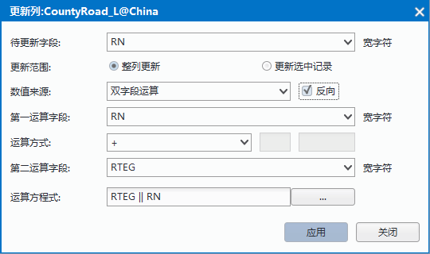
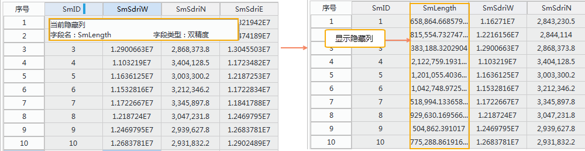

　　“属性表”选项卡的“编辑”组，组织了对矢量数据集的属性表和纯属性数据集的数据进行编辑的功能，可以对属性表中的行和列数据进行整体和批量更新。

### 删除行  
  
“删除行”选项，用于删除矢量数据集的属性表或纯属性数据集中选中的一行或多行属性记录。
  
**操作方式**  
  
1. 打开需要进行删除行操作的属性表，可以是矢量数据集属性表，也可以是纯属性数据集。   
2. 选中矢量数据集的属性表或纯属性数据集中的一行或多行属性记录，或选中要删除行中的单元格。   
3. 单击右键，选择“删除行”选项，或单击“属性表”选项卡“编辑”组中“删除行按钮，弹出对话框提示“被选择的记录一旦被删除是无法恢复的，是否继续”。  
4. 点击“是”，即可删除选中行或选中的单元格对应行的属性记录。 
  
**注意事项**    
    
+ 使用“删除行”按钮删除矢量数据集的属性表中的属性记录，被删除的记录对应的几何对象也会被一并删除，所以“删除行”按钮要慎用。   
+ 只有矢量数据集或纯属性数据集为非只读状态，“删除行”选项才可用，否则该选项会一直显示灰色，即为不可用状态。 

  
### 添加行
  
“添加行”按钮，用于在纯属性数据集中添加属性记录。“添加行”按钮只有在当前属性表窗口中是纯属性数据集时，才为可用状态。

**操作方式**   
  
1. 打开需要进行添加行操作的纯属性数据集，可在工作空间管理器中，右键点击要打开的纯属性数据集，在弹出的右键菜单中选择“浏览属性表”，或双击纯属性数据集，打开属性数据集。  
2. 点击“添加行”按钮，即可在当前纯属性数据集最后添加一行空的属性记录。 
  
**注意事项**   
 
+ 若打开矢量数据集的属性表，“添加行”按钮显示灰色，即为不可用状态。   
+ 只有纯属性数据集为非只读状态，“添加行”按钮才可用，否则该按钮会一直显示为灰色，即为不可用状态。 

  
#### 更新列 
  
“更新列”选项，可以实现快速地按一定的条件或规则统一修改当前属性表中多条记录或全部记录的指定属性字段的值，方便用户对属性表数据的录入和修改。

  
  
**操作方式**  
  
1. 打开要进行更新的属性表，可以是矢量数据集属性表，也可以是纯属性数据集。   
2. 若需更新选中的单元格内容，则需先在属性表中选中待更新的单元格，单击“属性表”选项卡中的“更新列”按钮，或单击鼠标右键，在右键菜单中选择“更新列”选项，即可弹出“更新列”对话框，如下图所示： 更新方式，需先选中要进行更新的单元格。     
     
3. 确定更新范围：更新范围提供了整列更新、更新选中记录两种更新方式：   
  + 整列更新：表示对指定的待更新字段中的所有字段值进行更新；   
  + 更新选中记录：表示更新指定的待更新字段中的选中记录，即对属性表中所有选中的单元格的值按照指定的规则进行更新。   
    
4. 数值来源：用来指定用于更新属性表字段值的值来源，分为：统一赋值、单字段运算、双字段运算以及函数运算具体说明请参见表格：  
数值来源|描述  
-|-  
统一赋值|通过指定一个值，在指定的更新范围内的单元格的值都将更新为这个值。
单字段运算 |构建某个指定的字段（“更新列”对话框中“运算字段”所指定的字段）与指定值（“更新列”对话框中“运算因子”所指定的值）的简单数学表达式，例如： SmID + 100，来更新属性表中指定的更新范围内的单元格的值。
在指定的更新范围内，对某个待更新单元格所在的记录而言，取出指定的字段（运算字段）的属性值和用户指定的值（运算因子）、运算方式，构建运算方程式进行运算，返回的值就是待更新单元格更新后的值。
双字段运算|基于指定的两个字段（“更新列”对话框中“第一运算字段”和“第二运算字段”所指定的字段），以及指定的运算方式，构建字段的简单数学表达式，例如： SmID + SmUserID，来更新属性表中指定的更新范围内的单元格的值。在指定的更新范围内，对某个待更新单元格所在的记录而言，取出指定的两个字段（第一、第二运算字段）的属性值和用户指定的运算方式，构建运算方程式进行运算，返回的值就是待更新单元格更新后的值。
函数运算|基于指定的字段（“更新列”对话框中“运算字段”所指定的字段），按照用户指定的函数规则（“更新列”对话框中“运算函数”）构建字段的函数表达式，例如：Abs(SmID)，来更新属性表中指定的更新范围内的单元格的值。在指定的更新范围内，对某个待更新单元格所在的记录而言，取出指定的字段（运算字段）的属性值和用户指定的运算函数，构建函数表达式进行运算，返回的值就是待更新单元格更新后的值  
     
5. 反向： 当数值来源为单字段运算或者双字段运算时，勾选该复选框后，可以交换表达式中运算符两侧的参数位置，然后再进行表达式的运算。  
6. 运算字段：当数值来源为单字段运算或者函数运算时，运算字段用来指定用于构建数学表达式或函数表达式的字段。  
7. 第一运算字段、第二运算字段:当数值来源为双字段运算时，用来指定参与构建运算表达式的两个字段。  
8. 运算方式：当数值来源为单字段运算或者双字段运算时，运算方式用来指定单字段与运算因子间或者双字段间的运算法则，可以为：加、减、乘、除、取模。    
运算方式|描述
-|- 
＋（加）|对数值型参数而言，就是把两个数值相加，返回一个数值；对字符型参数而言，就是把两个字符连接起来，其中前面的参数在新的字符前面，字符型参数之间只有“＋”运算。  
－（减）|只有数值型参数才有此运算方式，运算符前面的数值减去运算符后面的数值。  
×（乘）|只有数值型参数才有此运算方式，运算符前面的数值乘以运算符后面的数值。  
/ （除）|只有数值型参数才有此运算方式，运算符前面的数值除以运算符后面的数值，当除数为零时，不能进行该运算，返回被除数的值。  
％（取模）|只有数值型参数才有此运算方式，运算符前面的数值除以运算符后面的数值，返回余数值。当除数为零时，不能进行该运算，返回被除数的值。
  
 
9. 运算函数：当数值来源为函数运算时，用来指定运算的函数。   
  
  + 当数值来源为函数运算时，“运算函数”右侧两个文本框可用来指定函数的其他参数信息。具体说明请参见运算函数页面。  
  + 当预置的函数不够用时，用户可以点击下拉列表中的“更多”项，在弹出的SQL表达式中编辑自定义的表达式。 
10.  运算方程式：用来显示和编辑需要构建的运算表达式。单击组合框右侧的按钮，即可弹出“SQL表达式”对话框，可在弹出的对话框中构建字段表达式，或在“运算方程式”文本框中直接输入字段表达式，SQL表达式的具体说明请参见SQL表达式对话框页面。在指定的更新范围内，对某个待更新单元格所在的记录而言，根据用户构建的 SQL 表达式进行运算，返回的值就是待更新单元格更新后的值。  
11.  设置好以上参数后单击“应用”按钮，即可根据设置的运算方程式，执行更新属性表中待更新的单元格值的操作。    
  
### 撤销/重做 
  
隐藏列、隐藏行按钮，用来隐藏属性表中选中的列或选中的行。 

  
**操作方式**  
  
1. 在打开的属性表中，选中需要隐藏的一个或多个列或者行，通过点击相应的字段名称，或配合使用 Shift 或 Ctrl 键点击多个字段名称，即可选中相应字段的整列数据。 
  
2. 单击“隐藏列/隐藏行”按钮。 选中的列或行将不再显示在属性表窗口中，同时在被隐藏列的左侧第一列的字段名称右侧（或序号行的下侧）出现隐藏列/行的标志。     
3. 当鼠标移动到隐藏列/行的标志时，弹出隐藏列/行的提示框信息。
  
     

**注意事项**   
 
+  只有在当前属性表中有选中的列/行时，“隐藏列”或“隐藏行”按钮才可用。  
+  隐藏列/行操作并不会删除被隐藏的属性列/行，只是让数据暂时不可视，可以使用“取消隐藏”按钮显示隐藏的属性列/行。   
+  关闭属性表后再次打开，将不会保留前一次的隐藏行或隐藏列操作，会显示属性表中所有的行、列信息。
   
#### 取消隐藏列/取消隐藏行  
  
取消隐藏列、取消隐藏行按钮，用来显示属性表中被隐藏列或行。 

  
**操作方式**  
  
1. 在有隐藏列/行的属性表中，根据隐藏标志的位置（隐藏标志的相关内容参见“隐藏列/行”按钮）：   
  +  可选择隐藏列的前一列，单击“取消隐藏列”按钮，显示被选择列后的所有被隐藏列。 也可以选择隐藏列的前一列和后一列，单击“取消隐藏列”按钮后，显示被选择的两个列之间的被隐藏列。   
  +  可选择隐藏行的前一行，单击“取消隐藏行”按钮，显示被选择行后的所有被隐藏行。 也可以选择隐藏列的前一行和后一行，单击“取消隐藏行”按钮后，显示被选择的两个行之间的被隐藏行。   
  +  若当前属性表中无可选择的列/行，则说明所有属性列/行都被隐藏，则单击“取消隐藏列/取消隐藏行”按钮后，显示所有隐藏列/行。 
   
2. 隐藏标志对应的隐藏列/行显示后，隐藏标志消失。 
 

  
     

**注意事项**   
 
+  只有在当前属性表中有选中的列/行时，“隐藏列”或“隐藏行”按钮才可用。  
+  隐藏列/行操作并不会删除被隐藏的属性列/行，只是让数据暂时不可视，可以使用“取消隐藏”按钮显示隐藏的属性列/行。   
+  关闭属性表后再次打开，将不会保留前一次的隐藏行或隐藏列操作，会显示属性表中所有的行、列信息。

#### 取消隐藏列/取消隐藏行  
  
取消隐藏列、取消隐藏行按钮，用来显示属性表中被隐藏列或行。 

  
**操作方式**  
  
1. 在有隐藏列/行的属性表中，根据隐藏标志的位置（隐藏标志的相关内容参见“隐藏列/行”按钮）：   
  +  可选择隐藏列的前一列，单击“取消隐藏列”按钮，显示被选择列后的所有被隐藏列。 也可以选择隐藏列的前一列和后一列，单击“取消隐藏列”按钮后，显示被选择的两个列之间的被隐藏列。   
  +  可选择隐藏行的前一行，单击“取消隐藏行”按钮，显示被选择行后的所有被隐藏行。 也可以选择隐藏列的前一行和后一行，单击“取消隐藏行”按钮后，显示被选择的两个行之间的被隐藏行。   
  +  若当前属性表中无可选择的列/行，则说明所有属性列/行都被隐藏，则单击“取消隐藏列/取消隐藏行”按钮后，显示所有隐藏列/行。 
   
2. 隐藏标志对应的隐藏列/行显示后，隐藏标志消失。 
 

  
     

**注意事项**   
 
+  只有在当前属性表中有选中的列/行时，“隐藏列”或“隐藏行”按钮才可用。  
+  隐藏列/行操作并不会删除被隐藏的属性列/行，只是让数据暂时不可视，可以使用“取消隐藏”按钮显示隐藏的属性列/行。   
+  关闭属性表后再次打开，将不会保留前一次的隐藏行或隐藏列操作，会显示属性表中所有的行、列信息。

#### 定位 
  
属性表中的“定位”功能，用来在当前打开的属性表中定位到某一行或首末行。 

  
**操作方式**  
  
1. 在“属性表”选项卡的“浏览”组中，单击“定位”下拉按钮，选择“定位”，或直接单击“定位”按钮，弹出的“定位到”对话框中，显示出了当前光标所确定的属性行的位置，同时，根据当前位置，系统自动计算了可设置的相对位置和绝对位置的数值范围。 用户可以通过相对位置、绝对位置和定位条件三种设置方式的任一种，定位到目标记录位置。 具体使用相对位置、绝对位置还是定位条件来进行定位，用户可以通过选择相应方式的单选框来指定定位的方式。  
  + 相对位置： 输入要定位的目标记录距离当前记录的行数。可用正值或负值表示目标记录距离当前记录的前后位置，正值表示，目标记录在当前记录前面，距离其一定行数的位置；负值表示，目标记录在当前记录后面，距离其一定行数的位置。   
  + 绝对位置：不考虑当前记录的位置，输入需要定位的目标记录在整个属性表中所在行号。    
   
          
    
2. 点击“定位”按钮，即可根据所设置的定位条件定位到目标记录处。   
3. 在“属性表”选项卡的“浏览”组中，单击“定位”下拉按钮，选择“定位到首行”，即可定位并选中当前属性表首行。   
4. 在“属性表”选项卡的“浏览”组中，单击“定位”下拉按钮，选择“定位到末行”，即可定位并选中当前属性表末行。 

**注意事项**   
 
+  “定位到”对话框中，当前位置、相对位置和绝对位置都是由当前属性表行数的实际值确定，与各属性字段没有联系。   
+  定位到某一行后，可通过按键盘中的上、下键进行重新定位。   
+  在Oracle和SQL数据源中，不支持使用两个二进制字段相等作为查询条件进行定位。 

