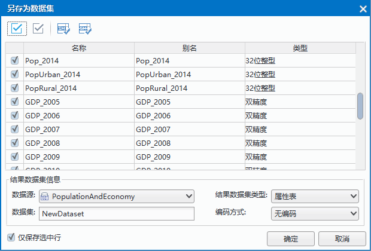

　　另存为数据集是指：以记录行为操作单位将矢量数据集属性表存储的全部或部分空间信息或属性信息输出为新的数据集或者纯属性数据集，或者将纯属性表的全部或部分属性信息输出为新的纯属性数据集。 

  
**操作方式**  
  
1. 打开属性表：在工作空间管理器中，右键点击某个矢量数据集，在弹出的右键菜单中选择“浏览属性表”；若数据集为纯属性表数据集，可通过双击打开属性表。  
2. 在打开的属性表中，选择需要输出的记录行（只要记录行中有一个单元格被选中，即选中了该记录行），可配合使用 Ctrl 或 Shift 键进行选择。   
3. 单击右键菜单栏中的“另存为数据集”按钮，并在弹出的“另存为数据集”对话框中设置相关参数：    

  
     

  + 字段信息：将选中字段值保存在另存数据集中。   
  + 数据源：输出的结果数据集所保存的数据源。  
  + 数据集：输出的结果数据集的名称。   
  + 结果数据集类型：设置将矢量数据集的属性表输出为新的数据集还是输出为纯属性数据集。如果当前属性表为矢量数据集的属性表，将其输出为新的数据集时，数据集的类型与该数据集的类型相同；如果当前属性表为纯属性数据集的属性表，则只能将其输出为纯属性数据集。  
  + 编码方式：将矢量数据集的属性表输出为新的数据集时，可以重新设置数据集的编码方式。 
在将矢量数据集（除了点数据集）的属性表输出为新的数据集时，系统提供了四种矢量数据压缩编码方式供用户选择：单字节、双字节、三字节、四字节，分别指的是使用1个、2个、3个、4个字节存储为一个坐标值。用户可根据实际需要选择一种矢量数据压缩方式。  
  + 仅保存选中行：勾选该复选框，则只对选中行数据进行另存，不勾选则导出整个属性表中的数据。  

4. 设置完成后，单击“另存为数据集”对话框的“确定”按钮，生成的结果数据集将显示在工作空间管理器中其所保存的数据源的结点下。     
  

  

