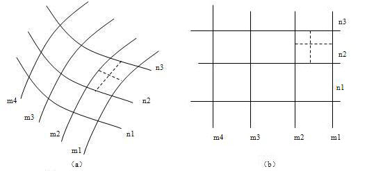
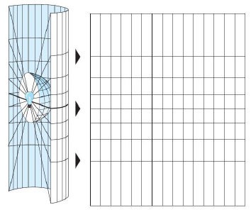
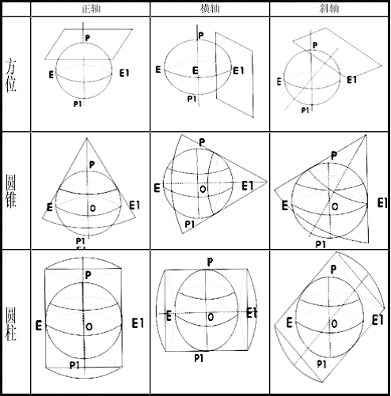
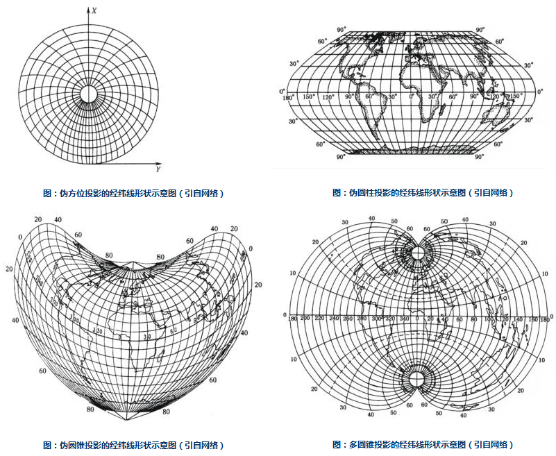

### 投影的定义

　　地球椭球体表面是曲面，而地图通常要绘制在平面图纸上，因此制图时首先要把曲面展为平面。然而球面是个不可展的曲面，换句话说，就是把它直接展为平面时，不可能不发生破裂或褶皱。若用这种具有破裂或褶皱的平面绘制地图，显然是不实用的，所以必须采用特殊的方法将曲面展开，使其成为没有破裂或褶皱的平面，于是就出现了地图投影理论。其基本原理就是：因为球面上一点的位置决定于它的经纬度，所以实际投影时是先将一些经纬线的交点展绘在平面上，再将相同的经纬度的点连成经线，相同的纬度的点连成纬线，构成经纬网。有了经纬网以后，就可以将球面上的点，按其经纬度展绘在平面上相应的位置处，如下图所示。

  

### 投影的实质

　　许多分析技术和空间数据都是针对二维坐标或平面坐标而设计的，需要以平面地图投影的方式来存储空间坐标，因此很多时候我们都需要利用地图投影将三维的地理坐标转换为二维平面坐标。所谓的地图投影就是通过特定的数学方程式将经纬坐标（λ，φ）转换为平面坐标（X，Y）。从三维坐标转换为二维坐标时总会出现扭曲变形，地图投影就是用来减小这种变形的。

　　由上可知，地图投影的使用保证了空间信息从地理坐标变换为平面坐标后能够保持在地域上的联系和完整性，这是地图制图的基本要求，也是进行空间操作和空间分析的基本前提，因此地图投影对于地理数据在 GIS 中的应用是很重要的。

### 投影的方法

　　投影方法有两种，分别是几何透视法和数学解析法。

-   几何透视法：是利用物体之间的透视关系，将地球表面上的点投影到投影面上的一种投影方法。例如，以平面、圆柱面、圆锥面为承影面，将曲面（地球椭球体面）转绘到平面（地图）上，如下图示意：

   
-   数学解析法:是建立地球椭球体面上的经纬网与平面上相应经纬网之间对应关系的方法。实质就是直接确定球面上某点的地理坐标与平面上对应点的直角坐标之间的函数关系。当前绝大多数地图投影都采用这种方法。

### 投影变形

　　地球椭球体是一个不可展曲面，而地图是一个平面，因为把这样的一个球面展开为平面，势必会造成某些部分的破裂或重叠，从而使位于这部分的地物和地貌变得不连续和不完整，从实际应用的角度出发，必须将裂开或重叠的部分予以均匀的拉伸或压缩，以消除裂缝和褶皱。在拉伸和压缩的时候，地图上这些部分就与地球体的相应部分失去了相似性，这种变化就是因为投影而产生的变形。这种由球面向平面投影时引起的经纬网几何特性的变化，称为地图投影变形。

　　地图变形有：长度变形、角度变形、面积变形和形状变形。

-   长度变形：长度变形是指长度比与 1 之差，而长度比是投影面上一微小线段和椭球体面上相应微小线段长度之比。长度变形用来反映线段投影后变化的程度，它是所有投影上都存在的最基本的变形，正是由它而引起了面积和角度变形。
-   角度变形：是指投影面上任意两方向线所夹之角与椭球面上相应的两方向线夹角之差。角度变形是形状变形的具体标志。
-   面积变形：是指面积比与 1 之差，而面积比是投影面上一微小面积与椭球面上相应的微小面积之比。面积变形是衡量地图投影变形大小的一种数量指标。
-   形状变形：是指地图上轮廓形状与相应地面轮廓形状的不相类型。

### 投影类型

　　地图投影的种类很多，一般按照两种标准进行分类：一是按投影的变形性质分类，二是按照投影的构成方式分类。

#### 按投影变形性质分类

　　按照投影的变形性质可以分为以下几类：等角投影、等积投影、任意投影。

-   等角投影：能保持无限小图形的相似。同一点上长度比处处相同-变形圆，不同点变形圆的半径不同，大范围看，投影图形与地面实际形状并不完全相似。由于这种投影无角度变形，便于图上量测方向/角度，所以常用于对真实角度和方向要求高的地图，比如航海、洋流和风向图等。由于此类投影面积变形很大，故不能量算面积。
-   等面积投影：是等面积投影，便于面积的比较和量算。常用于对面积精度要求较高的自然和经济地图，如地质、土壤、土地利用、行政区划等地图。
-   任意投影既不等角又不等积，各方面变形都存在，但都适中。在任意投影中，有一类比较特殊的投影叫做等距投影，满足正轴投影中经线长度比为1，在斜轴或横轴投影中垂直圈长度比为1。任意投影常用于教学地图、科学参考地图和通用世界地图等。

#### 按投影构成方式分类

　　根据投影构成方式可以分为两类：几何投影和解析投影。

-   几何投影是把椭球体面上的经纬网直接或附加某种条件投影到几何承影面上，然后将几何面展开为平面而得到的一类投影，包括方位投影、圆锥投影和圆柱投影。根据投影面与球面的位置关系的不同又可将其划分为：正轴投影、横轴投影、斜轴投影。如下图所示：

   

  - **方位投影**：以平面作为几何承影面，使平面与椭球体面相切或相割，将球面经纬网投影到平面上而成的投影。在切点或割线上无任何变形，离切点或割线越远，变形越大。

  - **圆锥投影**：以圆锥作为几何承影面，使圆锥与椭球体面相切或相割，将球面经纬网投影到圆锥面上而成的投影。该投影适用于中纬度地带沿纬线方向伸展地区的地图，我国的地图多用此投影。

  - **圆柱投影**：以圆柱作为几何承影面，使圆柱与椭球体面相切或相割，将球面经纬网投影到圆柱面上而成的投影。该投影方式一般适用于编制赤道附近地区的地图和世界地图。

-   解析投影是不借助于辅助几何面，直接用解析法得到经纬网的一种投影。主要包括：伪方位投影、伪圆锥投影、伪圆柱投影、多圆锥投影。

  - **伪方位投影**：据方位投影修改而来。在正轴情况下，纬线仍为同心圆，除中央经线为直线外，其余经线均改为中央经线的曲线，且相交于纬线的圆心。

  - **伪圆柱投影**：据圆柱投影修改而来。在正轴圆柱投影的基础上，要求纬线仍为平行直线，除中央经线为直线外，其余的经线均改为对称于中央经线的曲线。

  - **伪圆锥投影**：据圆锥投影修改而来。在正轴圆锥投影的基础上，要求经线仍为同心圆弧，除中央经线为直线外，其余的经线均改为对称于中央经线的曲线。

  - **多圆锥投影**：这是一种假想借助多个圆锥表面与球体相切而设计成的投影。纬线为同轴圆弧，其圆心均位于中央经线上，中央经线为直线，其余的经线均为对称于中央经线的曲线。

 