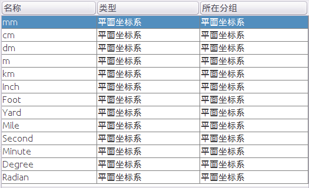
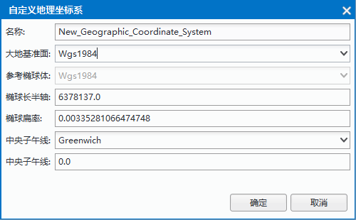
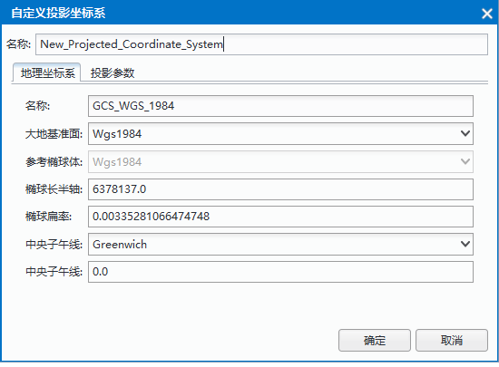
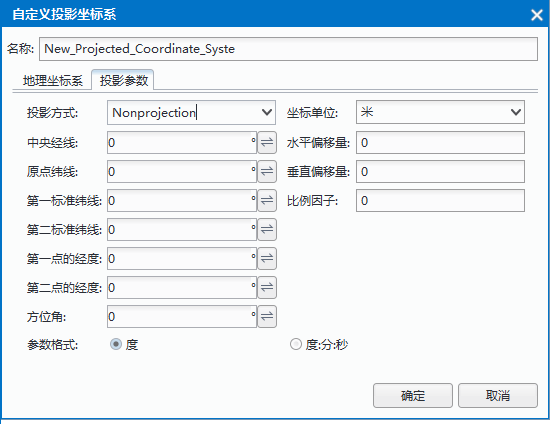

### 使用说明

　　在 SuperMap 中，数据的坐标系分为三类：平面坐标系、地理坐标系、投影坐标系。用户可以根据数据源或者数据集的需要，设置不同类型的坐标系统。投影设置可用于设置与管理当前工作空间中数据源或数据集的坐标投影信息。

### 操作步骤

　　在当前工作空间中，选中工作空间管理器中的数据源或数据集结点，单击“数据处理”菜单中的“投影设置”按钮，或单击鼠标右键，选中“属性”项，在“属性”对话框中选择“投影信息”选项，单击右下角“重新设定坐标系…”，弹出“投影设置”对话框。

　　对话框中显示了当前数据的坐标系信息，SuperMap 提供的坐标系类型有平面直角坐标系、地理坐标系和投影坐标系，用户可根据需要进行设置。

**平面坐标系**

平面坐标系一般用来作为与地理位置无关的数据的坐标参考，在对话框左侧树目录中单击`平面坐标系`节点，列表中会显示所有的平面坐标系类型，包括米、千米、英里、度等，如下图所示：

**地理坐标系**

地理坐标系是用经纬度来表示椭球上任意点的坐标，系统提供了包括用户自定义在内的200多种类型的地理坐标系供用户选择，我国常用的地理坐标系为：WGS 1984、Beijing1954、Clarke 1866 等。在左侧目录树的“地理坐标系”节点下选择“Default”文件夹后，右侧的文件列表中会列出系统提供的坐标系信息。

在列表中选中某一地理坐标系，单击鼠标右键可选择“自定义坐标系...”选项，可自定义地理坐标系的相关参数，具体参数说明如下：

  

- **类型**：用户可直接在文本框中输入地理坐标系名称，或单击右侧的下拉按钮，弹出地理坐标系列表，可在该下拉列表中选择某种系统预定义的地理坐标系
- **大地参考系**：基于地球椭球体建立的，确定了地球椭球体相对于地球球心的位置，为地表地物的测量提供了一个参照框架，确定了地表经纬网线的原点和方向，简言之，就是椭球体的定位和定向。每个国家或地区均有各自的基准面，我国常用的两个大地参考系包括：北京54坐标系（Beijing1954）、西安80坐标系（Xian1980）。用户也可根据实际需要，自定义椭球参数和中央经线的相关参数。
- **椭球参数**：地球椭球体表面是一个用数据公式表达的规则的数学表面，在测量和制图中常用地球椭球体表面用来代替地球的自然表面。椭球参数""在应用时应该根据各个国家或地区的具体情况选择合适的地球椭球体。我国常用的椭球体包括：Krasovsky1940（赤道半径为6378245.0米，扁率为1/298.3）、International1975（赤道半径为6378140，扁率为 1/298.257）等。用户也可根据实际需要，自定义赤道半径和扁率的具体数值。

- **中央经线**：定义地理坐标系横坐标的起算位置。在大部分坐标系统中，中央经线是指经过英国伦敦格林威治的经线（Greenwich，经度为0）。用户也可根据实际需要，自定义其经度的具体数值。

**投影坐标系**

程序提供了丰富的国内外常用的基本投影类型，用户可在“投影设置”对话框中选择一种系统提供的投影坐标系，或自定义一种投影坐标系，应用于当前选中的数据源、数据集。

在列表中选中某一地理坐标系，单击鼠标右键可选择“自定义坐标系...”选项，可自定义地理坐标系的相关参数，具体参数说明如下：

　　**设置投影坐标系**
 
若选择系统提供的投影坐标系，“投影坐标系”选项卡中的投影方式和坐标单位等参数是固定不可以编辑的，但用户可以修改地理坐标系的设置；若用户选择自定义（UserDefined），“投影坐标系”选项卡中的所有参数则被激活，为可编辑状态。大地参照系的类型下拉列表框、椭球参数的类型下拉列表框和中央经线下拉列表框都是类似的，选择地理坐标系类型为了UserDefined后，可以编辑其相关参数。

  

- **投影方式** 

　　系统提供了30多种国内外常用的基本投影类型。

  - 无投影：单击“投影方式”右侧下拉按钮，选择下拉列表中的第一项--无投影（NoneProjection），即设置为无投影。 
  - 系统预定义投影方式：单击该下拉按钮，弹出投影方式列表，可在该下拉列表中选择某种系统预定义的投影方式。

- **坐标单位** 

　　该标签右侧的下拉按钮用于显示和设置当前坐标系统应用的单位。系统缺省的单位是米，此外系统还提供：毫米，厘米，分米，千米，英里，英尺，英寸和码等共9种坐标单位供用户选择。 

- **地理坐标系**

　　“投影坐标系”选项卡的“地理坐标系”区域，用于自定义设置某类投影或无投影（NoneProjection）时中的地理坐标系及其相关参数。具体各参数的设置方法，请参见：设置地理坐标系。 

**设置投影参数**

当用户在“名称:”标签右侧的组合框中选择自定义（UserDefined），或输入一个新的投影名称，则“投影参数”选项卡为可用状态，可设置当前自定义投影方案的各项参数。系统提供了“度”和“度:分:秒”两种参数设置单位供用户选择。

  

上图中，水平偏移量和垂直偏移量的设置是为了避免地理坐标出现负值，主要用于高斯-克吕格、墨卡托和 UTM 投影。在圆锥投影中，圆锥面通过地球并与地球纬线发生相切或相割，这些切线或割线就是标准纬线。切圆锥投影用户只需指定一条标准纬线，割圆锥投影则需指定两条标准纬线，即第一标准纬线与第二标准纬线。如果是单标准纬线，则第二标准纬线应与第一标准纬线的值相同。另外还要设原点纬线，即最南端纬线

### 备注

　　通过快捷键 **Ctrl+F**/**Ctrl+F3** 可将鼠标定位到搜索框。

