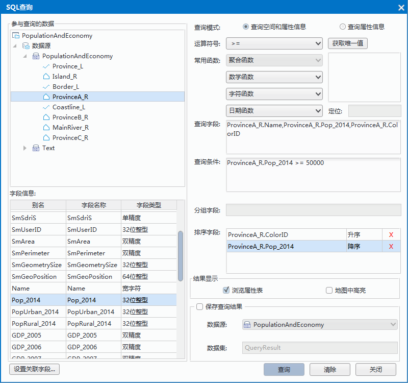
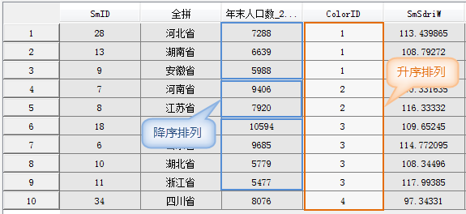
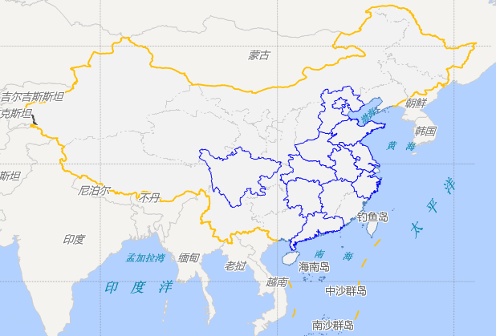

　　SQL查询是指根据 SQL 语句，从已有的数据中查询出满足特定条件的数据（记录数的子集，属性字段的子集，相关的统计等），这里的条件是通过对数据集的属性进行限定实现的，与空间位置无关。支持查询的数据类型有：点、线、面、文本、CAD、属性表、三维点、三维线、三维面、网络、路由数据集。

### 操作步骤

1. 单击“**数据处理**”菜单中的“**SQL查询**”选项，或在“工作空间管理器”中的待查询数据集处单击鼠标右键，选择“SQL查询...”弹出“SQL查询”对话框。对话框中其他参数含义及操作说明如下：

  

  -   **参与查询的数据：**编辑框显示当前工作空间所有的数据集，用户可指定参与 SQL 查询的数据集。单击选中某数据集后，下面的字段信息框中将相应显示该数据集属性表的所有字段。
  -   **字段信息：**用于显示当前选中数据集的所有字段，并显示字段的类型。查询字段、分组字段、排序字段以及构建条件表达式都可从字段信息框中选择字段。在字段信息列表的最下方有"设置关联字段"，双击“关联字段”按钮弹出“连接表设置”对话框，可以设置使用关联属性表中的字段来进行查询。
  -   **查询模式：**提供了两种查询模式：查询空间和属性信息、查询属性信息。前者的查询结果保留空间和属性信息，后者只保留属性信息；若不保存查询结果，后者的查询速度会快一些。用户可通过单击选择不同的查询模式。
  -   **运算符号、常用函数：**提供用于构造 SQL 查询条件的运算符号和常用函数，用户可以单击下拉列表，选择相应的运算符号和函数。
  -   **获取唯一值：**用于显示某一字段的所有值，方便用户查看这个字段有哪些记录值。用户在“字段信息”栏选中字段后，单击“获取唯一值”按钮可以将这个字段的值（不含重复值）罗列到下面的列表框中，也可以在**定位**标签右侧的文本框中输入感兴趣的字段值，系统会在列表框中实时定位。例如，如果一个字段的值为从1到100的数字，在此输入50，则下面的列表框会自动定位到50。同时，在构造查询条件时，双击列表中的字段值也可以直接出现在查询条件中。
  -   **定位**：在获取某一字段的所有值后，可以在**定位**标签右侧的文本框中输入某一字段值，会在字段值列表框中实时定位到该字段值。注意：只有选中某一字段，并获取了该字段的唯一值后，定位功能才能使用。
2.  **查询字段：**列出要查询的字段，各个字段以英文的逗号分隔，这些字段会出现在结果数据集中。用户添加查询字段有三种情况：

   (1) 光标定位到查询字段后的文本框中，在左下角字段信息框中双击选择字段，默认情况下是“数据集.属性字段”的格式。如想将查询结果单独保存为一个新的字段中，可以使用“数据集.属性字段 as 数据集.属性字段”语句，as 后的内容用来自定义查询结果中字段的名称。

   (2) 光标定位到查询字段后的文本框中，选择列表中的第一个字段（带“\*”号）使结果中保留所有字段。

   (3) 光标定位到查询字段后的文本框中，选择“常用函数”生成字段的表达式。

3.  **查询条件：**指定查询条件表达式。用户将光标定位到查询条件后的文本框中，可以直接输入，也可以通过从字段信息、运算符号和常用函数下拉列表框中选择相关系信息来构造查询条件表达式。查询条件的构造有两种情况：

   (1) 对于使用常用函数构造的查询条件，不同数据引擎对各函数支持的程度有所不同，请参见：[SQL查询对不同引擎的支持](SQLSupporttedType.html)。

   (2) 对于直接输入的查询条件，可根据当前数据源的引擎类型所支持的函数来指定。可参见：[构建SQL查询表达式](SQLQuery_Expression.html)。

4.  **分组字段：**将查询结果中的记录按指定字段来分组，所以分组字段必须是查询字段之一。同时，聚合函数也是对同一组内的数据进行统计计算的。用户将光标定位到分组字段后的文本框中，从字段信息列表中选择字段。
5.  **排序字段：**查询结果属性表将根据该字段的指定顺序排列记录，可依据多个不同字段进行升序或降序排列。当指定多个排序字段时，系统首先按第一个字段对记录排序，当第一个字段有相同值的记录，就按其第二个字段的值进行排序，依此类推，最后得到按照这个顺序排列的查询结果。

  　　用户将光标定位到排序字段后的文本框中，从字段信息列表中选择字段，默认情况下是升序。用户可以单击升序字样，出现升序与降序的选择列表，进行选择设置。当某一排序字段处于选中状态时，双击从字段信息列表中选择字段，可将当前的排序字段更新为字段信息列表中的字段。每一行行尾处有删除按钮，单击该按钮，删除该行排序信息。**注意**：用于排序的字段必须为数值型。

  　　设置了排序字段后，查询结果会按照第一个排序字段（Provinces_R.ColorID）指定的顺序（升序）先进行排序，由于第一个字段中有相同值的记录，然后按第二个排序字段（Provinces_R.Popu_2012）指定的顺序（降序）进行排序，结果如下图所示：

  　　

6.  **结果显示：**用于设置结果的显示情况。

    -   浏览属性表：选中此项，则查询结果以属性表形式打开。
    -   地图中高亮：选中此项，则可在地图窗口中高亮显示查询到的结果。此选项可设置的前提条件是：当前地图窗口中存在着被查询数据集；查询模式为“查询空间和属性信息”。

7.  **保存查询结果：**用于设置是否将查询结果保存为新的数据集。

  -   数据源：用于设置新数据集（查询结果）所要保存在的数据源。用户可在下拉列表中选择目标数据源。
  -   数据集：用于设置新数据集的名称。默认为：QueryResult。

8.  构建好查询语句以及设置好各项参数后，单击“查询”按钮，即可执行 SQL 查询操作，如果查询失败，请检查 SQL 语句构造是否正确。单击“清除”按钮，清除原有的查询参数，即可重新进行查询。

查询结果的地图显示效果如下图所示：

  

### 不同引擎对别名的处理方式

1. 对于 SDB 数据源的查询，如果对于查询函数没有指定别名，即没有给出 as alias，如 Len(World.COUNTRY)，那么系统会默认将查询结果中对应函数的字段命名为 Expr1000，Expr10002等。
2. 对于 SQL Server Plus 数据源的查询，如果对于查询函数没有指定别名，那么系统是不会给出默认的别名，即字段名为空。此时，“结果显示”中勾选“浏览属性表”时，在打开的属性表中可以看到对应函数的字段无字段名，但有查询结果数据；而“保存查询结果”中保存的查询结果里没有相应函数的查询结果。这是数据库的差异引起的。
3. 对于 UDB、Oracle 数据源的查询，如果对于查询函数没有指定别名，那么系统会默认将查询结果中对应函数的字段命名为查询时的函数名，如 Atan(Region2.SMID)；此时，“结果显示”中勾选“浏览属性表”时，在打开的属性表中可以看到对应函数查询结果的字段名为函数名 Atan(Region2.SMID)，且有查询结果数据；但“保存查询结果”中保存的查询结果里没有相应函数的查询结果。这是数据库的差异引起的。

### 备注

　　当使用函数作为查询结果中的字段时，请为函数添加别名，如 Len(World.COUNTRY) as Length，则浏览结果中属性表中字段名即为 Length，保存的结果数据集的属性表中字段名也为 Length；否则，如果没有指定别名，则查询结果中不会保存相应函数查询结果的字段值，但对于不同引擎其默认命名及浏览属性表中字段名不同。