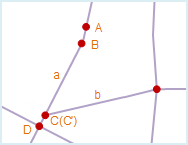
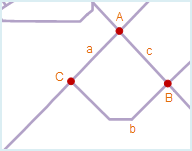

　　空间数据在采集和编辑过程中，会不可避免地出现一些错误。例如，同一个节点或同一条线被数字化了两次、相邻面对象在采集过程中出现裂缝或者相交、不封闭等，这些错误往往会产生假结点、冗余结点、悬线、重复线等拓扑错误，导致采集的空间数据之间的拓扑关系和实际地物的拓扑关系不符合，会影响到后续的数据处理、分析工作，并影响到数据的质量和可用性。此外，这些拓扑错误通常量很大，也很隐蔽，不容易被识别出来，通过手工方法不易去除，因此，需要进行拓扑处理来修复这些冗余和错误。

  

　　拓扑处理是修复拓扑错误或避免拓扑错误产生的过程，包括检查和修复两个步骤。拓扑处理包括去除假结点、去除冗余点、去除重复线、去除短悬线、长悬线延伸、邻近端点合并和进行弧段求交等7种规则，在拓扑处理时，需要对不同规则设置相应的容限，以达到最佳处理效果。

　　在本产品中，主要针对线数据集进行拓扑处理，可以对处理后的线数据集进行构建面数据集或网络数据集的操作，也可以使用“数据集拓扑检查”功能对其进行更加细致的拓扑检查操作。拓扑处理涉及到的操作功能包括线数据集拓扑处理、拓扑构面、拓扑构网。下面将依次介绍各拓扑处理规则的使用方法。

### 去除假结点

　　假结点是指连接两条弧段的点。当假结点没有实际意义时，可以执行去除假结点的操作，来去除该类假结点，并且把与该假结点相连的两条弧段合并为一条。如下左图所示，点 A 和点 B是无实际意义的假结点，需去除。处理结果如下右图所示。

    

### 去除冗余点

　　在一个线对象上由于操作问题出现多个距离较近且意义相同的节点时，只有一个节点是正确的，其余节点均为冗余节点，简称冗余点。 当一个线对象有两个或两个以上节点之间的距离小于或等于指定的节点容限时，拓扑处理后将只保留一个节点，其它点作为冗余点将被去除。节点容限可以在线对象所在数据集的属性窗口中设置。 如下左图所示，在线对象 a 上，点 A 和点 B之间的距离小于节点容限值，因此在拓扑处理时点 A 将作为冗余点被去除，仅保留点 B，处理结果如下右图所示。
　　同理，在线对象 a 上，点 C 和点 D之间的距离也小于节点容限值，在拓扑处理时点 C将作为冗余点被去除，处理结果如下图2所示。由于线对象 b 的端点（即结点） C' 与线对象 a 的节点 C 重合，且这两个线对象没有共用同一个交点，因此在拓扑处理时线对象 b 不受影响。如果想在拓扑处理时去除点 C 并且合并点 C' 与点 D，需要同时选中“去除冗余点”和“弧段求交”两个操作。

     

　　关于假结点和冗余点的异同：

   -   去除冗余点和去除假结点都是去除多余的点；
   -   冗余点一定是多余的点，必须去除；而假结点在有意义时需要保留。
   -   冗余点一般是矢量化过程中在绘制线对象的时候鼠标连击所致，该点连接的是连续且完整的一个线对象；而假结点一般是临近端点合并或捕捉画线时产生的，该点连接的是两个线对象。
   -   冗余点是节点，即线对象上除首尾两个端点以外的点；假结点是结点，即线对象的端点。

### 去除重复线

　　在不考虑线对象方向的情况下，当两个线对象中的所有节点依次重合（即坐标相同）或节点间的距离小于节点容限时，则称这两个线对象重合，其中一条线对象称为重复线。节点容限可以在线对象所在数据集的属性窗口中设置。

　　为避免建立拓扑多边形时产生面积为零或面积极小的多边形面对象，两条重合的线对象将在拓扑处理后只保留其中一条，重复线将被删除。

　　如下左图所示，线对象 AB 与线对象 A'B' 重合，其中 A'B' 为重复线。为了更好的区分重复线，这里将 A'B'用其它颜色表示。拓扑处理后，重复线 A'B' 将被去除，结果如下右图所示。

      

### 去除短悬线

　　如果一条弧段的端点没有与其他任意一条弧段的端点相连，则这个端点称之为悬点，含有悬点的弧段成为悬线。其中，短悬线是悬挂部分较短的线对象。

　　勾选“去除短悬线”后，需要设置使该规则成立的容限范围，当悬挂部分的长度小于设置的容限范围时，拓扑处理后悬挂部分将被删除。“去除短悬线”容限的设置范围需小于悬线容限的100倍，如果容限设为0，将按照默认容限处理。其中，悬线容限可在线对象所在数据集的属性窗口中设置。

　　如下左图所示，线对象 a、b、c 分别含有悬线，其中 a、b 为短悬线，且悬挂部分的长度小于设置的容限，拓扑处理后将被去除；而c的悬挂部分的长度大于设置的容限，拓扑处理后将被保留。结果如下右图所示。

      

### 长悬线延伸

　　如果一条弧段的端点没有与其他任意一条弧段的端点相连，则这个端点称之为悬点，含有悬点的弧段成为悬线。其中，长悬线是悬挂部分较长的线对象。

　　勾选“长悬线延伸”后，需要设置使该规则成立的容限范围，当长悬线的端点延伸到最近线对象的距离小于设置的容限范围时，拓扑处理后长悬线将延伸至与最近线对象相交。“长悬线延伸”容限的设置范围需小于悬线容限的100倍，如果容限设为0，将按照默认容限处理。其中，悬线容限可在线对象所在数据集的属性窗口中设置。

　　如下左图所示，线对象 a、b、c 分别长悬线，其中长悬线 a、b 延伸至最近线对象d的距离小于设置的容限，拓扑处理后将这两条悬线延伸到线对象 d 上；而悬线 c 延伸至最近线对象 d 的长度大于设置的容限，拓扑处理后将被保留。结果如下右图所示。

     

### 邻近端点合并

　　当多条弧段端点之间的距离小于节点容限时，这些端点被称为邻近端点。拓扑处理后，这些邻近端点将被合并为一个端点。节点容限可以在线对象所在数据集的属性窗口中设置。

　　需要注意的是，如果仅有两个端点的距离小于节点容限时，合并后将产生一个假结点。

　　如下图1所示，A 处和 B 处均存在邻近端点，拓扑处理后将被合并为一个结点。其中，A处合并后会得到一个假结点，需要再进行“去除假结点”操作。

      

###  弧段求交

　　当一个或多个线对象呈相交关系时，通过“弧段求交”操作可以将线对象从交点处打断，分解为多个有相连关系的简单线对象。通过“弧段求交”操作可以有效避免在建立拓扑多边形时漏掉面对象或者产生互相压盖的面对象。

　　如下左图所示，线对象 a 和 b 相交，且分别与线对象 c 相交，拓扑处理后这三个线对象将从相交处被打断，产生多个线对象，同时产生三个结点：点 A、点 B 和点 C。结果如下右图所示。

      

　　在实际应用中，情况会复杂一些，有些相交的线对象需要保留其相交关系，不能在交点处被分解。这时可以在线对象所在数据集的属性表中设置一个记录是否打断线的字段，通过输入过滤表达式来控制线对象是否被打断。

   -   **非打断对象**：设置过滤表达式以后，系统将不对满足该表达式的线对象进行打断处理。
   -   **非打断位置**：通过选择在右侧下拉列表内列出的点数据集确定非打断位置，通过判断所选点数据集中的点对象与其相邻的线对象之间的距离是否在容限范围内，来决定线对象是否会被打断。

　　若不设置非打断对象，则默认所有线对象都进行弧段求交操作；若不设置非打断位置，则默认所有的线对象都进行弧段求交操作；若同时设置了非打断线对象和非打断位置，则系统会处理二者对象的并集。

### 注意事项

1.  可以根据实际数据的情况和使用目的，选择不同的拓扑处理选项组合。
2.  建议在拓扑处理前勾选“弧段求交”，这样会得到较好的拓扑处理效果。
3.  拓扑处理时将在源数据集上进行拓扑错误的修改，如果想保留源数据集中的数据，需要在拓扑处理前备份源数据集。
4.  弧段求交操作得到的是一个真正的结点，而邻近端点合并操作有时会得到假结点，因此邻近端点合并操作后可能需要继续进行去除假结点的操作。
5.  拓扑处理的结果与拓扑容限大小的设置有关，推荐容限为默认值。
