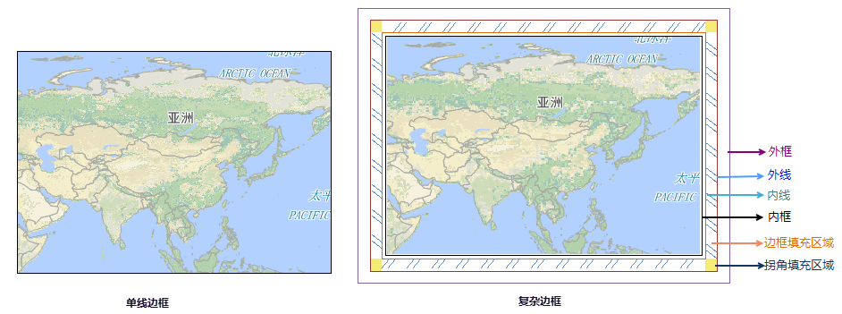
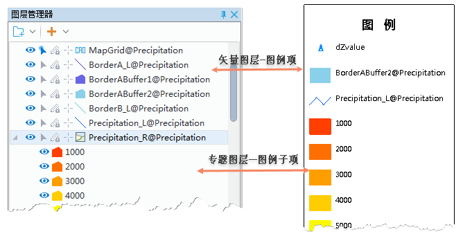

创建一个布局就是将所需的布局元素添加到布局窗口中加以整理与修饰，以达到地图所要表示的用途。而布局元素包括了一些地图元素（地图、比例尺、方向标、图例、专题图图例）、绘制元素（点、直线、折线、矩形、圆角矩形、椭圆和多边形）、标注元素（文本和艺术字）和其他相关元素（表格和图片）。
  
### 绘制地图元素   

在“对象操作”选项卡的“对象绘制”组，组织了在布局窗口中绘制地图，以及比例尺、图例、指北针等地图元素的功能。

### 绘制地图    

1. **绘制地图填充形状**：地图填充形状作为地图显示的容器，在“对象绘制”组中“地图”下拉按钮菜单中提供了包括矩形、圆角矩形、多边形、椭圆、斜椭圆、圆6种地图填充形状。根据地图显示要求选填充形状。
2. **选择填充地图**：填充形状绘制完成后，此时会弹出“选择填充地图”对话框，要求用户选择当前工作空间中已经存在的某个地图进行填充。
3. **修改布局地图属性**：双击待修改属性的地图对象；或者选中地图对象，单击右键，在弹出的右键菜单中选择“属性”项，即可弹出“布局地图属性”窗口，可对以下参数进行设置：
 - **指定关联地图**：“布局地图属性”窗口中的“地图名称”标签右侧的下拉按钮用于显示和设置当前填充框的关联地图。单击该标签右侧的下拉按钮，即可在下拉菜单中选择当前工作空间中存在的任一幅地图作为当前填充框的关联地图。选择任何一幅地图作为当前填充框的关联地图后，填充框显示的地图也会相应变为指定的地图。  
 - **比例尺**: 布局中的当前地图的显示比例尺。用户可以根据显示的需要，设置合适的比例尺。设置完成后，单击“锁定地图”，即可显示为设置的比例尺大小。  
 - **角度**: 可以通过指定一定的角度，对布局中的当前地图进行旋转。设置完成后，单击“锁定地图”，即可将地图按照指定角度进行旋转。   
 - **外接矩形**：该区域用于显示当前地图外接矩形的覆盖范围。“上”、“下”、“左”、“右”4个标签右侧的文本框只用于显示指北针外接矩形的范围值，不能进行设置。当地图的位置移动或大小改变时，这4个标签右侧的文本框中的数值也发生相应变化。  
 - **网格设置**:“显示网格”复选框用于控制是否显示布局中的地图网格。当勾选“显示网格”复选框后，布局中的地图会出现均匀大小的网格。单击右侧的“设置...”按钮，在弹出的对话框可对地图对象网格的相关属性进行设置。地图网格相关属性设置的具体方法请参见:地图网格设置。  
 - **边框设置**：用于设置地图边框的属性。包括单线边框（默认设置）和复杂边框两种类型，分别设置两种边框类型的参数，对重点参数做以下解释：   
    
 	 - **复杂边框**：地图几何对象的边框类型为复杂边框时，边框的结构分为外框、内框、外线、内线、边框转角区域以及边框填充区域，可以通过设置各种线框的线型、颜色、粗细以及进行区域部分的填充来修饰地图几何对象的边框可基本满足用户的需求。  
 	  
 	 - **内框/内线/外线/外框**：当地理边框选择为复杂边框时，使用内框/内线/外线/外框来为复杂边框设置0-4个框线，并设置其线型、宽度、颜色和间距。各类框线的设置方法相同。如果设置某一个框线的宽度为0，则该框线将不显示。距离表示当前线框与里层线框间的距离，内框则表示其与里层地图边界之间的距离。  
 	 - **边框风格**：用于设置复杂边框中内线至外线之间区域的填充内容和填充方向。     
 	 -   **填充方向**：系统为填充图案提供了2种旋转基点：从外向内（默认设置）和从内向外。从外向内表示填充图案是从外线向内线填充；而从内向外正好相反。     
 	 -   **填充设置**： 填充设置区域用于设置内线至外线其间填充图案。系统提供了三种填充方式：无填充、文本填充和图片填充，默认为无填充。
 
 	 - **拐角风格**：用于设置复杂边框中内线至外线之间区域的四个拐角处填充内容和填充方向。   
 	 - **起始模式**：系统为转角填充图案提供了4种旋转基点：左下、左上、右上和右下。系统默认的起始模式为右上，表示边框右上转角处的图案为正常视图，其他三个转角处图案为其依次旋转90度的结果，如上图所示。   
 	   
### 比例尺    
  
比例尺可对地图上的要素大小和要素间的距离进行直观指示。绘制比例尺的前提条件是当前布局窗口中存在绘制好了的地图，该地图处于选中状态并且没有被锁定。 
  
**绘制比例尺**  
选中布局窗口中的一个需要绘制比例尺的地图。 单击“对象操作”选项卡中“对象绘制”组的“比例尺”按钮，鼠标在当前布局窗口中的状态变为。 在当前布局窗口中需要绘制比例尺的位置，单击并拖拽鼠标，即可基于选中地图的属性绘制该地图的比例尺.  
  
**修改比例尺**  
可双击待修改属性的比例尺对象，在“比例尺属性”窗口设置比例尺的类型、单位、小节宽度、小节个数、左分个数、字体风格等各项参数。在该“比例尺属性”窗口中的各项参数设置都会实时反映到当前布局窗口中，即实现所见即所得。   
 
- 小节宽度：用于设置并显示当前地图比例尺中各小节的宽度。  
- 小节个数：用于设置并显示当前地图比例尺的小节的总数目。  
- 左分个数：用于设置并显示当前地图比例尺中最左边的一个小节平均分等的数目。 系统默认左分个数至少为2。 

### 图例

图例，能够帮助用户了解表示地图要素的符号的含义。绘制图例的前提条件是当前布局窗口中存在绘制好了的地图，该地图处于选中状态并且没有被锁定。   
  
**绘制图例**  
选中布局窗口中的一个需要绘制图例的地图。 单击“对象操作”选项卡中“对象绘制”组的“图例”按钮，鼠标在当前布局窗口中的状态变为。 在当前布局窗口中需要绘制图例的位置，单击并拖拽鼠标，即可基于选中地图的属性绘制该地图的图例。  
   
**修改图例**   
 创建图例后，便可修改图例的显示风格，并可对图例中的图例项/图例子项进行移除或添加。可双击待修改属性的图例对象，在“图例属性”窗口设置图例的标题及其风格、图例列数、图例宽度与长度、填充颜色、图例边框间距等各项参数。  
  
- **图例项** ：指矢量图层的图例。支持对图例项的字体及可见性进行设置。 
- **图例子项** ：指是专题图图层子项的图例，包括单值专题图、分段专题图、统计专题图、等级符号专题图。 支持对图例子项的风格、字体及可见性进行设置。若勾选了专题图图层复选框，则专题图的所有子项都会添加到图例中，若需要删除图例中的某个图例子项，可在布局中单击图例右键，选择“拆分布局元素”将图例项拆分，选中需删除的图例项，通过按键盘中的 Delete 键将其删除即可。   
    
  
### 指北针  
  
指北针用于指示地图的方向，绘制指北针的前提条件是当前布局窗口中存在绘制好了的地图，该地图处于选中状态并且没有被锁定。   
  
**绘制指北针**  
选中布局窗口中的一个需要绘制指北针的地图。 单击“对象操作”选项卡中“对象绘制”组的“指北针”按钮，鼠标在当前布局窗口中的状态变为。 在当前布局窗口中需要绘制指北针的位置，单击并拖拽鼠标，即可基于选中地图的属性绘制该地图的指北针。  
   
**修改指北针**   
 创建指北针后，便可修改指北针的样式及显示风格。可双击待修改属性的图例对象，在“指北针属性”窗口设置指北针的样式、旋转角度、宽度、高度等各项参数。    
系统提供了9种指北针样式供用户选择。若系统提供的指北针样式不能满足用户需求，用户也可导入一幅图片，作为当前关联地图的指北针，导入图片的格式可为：*.bmp、*.jpg、*.png、*.gif。

  

 

  