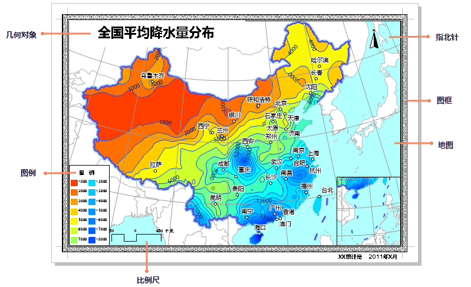

　  布局是地图（包括专题图）、图例、地图比例尺、图片、文本等各种不同地图内容的混合排版与布置，主要用于地图打印。而布局窗口就是制作布局（布置和注释地图内容）以供打印输出的窗口。为提供地理参考，可以添加格网。
  
        
  
- 布局是在布局窗口页面上组织的各种地图元素和结合元素。常见的地图元素包括多个地图框。
    
- 布局可采用横向或纵向两种页面布局。它们可以电子方式导出和使用，也可打印。页面大小随输出规范而变化。布局中的所见内容即为将地图打印或导出为相同页面大小时能够查看到的内容。

- 需要注意的是，布局是工作空间的一部分，要把布局保存下来，就一定要把工作空间也同时保存下来，否则布局不会真正保存下来。 
  