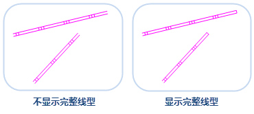
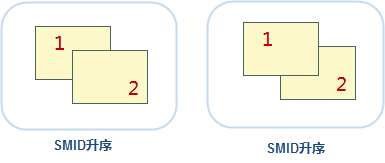

　　在图层管理器中选中一个或多个同类型或不同类型的图层进行设置，优化图层显示效果。本文主要介绍了图层通用属性、矢量图层属性、栅格图层属性及影像图层属性等相关参数的设置。

### 通用属性

　　矢量、栅格、影像图层都可在图层属性面板中设置以下图层属性：

　　**透明度**

　　透明度是图层的显示属性，可以在“图层属性”界面中“透明度”的数字调整框中进行设置。“透明度:”的数字调整框和下拉按钮可以设置当前图层的透明程度。用户可以直接输入透明度值，或者单击该标签右侧的下拉按钮，使用滑块来调整透明度，实时浏览设置结果。默认透明度的数值为 0，表示图层完全不透明，随着数值的增加图层会变得更透明；当透明度的数值设为100时，图层完全透明。透明度数值的范围为0至100之间的整数。

　　**最小可见比例尺**

　　用来设置当前图层的最小可见比例尺。图层设置最小可见比例尺后，若地图的比例尺小于该图层设置的最小可见比例尺，该图层将不可见。

　　用户可以通过在“最小可见比例尺”右侧的数字调整框输入比例尺数值，如 1：500000，将当前地图比例尺设置为最小可见比例尺。也可单击右侧下拉按钮选择比例尺设置为最小可见比例尺，下拉项可选比例尺为默认 1:5000 至 1:1000000 的 8 个比例尺；若地图设置了固定比例尺，则下拉项可选比例尺为固定的比例尺。

　　**最大可见比例尺**

　　用来设置当前图层的最大可见比例尺。图层设置最大可见比例尺后，若地图的比例尺大于该图层所设置的最大可见比例尺时，该图层将不可见。

　　用户可以通过在“最大可见比例尺”右侧的数字调整框输入比例尺数值，如 1：500000，将当前地图比例尺设置为最大可见比例尺。也可单击右侧下拉按钮选择某个比例尺设置为最大可见比例尺，下拉项可选比例尺为默认 1:5000 至 1:1000000 的 8 个比例尺；若地图设置了固定比例尺，则下拉项可选比例尺为固定的比例尺。

### 矢量图层属性
　　在图层管理器中选中矢量图层作为当前图层，“图层属性”界面中的会出现矢量参数的设置选项，其中包含了显示完整线型、十字路口优化、符号随图缩放、对象最小尺寸、显示过滤条件等属性设置的功能控件。

　　**显示完整线型**

　　"显示完整线型"保证线对象的线型符号能完整地显示，优化线符号的显示效果。如果线对象的长度小于线符号周期长度，或者线对象长度不够线符号周期长度的整数倍时，不足线符号的周期的那部分线就不能完全显示。使用显示完整线型命令就会把线符号长度重新整除，计算出一个和线对象长度非常近似的长度绘制。使用显示完整线型和不使用显示完整线型的示意图如下：

　　

　　**十字路口优化**

　　对于线图层，常会出现多个线对象相互交叉的情况，例如水系、道路。如果不作处理，按照正常情况显示，不仅不够美观，而且可能与实际情况不相符，不能正确表达交叉的线对象之间的连通性。我们往往需要对相互交叉的线进行优化，去除“路口”位置相互交叠的部分，最终达到真实的十字路口显示效果。具体的实现原理与效果请参见：

　　

　　**符号随图缩放**

　　“符号随图缩放”复选框用来设置在地图放大、缩小浏览操作过程中，图层中的地图符号对象是否也随之放大或者缩小。“符号随图缩放”复选框可应用于点状符号、线状符号、面填充符号及其边框。

　　勾选“符号随图缩放”复选框后，当前图层中的地图符号会随地图缩放。用户每执行一次地图放大或缩小操作，当前图层中的符号对象缩放的程度由缩放基准比例尺和地图缩放后的比例尺共同来确定。如果当前地图的比例尺大于缩放基准比例尺，则地图符号会按相同的放大比例进行放大；反之，地图符号会按相同的缩小比例缩小。例如，若符号缩放基准比例尺为 1：500000，此时符号的大小为 30，则当地图比例尺为 1：100000 时，即地图放大五倍，符号的大小也会随之放大五倍，符号大小变为 150。

　　**反走样显示**

　　在光栅图形显示器上绘制非水平且非垂直的直线或多边形边界时，或多或少会呈现锯齿状或台阶状外观。这是因为直线、多边形、色彩边界等是连续的，而光栅则是由离散的点组成，在光栅显示设备上表现直线、多边形等，必须在离散位置采样。由于采样不充分重建后造成的信息失真，就叫"走样"，而用于减少或消除这种效果的技术，就称为反走样。

　　针对地图信息失真，对地图中的直线、多边形、文本等的进行的反走样处理，包括线型反走样和文本反走样。反走样需要在图层透明度为0的情况下，同时开启地图反走样和图层反走样才可生效，开启地图反走样的同时，需在“图层属性”面板中勾选“反走样显示”复选框。

　　**显示压盖对象**

　　用于控制是否显示产生压盖现象的对象，若勾选该复选框，发生压盖现象的所有对象都会显示，需同时勾选“地图属性”面板中“显示压盖对象”复选框，图层显示压盖对象效果才生效。

　　**对象最小尺寸**

　　用来设置当前图层中对象显示的最小尺寸。当前地图放大或缩小时，若该图层中任意一个几何对象的最小外接矩形的宽度和高度之中的较大值小于此处设置的对象最小显示尺寸，则几何对象不可见。用户可在该标签右侧的文本框中输入特定的数值，设置当前图层中对象的最小显示尺寸，数值的单位为毫米。

　　**显示过滤条件**

　　用于设置当前图层的显示过滤条件，过滤图层中哪些对象可显示哪些对象不可显示，便于用户根据需要显示感兴趣的要素而过滤掉暂时不需要显示的要素。输入 SQL 表达式作为过滤条件，单击 Enter （回车）键即可应用图层的过滤条件，使图层中满足过滤条件的对象可见。

　　**对象显示顺序字段**

　　对象的绘制顺序会影响对象在地图上的显示顺序。地图中的对象会依据设置的字段中数值的顺序进行显示。如果该字段的字段值相同或为空，则采用该引擎默认的显示顺序，一般情况下取字段 SmID、排序为升的规则相同的显示。目前仅支持对单个矢量图层或单个专题图图层设置对象显示顺序字段。如下图所示，对象1的 SmID 为1，对象2的 SmID 为2，按照 SmID 字段分别进行升序和降序排列，结果如下所示：

   

　　**设置图层关联属性表**

　　单击“设置图层关联属性表...”按钮，设置关联字段连接外部表，进而通过构建有外部表字段参与的过滤条件来过滤显示图层中的内容。

### 栅格图层属性

　　**亮度**

　　用于调整栅格图层的明暗亮度，可在“亮度”数字调整框中直接输入亮度值，调整当前图层亮度。或者点击“亮度”数字调整框右侧下拉按钮，使用滑块来调整亮度度，实时浏览设置结果。

　　**对比度**

　　当前图层为栅格图层时，“对比度”数字调整框用来调整栅格图层的对比度。用户可在“对比度”数字调整框中直接输入对比度值，调整当前图层对比度。或者单击“对比度”数字调整框右侧的下拉按钮，使用滑块来调整对比度，实时浏览设置结果。

　　**拉伸设置**

　　在缩放浏览栅格数据时，需将原始图像映射为较大或较小的一组像素，SuperMap提供了 5 种插值方式，分别为最临近插值、低质量插值、高质量插值、高质量双线性插值、高质量三次插值。不同的插值方式决定了栅格显示的质量，但是输出图像的显示质量越高，所需的时间就越长。

- 最临近插值：是一种较简单的插值方式，该方式处理速度较快，但是图像显示效果最差。 
- 低质量插值：该方式会执行预筛选以确保高质量的收缩，插值后图像放大显示质量不好。 
- 高质量插值：缩放时图像显示质量较高，但是输出图像时间较长。 
- 高质量双线性插值：通过指定的高质量双线性插值法，执行预筛选，以确保缩放栅格的高质量显示效果。 
- 高质量双三次插值：通过指定的高质量双三次插值法，执行预筛选，以确保缩放栅格的高质量显示效果，此方式式输出的图像显示质量最高。 

　　**设置颜色表**

　　当前图层为栅格图层时，“设置...”按钮可以用来设置地图中栅格图层中像元的颜色。单击“设置...”按钮，弹出的编辑颜色表对话框。用户可通过编辑颜色表对话框设置栅格图层的颜色方案，或设置某个像元值所使用的颜色；也可通过添加新的像元值或者删除部分像元值来调整栅格数据的颜色显示方案。

　　**特殊值**

　　输入某一栅格值，即用户需要对某些特定值的栅格像元的显示效果进行设置。

　　**特殊值风格**

　　用来设置已指定栅格值的显示颜色。可点击“特殊值风格：”标签右侧的下拉按钮，在弹出的颜色面板中选择某一种颜色，则该栅格值的像元将显示为指定的色彩。 

　　**特殊值透明显示**

　　用来设置已指定栅格值是否透明显示。勾选该复选框，即可将指定栅格值像元设置为透明显示；不勾选该项，指定栅格值颜色仍以指定的颜色显示。 

### 影像图层属性

　　**亮度**

　　当前图层为影像图层时，“亮度”数字调整框用来调整影像图层的明暗亮度。用户可在“亮度”数字调整框中直接输入亮度值，调整当前图层亮度。或者点击“亮度”数字调整框右侧的按钮来调整亮度，实时浏览设置结果。

　　**对比度**

　　当前图层为影像图层时，“对比度”数字调整框用来调整影像图层的对比度。用户可在“对比度”数字调整框中直接输入对比度值，调整当前图层对比度。或者单击“对比度”数字调整框右侧的下拉按钮，使用滑块来调整对比度，实时浏览设置结果。

　　**透明色**

　　透明色设置用来将影像图层中某种颜色设置为透明色，即将影像中指定颜色覆盖的区域设置为透明效果。完成透明色的设置需要将“透明色”和“透明色容限”两个命令配合使用。

- 透明色：勾选该复选框，即可将指定无值像元设置为透明显示；不勾选该项，指定无值颜色仍以指定的颜色显示。 
- 透明色容限：设置透明色容限值后，假设原始颜色设置为 (r, g, b)、容限设置为 a，则需透明显示的颜色范围在 (r-a, g-a, b-a) 到 (r+a, g+a, b+a)之间。

　　**影像的颜色模式**

　　由于成色原理的不同，决定了显示器、投影仪这类靠色光直接合成颜色的颜色设备和打印机、印刷机这类靠使用颜料的印刷设备在生成颜色方式上的区别。 针对上述不同成色方式，SuperMap 提供 7 种色彩空间，分别为 RGB、CMYK、RGBA、CMY、YIQ、YUV 和 YCC。 

　　颜色模式组合框的下拉列表中列出了所支持的色彩空间，用来设置影像数据的颜色显示模式。单击“颜色模式:”标签右侧的下拉按钮，在弹出的下拉菜单中选择需要的颜色模式，即可完成颜色模式的设置。默认的颜色模式为 RGB。

- RGB：主要在显示系统中使用。RGB 是红色，绿色，蓝色的缩写。RGB 颜色模式使用 RGB 模型为图像中每一个像素的 RGB 分量分配一个 0~255 范围内的强度值。 
- CMYK：主要在印刷系统使用。CMYK 分别为青色，品红，黄，黑。它通过调整青色、品红、黄色三种基本色的浓度混合出各种颜色的颜料，利用黑色调节明度和纯度。 
- RGBA：主要在显示系统中使用。RGB 是红色，绿色，蓝色的缩写，A 则用来控制透明度。  
- CMY：主要在印刷系统使用。CMY (Cyan,Magenta,Yellow) 分别为青色，品红，黄。该类型通过调整青色、品红、黄色三种基本色的浓度混合出各种颜色的颜料。  
- YIQ：主要用于北美电视系统(NTSC)。 
- YUV：主要用于欧洲电视系统(PAL)。 
- YCC：主要用于 JPEG 图像格式。  

　　**影像拉伸**

　　影像拉伸功能通过线性拉伸改变原始影像的对比度，从而达到增强显示效果的目的。一般来说，影像上数值的差异越大，影像上要素的对比度越明显。如果数值差异不大，那么影像色彩就不容易区分（偏暗或者偏亮），会影响到后续有用信息的提取。因此对于对比度不明显的影像，需要进行拉伸扩大其信息差异。

　　**拉伸方式**

　　目前，SuperMap桌面应用程序提供四种拉伸方式：无拉伸、最值拉伸、标准差拉伸和高斯拉伸。

- 无拉伸：对影像不进行任何拉伸处理，但是这种绝对的无拉伸实际上只对无符号整型8-bit存储格式的影像数据有效。影像数据在计算机上所显示的像元值都在0至255范围之间，因此，对于使用非无符号整型8-bit进行存储的影像数据，在进行无拉伸显示时，SuperMap对其处理方式是使用最值拉伸进行显示，使其数值在0至255范围之间。 
- 最值拉伸：即最大最小值的线性拉伸。此种方式将像元值的最小值和最大值做范围值域，进行线性拉伸，使像元值分布在[0,255]之间。通过这样的拉伸处理，影像的对比度和亮度都得到的明显提高，从而使得影像中的地物会更加容易辨识。 
- 标准差拉伸：对原始影像的数据进行统计，主要是获得一个标准差取值范围，然后根据标准差拉伸系数重新计算标准差范围，将最后计算的标准差范围内的数值进行线性拉伸，使其分布在[0,255]之间，拉伸后的像元显示值与平均值偏离度减小。 
- 高斯拉伸：目的是使影像数据的像元值趋于正态分布，高斯拉伸属于线性拉伸。若勾选了“高斯拉伸使用中间值”，则进行影像拉伸时，以像元中间值为为中心轴进行高斯拉伸；若不勾选，则默认以像元最大值为中心轴进行高斯拉伸。

　**拉伸系数**

　　只有当选择拉伸方式为“标准差拉伸”或“高斯拉伸”时，才支持设置“拉伸系数”。 

- 标准差拉伸系数：仅当拉伸方式为标准差拉伸时，此参数可用。标准差拉伸系数确定了标准差的取值范围。假设标准差范围为[a,b]，标准差拉伸系数为 n，则进行标准差拉伸时，标准差的取值范围为[an,bn]。应用程序默认的标准差拉伸系数为2，即默认使用2倍标准差进行拉伸。 
- 高斯拉伸系数：仅当拉伸方式为高斯拉伸时，此参数可用。假设影像数据像元值范围为[a,b]，高斯拉伸系数为n，则进行高斯拉伸时，保持中心轴不变，将像元值进行n倍拉伸，最后以[0，255]的范围显示。应用程序默认的高斯拉伸系数为2。
如下图所示，图1为不经过任何处理的影像显示效果，整体色调偏暗，非常不利于区分地物信息；但是经过拉伸后（如图2所示），影像对比度增强，很多地物特征都突显出来了。
