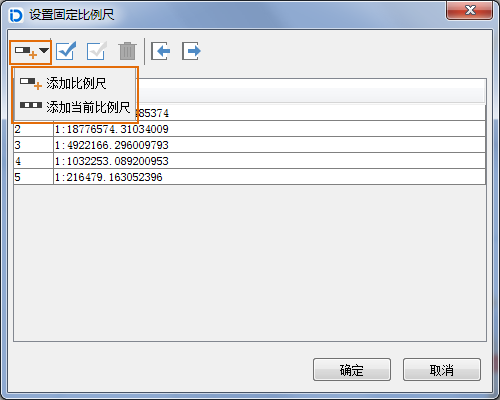

　　地图属性面板中的“范围”选项主要用为设置地图显示范围相关的参数，包含了比例尺、显示范围、中心点、视图范围、地图范围等。

### 当前比例尺

　　显示和设置当前地图的当前比例尺，缩放浏览地图时，当前比例尺的数值会不断地发生变化。在数值框中输入比例尺并按`Enter`键，即可将设置的比例尺应用到当前地图。

### 固定比例尺

　　勾选该复选框，启用以固定比例尺的方式进行地图缩放，即用户可以定义一系列的固定比例尺，那么当用户进行缩放操作时，每次缩放操作的结果将在这些固定比例尺之间切换，即缩放结果为缩放到与当前比例尺最邻近的固定比例尺状态。当前地图不会以用户定义的固定比例尺之外的比例尺大小进行显示。

**设置比例尺**

　　用于添加缩放地图显示的固定比例尺，单击“设置比例尺...”按钮弹出“设置固定比例尺”的对话框，在对话框中添加固定比例尺，具体操作方式如下：

　　单击对话框中的“添加比例尺”下拉按钮，可选择“添加比例尺”或“添加当前比例尺”方式进行添加。

　　

　　若对话框中没有比例尺记录，通过任意一种方式添加的第一个比例尺都默认为地图当前比例尺。若选中比例尺列表中的最后一个比例尺，通过“添加比例尺”方式添加的比例尺默认为前一个比例尺的两倍；若选中比例尺不是列表中的最后一个，则通过“添加比例尺”方式添加的比例尺为选中比例尺与后一个比例尺和的二分之一。缩放地图后通过“添加当前比例尺”方式即可添加当前地图比例尺。

　　当用户添加了多个比例尺后，点击“确定”按钮，完成比例尺的添加。当在地图窗口进行缩放操作时，缩放的结果将在所设置的固定比例尺之间进行切换。 

　　若设置比例尺之前没有勾选“固定比例尺”复选框，则添加了比例尺之后会自动勾选“固定比例尺”按钮。

### 裁剪显示范围

　　通过设置一定范围，在当前地图窗口中只显示指定范围的地图内容，而不显示范围之外的地图内容，从而呈现一种剪裁地图的效果。裁剪地图是以显示为目的的一种处理，并未裁剪地图的各个数据集。

　　勾选“裁剪显示范围”复选框后，单击右侧的“设置...”下拉按钮，在弹出的下拉菜单中选择一种裁剪区域的方式，即可在当前地图窗口中确定裁剪区域。下拉菜单中提供了选择对象、绘制矩形、圆形、扇形和多边形 5 种方式，其中，选择对象方式支持选择当前地图窗口中一个或多个面对象作为裁剪显示区域。

### 锁定最大显示范围

　　锁定最大显示范围的功能是指通过最大显示的范围锁定地图特定部分，从而使得在地图浏览过程中，地图的显示范围最大，即使指定范围外的地图内容在“锁定最大显示范围”状态下不可见。该功能与裁剪区域功能类似，区别在于裁剪区域操作后的地图可以自由缩放或平移，不受设置的范围控制；而地图锁定范围时，各种地图浏览操作均不会使显示范围超出指定范围。

　　勾选“锁定最大显示范围”复选框，此时，地图最大显示范围默认为地图范围。 单击右侧下拉按钮，在弹出下拉菜单中选择一种锁定范围的方式，即可在当前地图窗口中确定需要被锁定的区域。下拉菜单中提供了一系列确定锁定范围的方式：绘制矩形、圆形、扇形或多边形，以及通过选择当前地图窗口中某个面对象的范围作为锁定范围。

　　若用户不满意当前的锁定范围，可通过单击该按钮下拉菜单中的“设为地图范围”选项，将地图锁定的最大范围设为地图范围；或者重新确定新的锁定范围，已执行的锁定范围操作自动撤销，并应用新的锁定范围。

### 自定义全幅范围

　　自定义全幅范围的功能是指通过设置，自定义当前地图的全幅显示范围。当用户在当前地图中定义了全幅范围后，则在当前地图窗口进行地图浏览操作后，若用户单击“地图操作”选项卡中“浏览”组的“全幅显示”按钮，或者按键盘上的 F6 键，当前地图将以自定义的全幅范围全幅显示。

　　勾选“自定义全幅范围”复选框，单击该下拉按钮，在弹出下拉菜单中选择一种自定义全幅范围的设置方式，即可在当前地图窗口中设置全幅范围。下拉菜单中提供了一系列确定地图全幅范围的方式：绘制矩形、圆形、扇形或多边形，以及通过选择当前地图窗口中某个面对象的范围作为锁定范围。

　　可通过“清除全幅范围”选项取消已执行的全幅范围操作，也可重新绘制全幅范围，则之前的全幅操作自动撤销，并应用新的全幅范围。

### 中心点位置

　　以X、Y坐标值显示或设置当前地图窗口的中心点坐标值。在“X:”和“Y:”标签右侧的数字显示框为可用状态，显示了当前地图窗口的中心点的坐标值，用户可以在这两个数字显示框中重新输入数据，确定新的地图窗口中心点。

### 当前视图范围

　　“当前视图范围”可用来查看地图在当前地图窗口中可见范围的信息。当前视图范围的信息包括当前窗口显示的左、上、右、下的位置信息。可以对这些文本框进行编辑，输入左、上、右、下的坐标，当前地图比例尺不会改变，相当于地图发生了平移。

### 地图范围

　　“地图范围”显示了当前地图的空间范围信息。地图的空间范围是指包含地图中各个数据集的最小外接矩形。当地图中数据集增加或减少时，空间范围也可能会相应发生变化。地图范围的文本框处于灰色状态，不可编辑改变地图范围。

