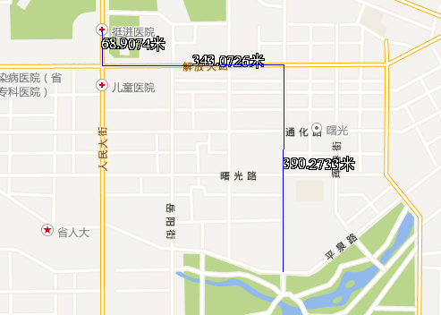

　　地图量算功能包括在地图上的距离、面积和角度量算。在量算时，用户可以打开智能捕捉功能，便于精确获取感兴趣的位置，同时，可通过使用 Ctrl+Z 按键，撤销上一步的量算记录。

　　在进行距离量算操作前，首先需要确定量算的单位。将鼠标移至“地图”下拉菜单的“地图量算”项，在其二级菜单中选择“量算设置”，弹出的对话框可分别设置距离、面积、角度的单位。

### 距离量算

　　1.  在“**地图**”下拉菜单中的“**地图量算**”二级菜单中选择“距离量算”，当前地图窗口的操作状态变为距离量算状态，并且鼠标在当前地图窗口中的状态变为十字丝。

　　2.  在地图窗口中待量算距离的起点位置单击鼠标左键，确定量算距离的起点；移动鼠标，屏幕上会出现连接鼠标当前点和起点的一条长度不断变化的临时线段，同时还显示了这条线段的距离值。

　　3.  量算过程中，地图窗口会同时显示两个结果数值：当前鼠标点与前一点之间的线段长度和当前鼠标点与量算距离的起点间折线段的总长度。在鼠标单击第二个点之前，地图窗口中显示的这两个数值相等；当鼠标单击第二个点后，移动鼠标，地图窗口中显示的两个数值发生变化，当前鼠标点与前一点之间的线段长度始终小于当前鼠标点与起点间折线段的总长度。

　　4.  用户可以单击一系列的点来连续进行距离量算，不仅可以获得当前两点间的距离，还可以获得总距离。

　　5.  单击鼠标右键即可结束距离量算，同时整条折线段的相应位置出现各条线段的数值注记，输出窗口中也显示出整条折线段的总距离值。

　　6.  单击“**地图量算**”选项中的“**清除**”项，即可清除当前地图窗口中临时折线和长度量算的数值注记。此外，按 `Esc` 键也可实现“清除”功能。

　　

### 面积量算

　　1. 在“**地图**”下拉菜单中的“**地图量算**”二级菜单中选择“面积量算”，则当前地图窗口的操作状态变为面积量算状态，并且鼠标在当前地图窗口中的状态变为十字丝。
 
　　2. 在当前地图窗口中，鼠标单击待量算面积的区域边界的某位置，即可确定用来量算面积的临时多边形边界的起点。当鼠标单击待量算面积的区域边界上的第二个点时，移动鼠标，当前鼠标点与前两个点构成一个临时面域（不共线的三点即可构成一个面），并且该面随着鼠标的移动而变化。同时，鼠标旁边会显示出当前临时面的面积。

　　3. 沿着待量算面积区域的边界线连续单击鼠标，绘制用于量算的临时多边形，即可获得多边形圈定区域的面积。
 
　　4. 单击鼠标右键即可结束面积量算，同时临时多边形的相应位置出现其面积的数值注记，输出窗口中也显示出面积量算的数值。

　　5. 单击“**地图量算**”选项中的“**清除**”项，即可清除当前地图窗口中的临时多边形和面积量算的数值注记。此外，按 `Esc` 键也可实现 “清除” 功能。

　　

### 角度量算

　　1.  在“**地图**”下拉菜单中的“**地图量算**”二级菜单中选择“角度量算”，则当前地图窗口的操作状态变为角度量算状态，并且鼠标在当前地图窗口中的状态变为。

　　2.  在当前地图窗口中，鼠标单击待量算角度的位置确定待量算角度一条边的起点，同时该点处形成一条指向正北方向的虚线，移动鼠标即可从起点处形成一条射线，同时显示该射线与正北方向虚线之间的夹角，即该射线的方位角。

　　3.  当鼠标单击待量算角度一条边的另一个端点时，即可确定一条边，移动鼠标可由第二个鼠标点引出一条射线，并与第一条边组成一个角度。此时，可显示两个角度量算值：这条射线与第一条边的夹角值以及这条射线的方位角值。

　　4.  连续单击鼠标，绘制用于量算角度的边，即可获得各条边确定的方位角和夹角。

　　5.  单击鼠标右键即可结束角度量算，同时临时折线的相应位置出现各个角度的数值注记，输出窗口中也显示出最后绘制的线段的方位角和夹角的数值注记。

　　6.  单击“**地图量算**”选项中的“**清除**”项，即可清除当前地图窗口中的临时折线和角度量算的数值注记。此外，按 `Esc` 键也可实现“清除”功能。

　　
