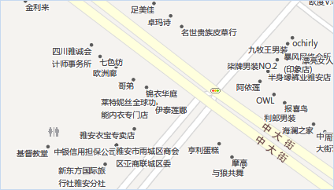
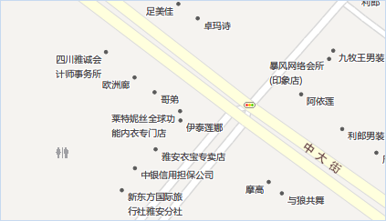
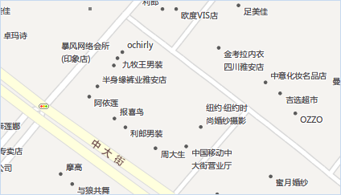
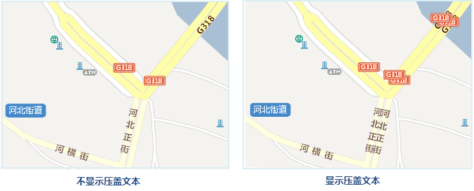
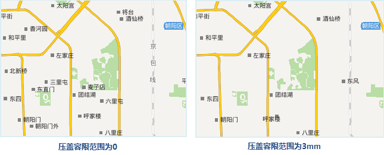

　　如今电子地图所反映的信息越来越丰富，地图要素往往会出现相互压盖的情况，特别是用来传达地图要素信息的标注文本，其越详细就越容易出现相互压盖或与其他地图要素压盖的情况，如何解决这些压盖问题呢？。SuperMap GIS 为您提供了完备的处理文本压盖、文本与地图对象压盖及地图对象压盖的解决方案，为您排忧解难，为您的地图美化保驾护航。

　　通常情况下，SuperMap GIS 所提供的自动避让功能可以解决一部分压盖问题，但是当自动避让后，仍旧存在压盖现象，这是可以进一步设置来隐藏避让不掉的地图要素。但在实际应用中，这种处理方式往往将地图上一些重要的信息隐藏掉了，因此，就需要更加灵活的压盖设置，可以使得重要的信息即使存在压盖也会显示。SuperMap GIS 8C提供了灵活的设置，可以根据需要来决定出现压盖的地图对象及标注文本的显示与否，下面结合应用场景一一介绍我们所提供的压盖设置方案，方便您的选择和应用。

### 避让与压盖

　　以基于点图层制作的标签专题图为例，当地图的比例尺较小时，由于点对象的分布相对密集，需要将点的标注全部显示（即使发生压盖也显示压盖的文本）就会出现如下图所示的效果，此时未使用自动避让功能，且开启了显示压盖对象。

　　

　　基于上面进行操作，当开启了自动避让功能后，如图2所示，标签文本的分布相对均匀，并且解决了一部分发生压盖的文本。为了避免与其他标签文本发生压盖，系统内部自动计算一个合适的位置来放置点对象的标签文本。

　　

　　开启了自动避让后，仍存在压盖情况，此时，为了地图的美观，我们可以通过不显示压盖对象的设置，隐藏被压盖的标签文本，同时开启自动避让功能，从而可以最大限度地保留标签文本内容。

　　

### 自动避让方式

　　以基于点图层制作的标签专题图为例，点对象的分布相对密集，当地图的比例尺较小时，需要将点的标注全部显示，不开启自动避让容易出现标签显示少、相互压盖的情况，如下图 1 所示，此时可以开启自动避让功能，使标签文本的分布相对均匀，解决了一部分发生压盖的文本。自动避让有两种避让方式，避让方式包括：两方向和四方向文本避让：

- 四方向文本避让：即标签文本的外接矩形的四个角点方向，如下图所示，当标签文本被压盖时，自动避让功能会自动进行这样的计算：将该标签文本的外接矩形的四个角点分别与被标注对象的描点对齐，然后将不会发生压盖的对齐方式返回，那么，最终避让的结果就是标签文本与被标注对象的描点采用此对齐方式。

　　

- 两方向文本避让：当标签文本被压盖时，自动避让功能在计算标签文本与被标注对象的描点的一个合适的不压盖的位置关系时，将与标签专题图层所设置对齐方式有关。例如：如果标签专题图层设置的对齐方式为左上角对齐，那么如果发生压盖时，自动避让功能会计算其对称点（右上角点）是否会发生压盖，即标签文本的外接矩形的右上角点与被标注对象的描点对齐时是否会压盖，如果不压盖则避让的结果采用该对齐方式。以此类推，上述的这种对齐关系整理如下：

　　

　　若对地图中的点对象制作标签专题图，设置不显示压盖对象并开启自动避让功能（对齐方式为左上角），地图显示效果如下，由此可以看出两方向避让与全方向避让的对比结果，全方向避让相对于四方向避让，会更多地容纳标签文本内容，保留更多的标注信息。

　　

　　图：两方向文本避让

　　

　　图：全方向文本避让

### 压盖

　　除了上述的标签专题图中的标签文本存在压盖现象，当地图中放置的要素较多且比例尺较小时，地图中的其他要素也存在压盖问题，如点对象、文本对象、统计专题图符号、等级符号专题图符号等，我们都可以采用上述的处理方式来规避压盖问题。但实际应用中，对于一些重要的地图要素，我们需要即使比例尺较小并且会出现压盖时，仍需要显示这些重要的地图要素，所以上述的所谓“大众”化的处理方式就无法满足应用需求了，此时，就需要存在特殊化的处理方式，通过压盖设置来满足这样的需求。

　　发生压盖的对象既可以位于同一个图层，也可以来自于不同图层。

- **点随标签显隐**：如果点图层中的点比较密集，对其制作标签专题图，则标签专题图的自动避让功能会将压盖重叠的标签自动避让掉，这样就形成个别点没有标签的错觉；如果不使用自动避让又会出现标签之间压盖的情况产生。点随标签显隐功能控制点图层和基于该图层制作的标签专题图的标签的过滤显示问题。选中”点随标签显隐”复选框，如果点对应的标签被隐藏掉的话，则该点也不会显示。

　　

- **显示被点压盖的点**：当地图中同一图层中的点对象或者不同点图层的点对象被其它点对象压盖时，可以控制是否显示相互压盖的点对象。选中此项表示将同时显示显示发生压盖的点对象，否则仅显示位于下方的点对象，位于上方的点对象不会显示。

- **显示点和文本相互压盖的对象**：文本包含标签专题图的文本注记和文本图层（CAD图层）的文本。当地图中的点图层和标签专题图或文本图层（CAD 图层）发生压盖现象时，可以控制显示相互压盖的对象与文本（包括标签）的显示情况。选中此项表示显示发生叠置的点和文本对象；否则仅显示位于下方的点或者文本对象，叠置于其上的对象将不会显示。注意：此项不能控制文本对象之间的压盖和点对象之间的压盖。

- **显示被文本压盖的文本**：文本包含标签专题图的文本注记和文本图层（CAD图层）的文本。当标签专题图图层或文本图层（CAD 图层）中的文本或者标签之间发生叠置时，可以使用“显示被文本压盖的文本”项对其压盖情况进行控制。选中“显示被文本压盖的文本”复选框，对发生叠置的文本对象不作处理，即全部显示叠置的文本对象；否则，对叠置的对象进行显示控制，即位于下方的对象保留，而叠置于其上的对象将被不会显示。注：在标签专题图图层中会先判断是否执行“自动避让”功能。

　　

- **显示被压盖的等级符号**：统计符号专题图中的等级符号之间很有可能发生压盖，这些叠置的对象可以来自一个或者多个图层。通过“显示被压盖的等级符号”选项设置参数，可以对发生压盖的等级专题图元素显示情况进行控制。选中该复选框，不会进行显示控制，显示所有发生叠置的等级符号；否则会对叠置的对象进行过滤，即仅显示下方的对象，不会显示位于其上的对象。

- **显示被压盖的统计符号**：如果地图中的统计符号专题图（如饼图和柱状图）图层的统计符号之间可能会发生压盖，这些统计符号可以存在于一个图层或者多个图层。通过压盖设置菜单中的“显示被压盖的统计符号”选项，可以对相互叠置的统计符号的显示情况进行控制。选中该复选框，则不会对统计符号的
显示进行控制，显示所有叠置的统计符号；否则仅显示位于下方的统计符号对象，不显示位于其上的统计符号对象。

- **压盖范围设置**：“压盖范围”用来设置两个对象之间的压盖间距，通过指定宽度和高度来确定此范围。例如设置压盖范围的宽和高分别为60和40，则实际的压盖范围计算方法是以文本对象的外接矩形为边界，向左向右60个单位，向上向下40个单位。单位为0.1mm。压盖范围对以上5种压盖情况均适用。压盖间距（压盖范围的宽或高）为正数时表示两个对象之间的距离，超出该距离时显示，小于等于该距离时不显示；为负数时表示两个对象的压盖距离，小于该距离的绝对值时显示，大于等于该距离的绝对值时不显示。

　　