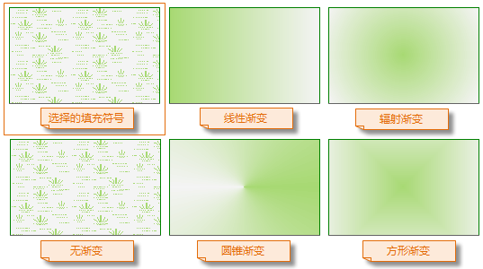
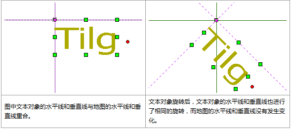

　　SuperMap iDesktop Cross 提供了丰富的点、线、填充符号资源，支持点、线、面、文本图层的风格渲染，可设置图层的符号类型、颜色、透明度等参数，从而优化地图的显示效果。

　　图层风格都在符号选择器中进行设置，打开图层对应的符号选择器对话框有两种方式：

- 方式一：在`图层管理器`中双击待设置风格的图层，即可弹出符号选择器对话框；
- 方式二：在`图层管理器`中选中待设置风格的图层，单击“地图”菜单栏后选择“风格设置...”项，或单击鼠标右键选择“图层风格”，即可弹出符号选择器对话框。
　
　
### 点符号

　　点符号的风格设置包括符号选择、显示大小、符号颜色、旋转角度、透明度等。设置任意参数后，`预览`框处都会显示符号的预览效果。

- **符号选择**

　　“点符号选择器”左侧目录树中显示了程序默认和工作空间中的符号目录，选择相应的目录，并在符号显示区域选中需要的点符号即可。

- **显示大小**

　　可设置点符号的宽度和高度大小，可在数字框中输入数值，也可点击数字显示框右侧的箭头进行调整，单位为`0.1mm`。若选中的为栅格符号，则可设置是否锁定宽高比例，若勾选了`锁定高宽比例`复选框，则表示固定了符号的宽度与高度的比例，在改变符号宽度（或高度）时，符号高度（或宽度）会根据固定的比例自动更新。

- **符号颜色**

　　用于设置符号的显示颜色，可在弹出颜色面板中选取默认颜色，或点击颜色面板底部的 “其它颜色”按钮，获取更多自定义颜色。

- **旋转角度**

　　用于设置符号的旋转角度值，旋转时按逆时针方向旋转，值域为[0，360]。

- **透明度**

　　用于设置点符号的透明效果，用户可以在数字显示框中输入数值来设置，也可以点击按钮调整透明度。透明度的数值为 0 至 100 之间的任意一个整数，0 代表完全不透明，100 代表完全透明。

　　设置好符号风格之后，单击“应用”按钮即可在地图中看到该点图层的显示效果，若不满意，可继续在对话框中进行修改。

### 线符号

　　线图层支持设置线符号、线宽度、线颜色等参数。

- **选择线符号**

　　“线符号选择器”左侧目录树中显示了程序默认和工作空间中的线符号目录，选择相应的目录，并在符号显示区域选中需要的线符号即可。

- **线宽度**

　　用于设置线的粗细，可以在其右侧的数字显示框中输入数值来设置，也可以单击右侧的箭头按钮来调整线宽，调整单位为0.1ｍｍ。

- **线颜色**

　　用于设置线符号的颜色，单击其右侧的下拉按钮，可在弹出颜色面板中选取默认颜色，或单击颜色面板底部的 “其它颜色”按钮，获取更多自定义颜色。
　　
### 填充符号

　　填充符号选择器提供了填充符号选择、颜色、边线风格、透明度、渐变填充等参数的设置。

- **符号选择**

　　在符号库窗口中，可在各目录中找到需要的填充符号并选中，即可设置该填充符号风格。

- **前景颜色**
 
　　设置填充符号填充内容的颜色，单击其右侧的下拉按钮，用户可以在弹出颜色面板中选取默认颜色，或单击颜色面板底部的 “其它颜色”按钮，获取更多自定义颜色。 

- **背景颜色**
　　设置填充符号非填充内容的颜色，单击其右侧的下拉按钮，用户可以在弹出颜色面板中选取默认颜色，或单击颜色面板底部的 “其它色彩...”按钮，获取更多自定义颜色。 
 
- **背景透明**
　　勾选该复选框后，填充符号的非填充内容将设置为透明效果，此时“背景颜色:”的设置无效。
 
- **透明度**
　　设置填充符号的透明效果。用户可以在其右侧的数字显示框中输入数值来设置；也可以单击数字显示框右侧的箭头，使用弹出的滑块来调整透明度。透明度的数值为 0 至 100 之间的任意一个整数，0 代表完全不透明；100 代表完全透明。
 
- **渐变填充**
　　勾选该复选框后，将使用渐变颜色作为填充符号的填充内容，此时，填充符号的填充内容为颜色，即用户在第 1 步中选中的填充符号无效。在渐变填充模式下， “前景颜色”和“背景颜色”将作为渐变的两种颜色，即渐变模式为双色渐变，从前景色渐变到背景色。 渐变填充的其他参数设置：如果勾选了“渐变填充”复选框，则复选框下面区域的功能变为可用状态，用来设施渐变的参数： 
  - 类型：设置渐变的方式。包括以下五种方式：

　　（1）无渐变：不使用渐变颜色作为填充符号的填充内容，而是使用第 1 步所选中的填充符号的填充内容；

　　（2）线性：渐变为线性渐变；

　　（3）辐射：渐变为辐射状渐变，从中心向周围渐变；

　　（4）圆锥：渐变为圆锥体方式渐变；

　　（5）方形：渐变为方形渐变。

　　

   - 角度：设置渐变填充的旋转角度。

   - 水平偏移：设置渐变填充中心点相对于填充范围中心点的水平偏移百分比。用户可以在其右侧的数字显示框中输入数值来设置；也可以单击数字显示框右侧的箭头，使用弹出的滑块来调整数值。 

   - 垂直偏移：设置渐变填充中心点相对于填充范围中心点的垂直偏移百分比。用户可以在其右侧的数字显示框中输入数值来设置；也可以单击数字显示框右侧的箭头，使用弹出的滑块来调整数值。 

   - 线型选择：设置填充符号的边框线风格。单击其右侧的按钮，将弹出另一个符号库窗口，显示所加载的线符号库，在此设置填充符号的边框线风格，具体参见 线符号风格设置。 

### 文本对象

　　文本图层中的文本对象支持设置为不同显示风格，用于标注不同特征的要素，当文本图层为可编辑状态，选中文本对象即可通过“地图”菜单栏中的“文本风格”选项，设置文本对象的显示风格。此处设置的文本风格会实时对图层中选中文本对象生效。

- **字体名称**：单击右侧下拉按钮，可从中选择某一种字体作为同类文本的标准，例如选择“宋体”，则当前文本图层中的所有满足其他条件宋体文本对象为同类文本。注意：可通过键盘输入字母快速定位字体。
- **锚点对齐**：以锚点为对齐起始点进行向外的对齐，即锚点是对齐基点。在对齐方式发生变化时，锚点位置不变，文本对象根据不同的对齐方式以锚点为对齐起始点移动。在12种对齐方式中有3种基线对齐方式。基线主要是针对英文字符而言，是指在使用三线格英文写作时的第二条线，例如小写英文字母 abcde，全部的大写英文字母均位于基线上，而小写字母 gypj 有部分位于基线下。下表左基线、右基线和中心基线图示中的辅助线位置就是基线。

- **字号**：在组合控件中选择或直接输入字号大小，作为同类文本的标准。例如选择或输入字号为“10.5”且不改变字高和字宽值，则当前文本图层中同时满足其他标准的所有字号为10.5的文本为同类文本。
- **对齐方式**：单击右侧下拉按钮，可从中选择某一种对齐方式作为同类文本的标准，例如选择“左上角”，则当前文本图层中所有满足其他条件的对齐方式为左上角的文本对象为同类文本。
- **旋转角度**：从中选择或直接输入角度值作为旋转角度相同的标准，单位为度，例如选择或输入角度为“45”，则当前文本图层中符合其他标准且旋转角度为45°的所有文本为同类文本。应用程序提供了 0，45，90，135，180，225，270，315 共 8 种常用的角度值。也可以直接输入任意角度值，系统将会把输入值换算至0-360之间，如-180，720被换算为180和0。

　　

- **文本颜色**:设置文本对象的颜色可在弹出的颜色面板中选择一个颜色作为文本颜色，也可通过“提取颜色”吸取设置颜色，或者单击“其他颜色”，在弹出的“选择颜色”对话框中指定文本颜色
- **背景颜色**：用于设置文本背景颜色或轮廓颜色背景色，在未勾选“背景透明”时，用于设置文本背景颜色，若勾选了“轮廓”复选框，则表示文本轮廓的颜色。

　　

- **字体效果**：字体效果包括：粗体、斜体、轮廓、阴影、下划线、删除线、背景透明、固定大小，勾选相应的选项，就可以启用该效果，会实时的显示在预览区域，可以即时预览效果。
  - 加粗：勾选该复选框则表示文本显示效果为粗体。
  - 删除线：设置文本对象的文字是否添加删除线，勾选该复选框表示为文本添加删除线，不勾选则表示文本没有删除线。
  - 斜体：设置文本对象的字体是否显示为斜体。
  - 下划线：设置文本是否添加下划线。
  - 阴影：用来控制文本对象的文字是否有阴影，当该按钮为按下状态  时，表示文字有阴影，同时“文本风格”组的按钮为可用状态，用户可单击该按钮在弹出的颜色面板中设置文字阴影的颜色；如果按钮为0非按下状态  时，文字没有阴影，也不能进行文本阴影的设置。
  - 固定大小：用来控制文本对象是否固定大小。当该按钮为按下状态  时，表示文字大小不随地图的缩放而改变大小；如果按钮为非按下状态  时，表示文字大小随地图的缩放而缩放。
  - 背景透明：本对象的文字是否有背景修饰，勾选该复选框则表示文本屋背景修饰，不勾选该复选框则表示文本有背景颜色修饰，可在“背景颜色”处设置背景颜色颜色。文字背景修饰与文字轮廓线修饰互斥，即两者对于文字的修饰不能同时使用。
  - 轮廓：设置文本对象的字体是否有轮廓修饰，勾选该该复选框表示字体有轮廓修饰，轮廓颜色为`背景颜色`。文字轮廓线修饰与文字背景修饰互斥，即两者对于文字的修饰不能同时使用。轮廓：用来控制文本对象的文字是否有背景修饰，当该按钮为按下状态  时，表示文字无背景，如果按钮为非按下状态  时，文字有背景，同时“文本风格”组上的  按钮为可用状态，用户可单击该按钮在弹出的颜色面板中设置文字背景的颜色。文字背景修饰与文字轮廓线修饰互斥，即两者对于文字的修饰不能同时使用。 

