　　矢量数据和栅格数据都可以用来制作专题图，不同之处在于矢量数据的专题图是基于其属性表中的属性信息，而栅格数据则是基于像元值。SuperMap　iDesktop Cross 提供多种用于矢量和栅格数据的专题图，专题图适用于点、线、面、复合及栅格数据集，文本数据集和影像数据集不可以制作专题图。

　　适用于矢量数据的专题图类型有：单值专题图、分段专题图、标签专题图、统计专题图、等级符号专题图、点密度专题图、自定义专题图；适用于栅格数据的专题图类型有：栅格分段专题图、栅格单值专题图。专题图有以下几个特点：

- 专题图作为一个独立的图层来显示，不附属于普通图层，因此在地图中专题图可以根据实际需求调整它在地图图层中的显示顺序。

- 对同一数据集可以制作多个同种类型的专题图；也可以同时制作多种类型的专题图，比如对于面数据集，用户可以制作针对矢量数据集提供的所有类型的专题图。

### 单值专题图

　　单值专题图是将专题值相同的要素归为一类，为每一类设定一种渲染风格，如颜色或符号等，专题值相同的要素采用相同的渲染风格，从而用来区分不同的类别。单值专题图的专题变量可以是非数值型的描述性属性，如要素的名称，类型以及状态等；也可以是数值型的但用于标识的属性，如要素的唯一标识 ID，土地利用类型标识号等；当然，专题变量也可以是数值型的表示量的属性，这时每一个数值的要素会被赋予一种风格，如果数值非常多而且各不相同，不推荐用此方法制作专题图，因为并不能达到区分数据的作用。

　　单值专题图着重表示现象的质的差别，一般不表示数量的特征。可用于地质图、地貌图、植被图、土地利用图、政治行政区划图、自然区划图、经济区划图等。例如，在制作土地利用现状图时，为了更直观的看出草地、林地、居民地等不同类型的土地利用的分布区域和范围，通常会给同种土地利用类型赋予相同的颜色或填充风格，此时就是利用单值专题图在进行渲染。

  

### 分段专题图

**1.概述**

　　分段专题图的专题值按照某种分段方式被分成多个范围段，要素根据各自的专题值被分配到其中一个范围段中，在同一个范围段中的要素使用相同的颜色，填充，符号等风格进行显示。分段专题图所基于的专题变量必须为数值型，分段专题图一般用来反映连续分布现象的数量或程度特征，如降水量的分布、土壤侵蚀强度的分布等。

　　在制作土壤侵蚀强度分布图时，如何才能清楚地反映土壤侵蚀强度的高低呢？答案是对土壤侵蚀强度进行分段，比如说将其分为 6 段，分别为微度：&lt;500；轻度：500-2000；中度：2000-6000；强度：6000-10000；极强：10000-20000；剧烈：&gt;20000，单位为吨/（千米2\*年）。从轻度到剧烈，其颜色逐渐加深，即土壤侵蚀强度较低用淡红色，而土壤侵蚀强度较高的用深红色，这样就可以达到清楚反映土壤侵蚀强度高低的目的。反映在 GIS 中就是利用分段专题图进行渲染。

　　下图为一幅降水量分段专题图的示意图：

  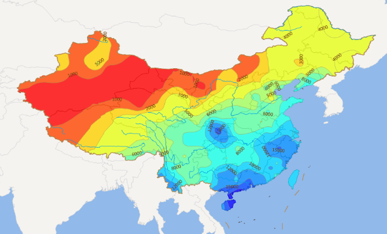

**2.风格设置**

　　分段专题图最典型的就是使用颜色来反映各分段之间程度的差异，如降水量从低到高变化，其分段的颜色一般是从绿色渐变到红色来表现。当需要更进一步对每一段的风格进行渲染时，SuperMap 提供各种包括颜色，线型，填充等等的风格设置，从而可以根据用户的需求设置各分段的风格。

**3.分段方法**

　　SuperMap 提供了6种分段的方法，包括等距离分段法、平方根分段法、标准差分段法、对数分段法、等计数分段法以及自定义分段法，这些分段方法根据一定的距离进行分段，因而分段专题图所基于的专题变量必须为数值型。采用不同的分段方法，得到的分段专题图也各异；当分段个数不同时，也会得到不同的分段专题图。

　　分段好坏的一个标准就是是否使具有相似值的要素都落到同一个分段中，而决定分段专题图呈现的两个重要因素是所使用的分段方法以及分段个数。下面分别介绍　SuperMap 组件产品所提供的各种分段方法。

　　等距离分段法：等距离分段是根据专题值的最大值和最小值，按照用户设定的分段数进行相等间距的分段。在等距离分段中，每一段具有相等的长度。例如选择一个字段作为专题变量，其值是从 1-10 的，现在需要用等距离分段法将其分为 4 段，则分别为 1-2.5、2.5-5、5-7.5 和 7.5-10。

　　**注意**：分段的区间采用前闭后开，即：\[ 1,2.5)、\[ 2.5,5)、\[5,7.5)、\[7.5,10)，按照此种分段方式，可能某个分段范围中没有要素。

### 标签专题图

**1.概述**

　　地图上的必要的标注是必不可少的，不仅帮助用户更好的区分地物要素，同时也显示了要素的某些重要属性，如行政区划、河流、机关、旅游景点的名称、等高线的高程等。在　SuperMap 中，通过制作标签专题图，用户可以轻松的实现地图标注。

　　标签专题图用于专题值对点、线、面等对象做标注（也叫标签），多用字符或数值型字段，如标注地名、道路名称、河流等级、宽度等信息。这里需要注意的是地图上一般还会出现图例说明，图名，比例尺等等，这些都是制图元素，不属于标签专题图标注的范畴。

　　在标签专题图中，可以统一对标签的显示风格和位置进行设置，也可以通过分段的方式，对单个或每个分段内的标签的风格单独进行设置。

　　标签专题图有四大特点，一是可以对标签专题图进行分段风格设置，即用户可以设置一个分段字段表达式，对比该表达式的值与按照一定的分段模式确定的分段值，从而将落在不同分段范围内的要素的标签设置为不同的风格；二是支持复杂标签专题图，即支持标签嵌套标签的形式；三是对标签专题图的文本提供复合风格设置，比如文本“喜马拉雅山”，可以将前三个字用红色显示，后两个字用蓝色显示；四是支持文本缩放的最大最小值，即地图缩放时，文本仅在最大最小值范围内进行缩放。

  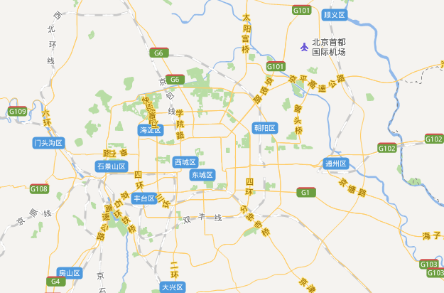

**2.标签位置的控制**

　　标签专题图中，各要素的标签在要素位置的附近放置，如何放置美观，如何避免标签之间发生重叠的现象，以及如何使标签与要素的关系易于识别等都是需要考虑的问题，因而，对标签位置的控制是非常重要的。

-   **内点**

　　在标签专题图默认情况和统一设置的情况下，标签的锚点即为要素的内点。要理解锚点的位置，首先要理解内点的位置。

　　对于不同的几何对象，内点的位置也不同。点对象的内点是该点本身；面对象的内点是在几何对象的内部，并靠近中央的点；线对象的内点是线对象的第一个子对象的内点（当线对象只有一个子对象时，取该子对象的内点），当该子对象有奇数个节点时，取中间一个节点为内点，当该子对象有偶数个节点时（多于两个节点的情况），取中间两个节点中间值为内点，当该子对象有两个节点时，取两节点之中心为内点。

-   **锚点与标签位置**

　　一般情况下，通过标签的锚点来控制标签的位置。标签与锚点位置关系的设置是在标签或文本的风格中进行的，目前提供 12 种标签与锚点的位置关系，或者称为对齐方式来控制标签在锚点周围的放置情况，分别为：角点对齐方式：左上角对齐、左下角对齐、右上角对齐、右下角对齐；居中对齐方式：顶部居中对齐、中心对齐、左中对齐、右中对齐、底部居中对齐；基准线对齐方式：基准线左对齐、基准线居中对齐、基准线右对齐。

   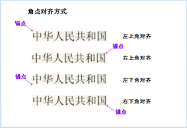   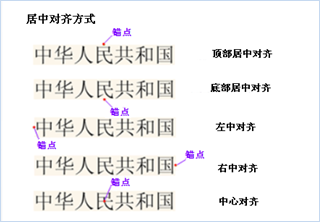   

   比如说，一个面状要素（圆形），其内点为圆心（红色），分别选用顶部居中对齐（粉红色）和右下角对齐（蓝色）两种方式来确定标签的位置，则标签的放置位置如下图所示：

-   **偏移量**

　　标签的锚点可以对要素的内点有一定的偏移。当用户希望标签的锚点位置不在内点上时，通过设置标签在 x 和 y 点的偏移量，可以控制标签的锚点位置。偏移量的值为一个常量值或者字段表达式所表示的值，即如果字段表达式为 SmID，其中 SmID = 2，那么偏移量的值为 2，标签偏移量的单位为地图单位。偏移量可以固定大小，即它可以不随地图的缩放而缩放。

- **效果及特殊处理**

　　在标签的位置设置上，SuperMap 提供许多效果设置和特殊处理来满足不同的标注需求，这时标签的锚点可能与要素的内点就没有关系了，包括：流动显示、自动避让、牵引线显示、沿线标注等。有的效果不是对所有类型的要素都适用的，如流动显示只适合于线和面要素的标注，而沿线标注只适用于线要素的专题图。

   -   **流动显示**：对于跨越比较大的区域和线条状的几何对象，在一个地图窗口中不能完全显示的情况下，如果其标签位置比较固定，在当前地图窗口中该对象的标签不可见，则需要通过平移地图来查看对象的标签信息。如果采用了流动显示的效果，在当前地图窗口中，对象即使是部分显示，其标签也会显示在当前地图窗口中。当平移地图时，对象的标签会随之移动，以保证在当前地图窗口中部分或全部显示的对象，其标签都可见，从而可以方便地查看各要素的标签信息。左图与右图分别表示不流动显示与流动显示的效果。**注意**：流动显示效果不可应用于点图层的标签专题图。

      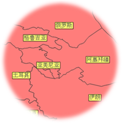

   - **自动避让**：当要素相距很近，而且各要素的空间范围都较小的情况下，标签的锚点由要素的内点控制，其标签可能相互重叠，而使得在底部的标签不可见。使用自动避让功能，在标签重叠时，部分标签将不按设定的与要素的内点相对位置来显示，以便不遮盖其他标签或被其他标签遮盖，使各标签都可见且不重叠。当然，在标签重叠度很大的情况下，即使使用自动避让功能，可能也无法完全避免标签重叠现象。

   - **牵引线显示**：在当标签流动显示时，其位置不固定，由于牵引线始终指向要素的内点，因而通过牵引线显示功能可以找到流动的标签实际对应的要素。下图是在牵引线显示的情况下得到的标签专题图。

   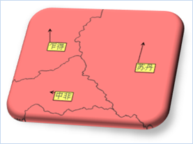

   -   **沿线标注**：线状地物一般都延伸得很长，制图时，将线状地物的标签沿线放置会比较美观，而且可以使标签隔一定长度出现，便于识别线状地物。

　　沿线标注功能提供 5 种沿线标注的方向，分别为沿线方向，由上至下、由左至右，由上至下、由右至左，由下至上、由左至右，由下至上、由右至左。当采用沿线方向进行标注时，标签将沿线的方向从起点到终点进行标注。对于其余 4 种标注方向选项，每种选项都包含竖直方向（由上至下或由下至上）和水平方向（由左至右或由右至左）两个部分的设置，这两部分不是同时起作用的，究竟哪一部分起作用，是由线的走向决定的。线的走向的判定方法为：如果是直线，连接线的起点和终点，若此线与水平方向的夹角小于 60 度，则认为此线的走向是水平的，否则是竖直的；对于弧线，则是考虑锚点处弧线的切线与水平方向的夹角。对于水平走向的线，则按照选项中水平方向部分的设置（从左到右或者从右到左）进行标注，竖直方向部分的设置（从上到下或者从下到上）不予考虑；反之对于竖直走向的线，则按照选项中竖直方向部分的设置（从上到下或者从下到上）进行标注，水平方向部分的设置（从左到右或者从右到左）不予考虑。例如，图12的沿线标注方向为由上至下，由左至右，则标签 14、15 是按照由上至下的方向在进行标注，标签 16、17 是按照由左至右进行的标注。

　　**注意**：沿线标注时，标签的位置会随着角度是否固定而改变。如果固定角度，则所有标签均按文本风格设置中字体的旋转角度来显示，不考虑沿线标注的方向；如果不固定角度，在显示标签时会同时考虑字体的旋转角度和沿线标注的方向。图12与图13沿线标注的方向均为：由上至下，由左至右；字体的旋转角度为 0。如下：左图为不固定角度，右图是固定角度。

   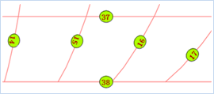   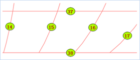

   -   **地图重复标注**：一个线数据集如果有一条记录由多个子线段组成，基于任意字段制作标签专题图且设置沿线标注时，在地图上会有多个重复的标签。例如，对于代表北京五环路的线数据，假如有 4 条子线段组成，当以名称字段（字段值为：五环路）做为专题变量制作标签专题图（沿线标注）时，如果不选择避免地图重复标注，则显示效果如图14左图，如果选择了避免地图重复标注，系统会将这条线的四个子线部分看成一条线来进行标注，其显示效果如下右图所示。

   

**3.标签风格**

-   文本风格

    　　标签文本风格的设置包括字体，对齐方式，字体大小，字高，字宽，字体旋转角度，前景色，背景色等，另外还提供一些字体效果，如粗体，斜体，阴影，轮廓线，删除线，透明与否等的设置。其中在设置文本背景不透明时，背景色就是文本的背景色，在同时设置背景透明和以轮廓的方式显示文本时，背景色是轮廓线的颜色；字体的前景色即为字体的颜色。字体的对齐方式为字体对于锚点的相对位置，详细信息请参见标签位置的介绍。另外，字体的大小一般与字体的高度是一一对应的，改变字体高度，字体的大小也会相应改变，反之亦然。

    　　对数字提供显示精度的设置，即若显示精度设置为0.1，则字段值为 178.3129 的对象在标签专题图中显示为 178.3；对文本提供最大、最小高度（宽度）的设置，这项设置可以在地图进行缩放时对字体的大小进行控制，即地图放大，字体也会随之放大，但是最大不会超过最大高度（宽度），该设置生效的前提是字体不固定大小。

-   文本复合风格

    　　对文本进行复合风格设置，即用户可以使标签的文字显示不同的风格，比如文本“喜马拉雅山”，可以将前三个字用红色显示，后两个字用蓝色显示。对同一文本设置不同的风格实质上是对文本的字符进行分段，同一分段内的字符具有相同的显示风格。对字符分段有两种方式，一种是利用分隔符对文本进行分段；另一种是根据分段索引值进行分段。

    　　利用分隔符对文本进行分段：比如用“&”作分隔符，它将文本“5&109”分为“5”和“109”两部分，在显示时，“5”和分隔符“&”使用同一个风格，字符串“109”使用相同的风格。

    　　利用分段索引值进行分段：文本中字符的索引值是以 0 开始的整数，比如文本“珠穆朗玛峰”，第一个字符（“珠”）的索引值为 0，第二个字符（“穆”）的索引值为 1，以此类推；当设置分段索引值为 1、3、4、9 时，字符分段范围相应的就是(-∞，1)，\[1，3)，\[3，4)，\[4，9)，\[9，+∞)，可以看出索引号为 0 的字符（即“珠”）在第一个分段内，索引号为 1、2 的字符（即“穆”、“朗”）在第二个分段内，索引号为 3 的字符（即“玛”）位于第三个分段内，索引号为 4 的字符（“峰”）在第四个分段内，其余分段中没有字符。

-   背景风格

    　　标签设置背景形状风格共有 7 种类型：矩形、圆角矩形、椭圆形、菱形、三角形、圆形和符号，其中符号背景可以选用点状符号库中的一种点状符号作为标签的背景。例如，图12 的标签背景形状是椭圆形。对背景的形状的风格设置与面符号的风格设置相同。

**4.标签专题图的分段显示**

　　标签专题图可进行分段风格设置，通过分段的方式，可以对每个分段内的标签的风格进行设置，即用户可以设置一个分段字段表达式，对比该表达式的值与（按照一定的分段模式确定的）分段值，来确定要素所属的分段范围，进而将落在不同分段范围内的要素的标签设置为不同的风格。

### 统计专题图

**1.概述**

　　统计专题图是通过为每个要素或记录绘制统计图来反映其对应的专题值的大小。统计专题图可以基于多个变量，反映多种属性，即可以将多个专题值绘制在一个统计图上。通过统计专题图可以在区域本身与各区域之间形成横向和纵向的对比。多用于具有相关数量特征的地图上，比如表示不同地区多年的粮食产量、GDP、人口等，不同时段客运量、地铁流量等。

　　例如，在统计北京市旅游景点各季度的游客量时，可以在北京市旅游图上，以字段　Pop1、Pop2、Pop3、Pop4（分别代表 4 个季度的游客量）作为专题变量，制作一幅游客量的统计专题图，这样可以看出某一季度各个景点的游客数量，同时也可以直观的对比某一个景点各季度的游客数量。

  

**2.深入了解统计专题图**

-   **统计专题图与统计图**

    　　统计专题图与统计图是两个不同的概念。在统计专题图中，每个区域都会有一幅表示该区域各专题值的统计图，统计图有多种表现形式，目前提供的统计图类型有：面积图，阶梯图，折线图，点状图，柱状图，三维柱状图，饼图，三维饼图，玫瑰图，三维玫瑰图，环状图，堆叠柱状图以及三维堆叠柱状图。

   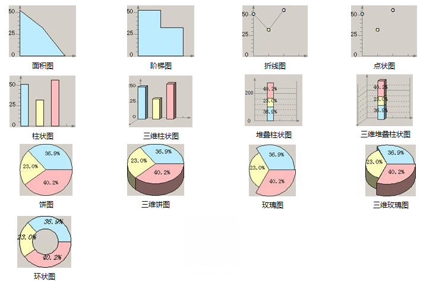

*   **分级模式**

　　在确定统计图的大小以及统计图中各专题变量所占的比例时，会用到专题图分级模式，该模式主要用在统计专题图和等级符号专题图中。分级主要是为了减少制作专题图时数据大小之间的差异。如果数据之间差距较大，则可以采用对数或者平方根的分级方式来进行，这样就减少了数据之间的绝对大小的差异，使得专题图的视觉效果比较好，同时不同类别之间的比较也还是有意义的。目前提供的分级模式为：常量分级模式、对数分级模式和平方根分级模式。对于有值为负数的字段，不可以采用对数和平方根的分级方式。

　　　常量分级模式（CONSTANT）：按属性表中原始数值的线性比例进行分级运算。

　　　平方根分级模式（SQUAREROOT）：按属性表中原始数值平方根的线性比例进行分级运算。

　　　对数分级模式（LOGARITHM）：按属性表中原始数值自然对数的线性比例进行分级运算。

-   **如何确定统计图大小**

　　统计图显示的最值，分级模式以及专题最值共同决定了统计图的显示大小。统计图显示的最值包括统计图显示的最大值与最小值，所有统计图的显示大小均在最大、最小值之间逐渐变化。分级模式不同，同一要素所对应的统计图大小也会有所不同。

　　专题最值包括专题最大值与最小值。对每一专题变量对应的专题值取最大最小值，将这些最大值、最小值分别相加，构成**专题最大值、最小值**。比如：一幅专题图有两个专题变量，字段 ID 和字段 SmID。字段 ID 的字段值最大为 25，最小为 1，字段 SmID 对应的字段值，最大为 10，最小为 5，则该专题图的专题最大值为 35（即25+10），最小值为 6（即1+5）。

　　注意：要素各专题值的总和决定该要素对应的统计图的大小，要素每一个专题值决定该专题变量对应在统计图中的比例。

　　**对应关系**：给出统计图显示的最大值与最小值、专题最大值和最小值，利用线性关系计算出线性系数；再根据计算出来的线性方程，算出各个要素对应的统计图的大小。以柱状图为例：某专题图专题变量有两个，分别为字段 Val1 和字段 Val2；若分级方式为常量分级模式（CONSTANT），用户设置的显示最大值为 20，最小值为 10；系统根据专题值计算的专题最大值和最小值分别为 10和 6，则由显示最值和专题最值确定的线性方程为 Y＝2.5X-5。如果某一个要素 A 的 Val1 值为 2，Val2 的值为 6，则要素 A 的各专题值的总和为 8，根据线性方程可知该要素对应的柱状图的大小应为 15（统计图类型不同，所代表的意义不同，比如对于饼图，该大小代表圆的直径）。对柱状图来说，这代表A要素对应的柱状图总高度为 15（柱状图的柱宽是用户通过 ThemeGraph.BarWidth 属性设定的），因为专题值 Val1 与 Val2 的比例为1：3，所以在柱状图中，代表专题值 Val1 的柱子高度为 3.75，代表专题值 Val2 的柱子高度为 11.25。

　　**注意**：以上数值的单位与地图单位相同，即：如果地图单位为米，则所求高度值的单位也为米。

-   **统计专题图显示效果设置**

　　统计专题图也可以像标签专题图一样，设置统计图是否流动，是否自动避让，是否显示牵引线，是否进行偏移，如果偏移是否固定偏移量等，此外，还可以对某些类型统计图的坐标轴及统计图本身的风格进行设置。

　　(1). **统计图坐标轴的设置**

   　　对统计图的坐标轴，可以设置是否显示坐标轴；如果显示，还可以设置坐标轴的颜色、是否在坐标轴上显示网格以及是否显示坐标轴的文本标注，如果显示文本标注，还可以设置坐标轴文本的风格。图18所示坐标轴的设置为：坐标轴颜色为黑色，显示网格，显示文本标注。

　　　　

　　(2). **统计图的设置**

   　　对统计图可以设置在放大或者缩小地图时统计图是否固定大小，也可以设置是否显示统计图上的文本标注。如果显示文本标注，可以设置统计专题图文本显示格式以及文字标注风格。对于统计专题图文本显示格式，有如下几种，百分数、真实数值、标题、标题+百分数、标题+真实数值。

   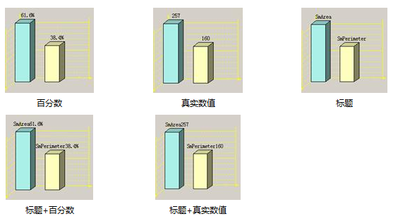

　　(3). **统计图的自动避让设置**

   　　对于统计图，也可以像标签专题图的标签一样进行避让设置。在对数据集同时制作统计专题图和标签专题图时，如果统计图不显示文本标注，标签专题图的标签即使和统计图重叠，两者也都可正常显示；如果统计图显示文本标注，在统计图中的文本标注和标签专题图中的标签不重叠时，两者均可正常显示，但是如果重叠，则会过滤掉统计图的文本标注，只显示标签。

　　(4). **其它设置**

   　　除了以上设置，还可以选择是否显示属性值为负值的数据；对于柱状图、三维柱状图、堆叠柱状图、三维堆叠柱状图，可以设置柱宽；对于玫瑰图或三维玫瑰图，可以设置分片的角度；对于饼图、三维饼图、玫瑰图、三维玫瑰图，可以设置其起始角度。

### 点密度专题图

　　点密度专题图用一定大小、形状相同的点表示现象分布范围、数量特征和分布密度。点的多少和所代表的意义由地图的内容决定。点密度专题图利用图层的某一数值属性信息（专题值）映射为不同等级，每一级别使用不同数量或表现为密度的点符号来表示该专题值在各个分区内的分布情况，体现不同区域的相对数量差异。多用于具有数量特征的地图上，比如表示不同地区的粮食产量、GDP、人口等的分级，主要针对区域或面状的要素，因而，点密度专题图适用于面数据集。

  

**专题图中点的意义**：

-   点密度专题图使用点的数目或者密集程度来反映一个区域或范围所对应的专题值，其中一个点代表一定数量，则一个区域内的点的个数乘以点所表示的数量就是此区域对应的专题值。例如，一个城市共有 2000000 人口，点密度专题图中一个点代表 20000 人口，则在这个市的区域范围内将会分布有 100 个点。
-   在点密度专题图中，对于点的个数相同的两个区域，面积比较小的区域的点分布密集，因而点密度专题图的专题值（或制图对象）是数量，反映的却是密度。例如，对各区域的人口数制作点密度专题图，以图形的表现方式，即点的密集程度，反映了人口密度；当然，也可以以人口密度作为专题变量制作分段专题图，用颜色的差异来反映区域的人口密度的差异。点密度专题图中点的个数越多越密集，则说明数据反映的事物或现象在该区域的密度或浓度越大。
-   用户可以指定点密度专题图中单个点所代表的数值及其显示尺寸。当单个点所代表的数值太小，或设置的点符号显示尺寸过大时，都会使点相互堆叠成块，从而使得现象的分布不明显，因而设置合适的点所表示的数值以及点的显示尺寸是很重要的。当用来制作点密度专题图的专题值很大时，最好将点所代表的数值设置大一些，点符号的尺寸设置小一些。实际制图中，可能需要通过多次尝试来找到合适的点所代表的数值与点显示尺寸的组合。
-   对于一个点密度专题图，点的风格都是一致的。用户可以对数据的多个属性制作多个点密度专题图，使用不同的点风格来区分不同的点密度专题图，从而在一个地图上表现多种属性的分布密度特征。
-   点密度专题图中点的分布是随机的，并不代表实际的分布位置。即使在相关设置完全相同的情况下，每次制作出的专题图，点的数量相同，但点的位置都有差异。

### 等级符号专题图

　　等级符号专题图根据各要素的某个数量特征，按照一定的分类方法用一组等级符号表示在地图上，以呈现要素间该数量特征的相对关系。等级符号专题图多用于具有数量特征的地图上，比如表示不同地区的粮食产量、GDP、人口等的分级，也就是说，用于制作等级符号专题图的专题变量类型为数值型。

  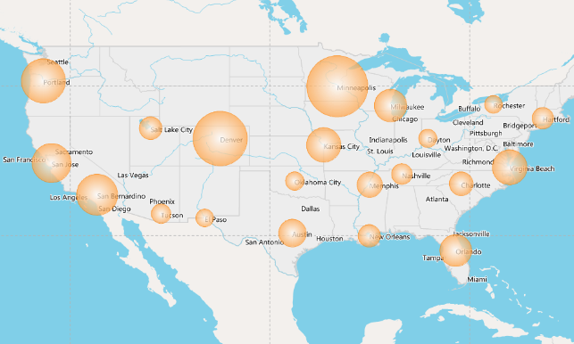

　　**如何确定等级符号显示的大小**

　　显示大小主要取决于以下因素：点状符号（即等级符号专题图中的符号）的大小，等级符号专题图的基准值，按照分级模式运算后的统计值的大小。点状符号大小不是等级符号专题图中符号的显示大小。对于一幅等级符号专题图来说，点状符号的大小是统一的，由于每个要素的专题值不同，所以最终显示在专题图中的点状符号大小会有所不同。

　　统计指的分级模式有三种：常数分级模式、对数分级模式和平方根分级模式。在等级符号专题图中，不同分级模式用于确定符号大小的数值是不相同的，常数分级模式按照字段的原始数据进行，对数分级模式是对每个要素对应的专题值取自然对数、平方根分级模式则是对其取平方根，用最终得到的结果来确定其等级符号的大小。基准值由用户设定，基准值越大，点状符号最终的显示大小越小。

　　**等级符号显示效果设置**：等级符号专题图也可以像标签专题图，统计专题图一样，设置是否流动显示，是否显示牵引线，是否进行偏移，偏移量是否固定，所不同的是标签专题图针对的是标签，统计专题图针对的是统计图，等级符号专题图针对的是符号。除了以上设置，用户还可以设置是否显示专题值为负值或者零值的要素，以及专题值为正值，负值，零值时等级符号的风格。

### 栅格单值专题图

　　栅格单值专题图，是将属性值相同的像元归为一类，为每一类设定一种颜色，从而用来区分不同的类别。栅格单值专题图适用于离散栅格数据和部分连续栅格数据，对于单元格值各不相同的那些连续栅格数据，使用栅格单值专题图不具有任何意义。

　　用户在了解了单值专题图后，对栅格单值专题图的理解就比较容易了，因为这两类专题图除了操作对象的不同之外，只有一些细节上的不同。下面通过对比两类专题图的相异之处来帮助用户理解栅格单值专题图。

1.  单值专题图的操作对象是矢量数据，而栅格单值专题图的操作对象是栅格数据；
2.  单值专题图的专题值为要素的字段值或字段表达式的值，而栅格单值专题图所使用的专题值为栅格数据集中像元的属性值；
3.  单值专题图子项的风格设置包括颜色风格设置，填充风格设置，符号风格设置等，而栅格单值专题图子项的设置，只有颜色风格设置一种。

### 栅格分段专题图

　　栅格分段专题图，是将所有像元的属性值按照某种分段方式分成多个范围段，属性值在同一个范围段中的像元使用相同的颜色进行显示。栅格分段专题图一般用来反映连续分布现象的数量或程度特征。比如某年的全国降水量分布图，将各气象站点的观测值经过内插之后生成的栅格数据进行分段显示。

　　用户在了解了分段专题图后，对栅格分段专题图的理解就比较容易了，因为这两类专题图除了操作对象的不同之外，只有一些细节上的不同。下面通过对比两类专题图的相异之处来帮助用户理解栅格分段专题图。

1.  分段专题图的操作对象是矢量数据，而栅格分段专题图的操作对象是栅格数据；
2.  矢量数据集分段专题图支持所有的分段方法，而栅格分段专题图只支持其中的四种，即等距离分段法、平方根分段法、对数分段法以及自定义分段法；
3.  分段专题图的专题值为要素的字段值或字段表达式的值，而栅格分段专题图所使用的专题值为栅格数据集中单元格的属性值；
4.  分段专题图中每一段的风格设置包括颜色风格，填充风格，符号风格等，而栅格分段专题图中，只有颜色风格设置一种，各分段使用不同的颜色来进行区分。

