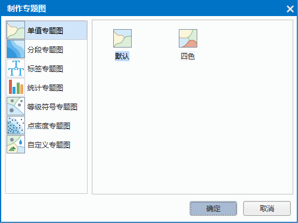

SuperMap iDesktop Cross 提供了基于矢量和栅格数据制作专题图的功能，支持的专题图类型包括：单值、分段、标签、统计、等级符号、点密度、自定义、栅格单值和栅格分段等，具体说明如下：

- **单值专题图**：将图层中属性字段值相同的对象归为一类，为每一类设定一种渲染风格，如颜色或符号等，以表达不同属性值之间对象的差别。单值专题图有助于强调数据的类型差异，单不能显示定量信息，因此多用于具有分类属性的地图，如土壤利用类型、土地利用图、四色图等。
- **分段专题图**：将图层中所有对象的专题值按照某种分段方式分成多个范围段，为每一个范围段设定一种渲染风格，对象根据各自的专题值所处的范围段的风格进行显示。分段专题图表示了某一区域的数量特征，如不同区域的销售数字，家庭收入，GDP，或者显示比率信息如人口密度等。
- **标签专题图**：主要用于在地图上做标注，即用专题值对点、线、面等对象做标注。多用于文本型或数值型字段，如标注地名、道路名称、河流宽度、等高线高程值等信息。
- **统计专题图**：通过为图层中每个对象绘制统计图以反映其专题值的大小。统计专题图可以基于多个专题变量，反映地图对象的多个属性。借助统计专题图可以更好的分析自然现象和社会经济现象的分布特征和发展趋势，在统计图区域本身与各区域之间形成横向和纵向的对比，多用于具有相关数量特征的地图上，比如表示不同地区多年的粮食产量、GDP、人口等。
- **等级符号专题图**：与分段专题图类似，等级符号专题图将矢量图层的某一属性字段信息映射为不同等级，每一级分别使用大小不同的点符号表示，符号的大小与该属性字段值成比例，属性值越大专题图上的点符号就越大，反之亦同。等级符号专题图多用于具有数量特征的地图上，例如不同地区的粮食产量、GDP、人口等的分级。
- **点密度专题图**：用一定大小、形状相同的点表示现象分布范围、数量特征和分布密度。点符号分布在区域内的密度高低与该属性字段值成比例，属性值越大专题图上的点符号的分布就越密集，反之亦同。点密度专题图多用于具有数量特征的地图上，例如表示不同地区的粮食产量、GDP、人口等的分级点的多少和所代表的意义由地图的内容确定。
- **自定义专题图**：通过自定义属性字段来创建自定义专题图，根据数值型字段值与符号库中对应ID号的风格来设置显示风格，可以更自由的表达数据信息。
- **栅格分段专题图**：将栅格数据集中像元的属性值划分成多个范围段，像元值在同一个范围段中的像元以同种颜色进行显示，以不同的颜色表达像元值位于不范围段的像元。
- **栅格单值专题图**：栅格数据集中属性值相同的单元格归为一类，每一类设定一种颜色，以不同的颜色表达不同像元值的像元。

### 创建专题图

在地图窗口中打开待制作专题图的数据，在图层管理器中选中一个矢量或栅格图层，单击鼠标右键选择“制作专题图...”选项，或在“**地图**”菜单选项卡中单击“专题图...”选项，弹出如下图所示的“制作专题图”对话框，用户可根据需要选择制作的专题图类型。

　　

在对话框左侧单击选择专题图类型，在右侧选择相应的专题图模板，单击“确定”后即可应用模板中的风格创建一幅专题图。创建好的专题图会自动添加到当前地图窗口中，同时会弹出专题图面板，便于用户设置专题图的相关属性。

### 修改专题图

通过默认模板创建的专题图通常都不能达到用户的需求，可通过修改“专题图”面板中提供的参数设置，使专题图的显示效果满足用户需求。各类型专题图的参数设置有所不同。

#### 通用参数

- **表达式**

　　表达式是用来制作专题图的字段或字段表达式，对于矢量数据而言，表达式可以是单字段，也可以是通过SQL表达式构建的单个或多个字段的数学表达式。例如，Pop_2006 为 2006 年的人口数字段，该字段的单位为`万`，那么在制作标签专题图时，可以用表达式“Pop_2006||万人”来做该专题图的专题变量。

　　注意：对于 Oracle Plus、SQL Plus 引擎类型的数据制作专题图时，字段表达式只能为字段值或者字段运算式，如（SmID） 或者 （SmID + 1） 等。目前不支持通过条件表达式设置专题图字段的方式。如果设置的字段表达式是条件表达式，如："SmID > 100"，那么制作的专题图会失败，输出窗口会提示"专题图更新失败"。

- **专题图子项**

　　不同类型专题图对应的专题图子项的含义不同，有专题图子项的专题图类型包括：单值专题图、统计专题图、分段专题图、标签专题图、栅格分段专题图、栅格单值专题图。一个子项内包含的要素视为一个整体，对该子项进行风格设置时，子项内的要素均会发生改变。

  - 单值专题图是将专题值相同的要素归为一类，为每一类设定一种渲染风格，其中每一类就是一个专题图子项。比如，利用单值专题图制作行政区划图，Name 字段代表省/直辖市名，该字段用来做专题变量，如果该字段的字段值总共有 5 种不同值，则该行政区划图有 5 个专题图子项，其中每一个子项内的要素 Name 字段值都相同。
  - 分段专题图是将专题值按照某种分段方式分成多个范围段，要素根据其所对应的专题值被分配到其中一个分段中，在同一个范围段中的要素使用相同的颜色、填充、符号等风格进行显示，其中每一个范围段就是一个分段专题图子项。 
  - 标签专题图用专题值对点、线、面等对象做标注，对于分段标签专题图而言，同一范围段内的标签具有相同的显示风格，其中每一个范围段就是一个专题图子项。
  - 统计专题图可以将多个专题值绘制在一个统计图上，从而一次对多个数值型变量进行分析统计。专题图子项的个数就是专题图中专题变量的个数。比如，一幅城乡人口比例图（三维柱状图），该图有两个专题变量，一个专题变量为字段城镇人口（代表城镇人口数量），另一个专题变量为字段农村人口（代表农村人口数量）。则该统计专题图的专题图子项有两个，分别为东北三省城镇人口字段的值所对应的统计图和农村人口字段的值所对应的统计图。
  - 栅格分段专题图类似于分段专题图，不同在于分段专题图的操作对象是矢量数据，而栅格分段专题图的操作对象是栅格数据，相应地，栅格分段专题图子项就是按照某种分段方式分成的不同的范围段。 
  - 栅格单值专题图是将属性值相同的像元归为一类，每一类是一个专题图子项。

- **颜色方案**

　　颜色方案是为专题图的所有专题图子项的颜色渲染提供配色方案，同时会根据专题图子项的个数来合理分配给每个子项一个渲染颜色。根据专题图类型和适用情况，SuperMap 将颜色方案进行分类，分为适用晕渲图、适用 DEM、适用统计专题图、适用单值专题图、适用分段专题图、渐变色、随机色几大类别，同时，颜色方案支持用户自定义，用户可根据配图需求选择相应的颜色方案，颜色方案的具体介绍和操作请参见颜色方案管理器。

- **子项风格**

　　在制作专题图时，如果需要对专题图子项的风格进行修改，可以选中多个专题图子项，对点、线、填充符号的风格进行修改。

　　**点符号**

 参数名称         | 含义           
 :-------------- | :---------------
 符号类型 | 所使用的点符号类型。 
 符号大小 | 所使用的符号大小。 
 符号颜色 | 点符号的颜色。 
 图标 | 代替点符号显示的图标文件。 
 缩放比 | 当采用图标来代替点符号时，设置图标的缩放比率。数值单位为：百分比(%)
 旋转角度 | 当点符号为三维模型符号时，设置模型符号旋转角度。数值单位为：度(°)

　　**线符号**

 参数名称         | 含义           
 :-------------- | :---------------
 线型 | 使用的线符号或者填充符号的边界线类型 
 线宽度 | 线符号的宽度 
 线颜色 | 线符号的颜色 

　　**填充符号**

 参数名称         | 含义           
 :-------------- | :---------------
 填充类型 | 填充符号的类型。 
 前景色 | 填充符号填充内容的颜色。 
 背景色 | 填充符号非填充内容的颜色。 
 透明度 | 填充符号的透明效果，透明度取值为0 到100之间的任意整数,0表示不透明，100表示完全透明。 
 渐变类型 | 在启用渐变填充的情况下，使用的渐变填充类型。可以使用的渐变类型包括无渐变、线性渐变、辐射渐变、圆锥渐变或者方形渐变。 
 渐变角度 | 设置渐变填充的旋转角度。 
 渐变中心X偏移 | 渐变填充中心点相对于填充范围中心点的水平偏移百分比。 
 渐变中心Y偏移 | 渐变填充中心点相对于填充范围中心点的垂直偏移百分比。 

　　**即时刷新**

　　在“专题图”窗口中的各项参数设置都会实时反映到当前地图窗口中相应的专题图图层，即实现所见即所得。用户也可以通过取消勾选对话框底部的“启用即时刷新”复选框，不启用实时刷新。若不勾选“启用即时刷新”复选框，则用户完成各项参数设置后，可单击对话框底部的“应用”按钮，将对话框中的参数设置应用于当前专题图。

　　[单值专题图](/SuperMap-iDesktop-Cross/docs/Map/ThematicMap/UniqueValueProperties.html)

　　[分段专题图](/SuperMap-iDesktop-Cross/docs/Map/ThematicMap/RangesMapGroupDia.html)

