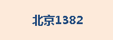
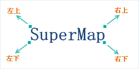
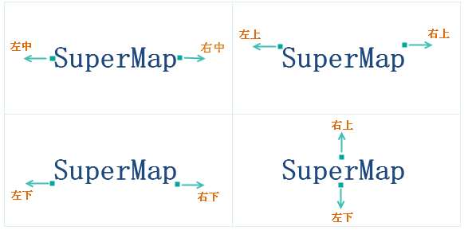
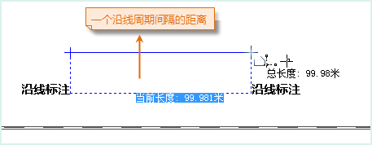
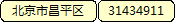
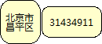
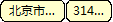

　　统一风格、分段风格标签专题图的“属性”选项卡参数设置一样，面板中的参数分为属性、风格、高级三大类，通过设置属性面板中的参数，可美化地图中的标签。

### 属性

**标签表达式**

　　用来指定当前标签专题图所使用的专题变量，该专题变量确定了标签专题图上所显示的标签对象的文本内容。专题变量可以为单个属性字段或者字段的数学表达式。如果用户想使用连接符实现多个字段的显示，就要选择组合框下拉列表中的“表达式...”项，在弹出的“SQL表达式”对话框中构建属性字段的表达式，字段表达式构建完成后，当前标签专题图便使用新的专题变量重新对图层中的对象进行标注。

**标签专题图标注表达式说明**

 符号 | 含义 | 支持的引擎 | 实例 | 效果
 :------ | :----- | :------ | :------
 + | 连接符 | UDB、SQL | 格式：字段名1 + 字段名2 +...  字段类型:文本型、字符型  示例：NAME + ENAME |   
 &#124;&#124; | 连接符 | UDB、Oracle | 格式：字段名1 &#124;&#124; 字段名2 &#124;&#124; ... 字段类型:文本型、字符型或数值型等，示例：NAME &#124;&#124; GDP\_2000 |   
 \[/\] | 分数符 | UDB、Oracle | 格式：字段名1 \[/\] 字段名2，字段类型:文本型、字符型或数值型等，示例：NAME \[/\] POP\_1990 &#124;&#124; '万人' |   
 chr(10) | 换行符 | UDB、Oracle | 格式：字段名1 &#124;&#124; chr(10) &#124;&#124; 字段名2...”，字段类型:文本型、数值型、字符型，示例：BaseMap\_R.NAME &#124;&#124; Chr(10) &#124;&#124; BaseMap\_R.POP\_1999 |   
 char(10) | 换行符 | SQL | 格式：字段名1 + char(10) + 字段名2...”，字段类型:文本型，示例：NAME + Char(10) + POP\_1999 |   
 chr(45) | 间隔符 | Oracle | 格式：字段名1 &#124;&#124; chr(45) &#124;&#124; 字段名2...”，字段类型:文本型，示例：NAME &#124;&#124; Chr(45) &#124;&#124; NAME |   
 char(45) | 间隔符 | SQL | 格式：字段名1 ＋ char(45) + 字段名2...”，字段类型:文本型，示例：NAME + Char(45) + NAME |   
 str() | 将数值转为字符串 | SQL | 格式：str(字段名)，字段类型:文本型、字符型或数值型等，示例：NAME + ':' + Str(POPU) + '万人' |   
 to\_char() | 将数值转为字符串 | Oracle | 格式：to\_char(字段名)，字段类型:文本型、字符型或数值型等，示例：NAME \[/\] '面积:' &#124;&#124; to\_char( SMAREA) |   

　　**注意：**对于 Oracle Plus、SQL Plus 引擎类型的数据制作专题图时，字段表达式只能为字段值或者字段运算式，如（SmID）或者 （SmID + 1）等。目前不支持通过条件表达式设置专题图字段的方式。如果设置的字段表达式是条件表达式，如：“SmID &gt; 100”，那么制作的专题图会失败。

**背景设置**

　　用来为标签专题图中的标签对象（文本对象）添加一个指定形状，指定风格的背景，该背景为文本对象的背景，不同于文本对象中文字的背景。

- **背景形状：**用来控制文本对象的背景形状，通过选择组合框下拉列表中的项目即可为文本对象添加背景修饰，背景形状主要的形式有：

  -   **默认：**标签专题图中的文本对象没有任何背景形状修饰。
  -   **矩形、圆角矩形、椭圆、菱形、三角形：**采用这五种形状之一，将以相应的图形作为标签专题图中文本对象的背景形状，同时下面背景风格的“设置”按钮变为可用状态，用来设置标签专题图中文本的背景风格。
  -   **点符号：**标签专题图中的文本对象使用使用点符号作为标签专题图中文本对象的背景。

- **背景风格：**用来控制文本对象背景形状的风格，通过点击右侧的“设置”按钮来设置标签专题图中文本的背景风格。当背景形状为矩形、圆角矩形、椭圆、菱形、三角形时，弹出[填充符号风格设置](../../Visualization/LayerStyle/FillSymStyle.htm)对话框；当背景形状为点符号时，弹出[点符号风格设置（地图和布局）](../../Visualization/LayerStyle/PointSymStyle.htm)对话框。

**标签偏移量**

　　用于设置标签专题图中标签对象的锚点相对于其所标注的对象的内点的偏移程度。

-   **偏移单位：**用于设置偏移量数值的单位。点击右侧的下拉按钮，在弹出的下拉菜单中，系统提供“坐标系单位”和“0.1毫米”两种偏移单位供用户选择。“0.1毫米”，表明符号的偏移量以0.1毫米为单位；“坐标系单位”，则所设置的偏移量与地图的坐标系的单位保持一致。
-   **水平偏移量：**用于设置标签相对于其表达对象的水平偏移量。可以直接输入数值设置偏移量；也可以选择该图层的一个数值型的字段，使用字段值作为偏移量。
-   **垂直偏移量：**用于设置标签符号相对于其表达对象的垂直偏移量。可以直接输入数值设置偏移量；也可以选择该图层的一个数值型的字段，使用字段值作为偏移量。

**"效果设置"区域**

　　用于调整和控制标签专题图中标签对象（文本对象）的显示效果。

-   **流动显示：**选中该复选框，则专题图的渲染风格可以流动显示，即标签会随着地图窗口的变化而移动以达到全部显示的优化效果。当开启流动显示效果时，请勿使用局部刷新功能，否则会导致局部刷新效果显示不正确。注：点图层创建标签专题图时不支持流动显示功能。
-   **显示上下标**：选择该复选框，根据标签表达式中设置的规则，实现上下标的显示效果。在使用上下标时，需要注意以下问题：
    -   上下标功能暂不支持沿线标注、旋转角度、换行显示等参数设置。
    -   上下标功能暂不支持带分隔符的标签表达式。
    -   删除线、下划线等字体效果不支持上下标功能。

-   **显示小对象标签：**选择该复选框，可以显示标签专题图中小对象的对应的标签，否则，将根据比例尺的大小情况，忽略部分小对象对应的标签，即小对象的标签不显示。
-   **竖排显示标签：**选择该复选框，可以将标签竖排显示。**注意**：若勾选了“沿线标注”复选框或设置了字体的“旋转角度”，则设置“竖排显示标签”不生效。
-   **自动避让：**选中该复选框，可以使地图中的标签对象在一定范围内自动调整，达到使标签同时显示而不互相重叠和影响。
   -   **全方向文本避让：**选中该复选框，可以使地图中的标签在其标注对象外接矩阵的四个方位上按照一定的次序(左下、左上、右下、左下)进行调整，选择不会发生压盖的对齐方式，最终使标签同时显示而不互相重叠和影响。

　　　  

 
   *   **两方向文本避让：**选中该复选框，可以使地图中的标签在其标注对象周围的几个方位上进行调整，对象的对齐关系如下图所示。例如：如果标签专题图层设置的对齐方式为左上角对齐，那么如果发生压盖时，自动避让功能会计算其对称点（右上角点）是否会发生压盖，即标签文本的外接矩形的右上角点与被标注对象的描点对齐时是否会压盖，如果不压盖则避让的结果采用该对齐方式。

　　　  

-   **显示牵引线：**如果选中该复选框，则当标签偏移其所标注的对象时，两者之间可以用牵引线连接；同时标签右侧的“线型风格”按钮为可用状态，点击该按钮，弹出“风格设置”窗口，用户可设置牵引线的符号样式，具体请参见：[线符号风格设置](../../Visualization/LayerStyle/LineSymStyle.htm)。
-   **数值文本精度：**用于设置数值型文本在标签上显示的精度。当标签中的内容为数值时，该标签右侧的下拉按钮可用，用户可在下拉按钮中进行设置。系统提供从0.00000001到1共9种精度，默认为无精度。例如假设精度为1，则字段值为178.5的对象在标签专题图中显示为179；如果为默认值即无精度，则各个对象的字段值直接显示在专题图中。

　　**注意**：当标签专题图图层属性处，勾选了流动显示、自动避让、显示牵引线复选框中任意一个属性时，不建议用户使用“局部刷新”功能，若启用“局部刷新”可能会出现地图边缘标签显示不完整的情况。

### 风格

　　**字体名称**：用于设置标签专题图中标签文本所使用的字体，该标签控件右侧的组合框下拉列表中提供了丰富的字体供用户选择，同时提供了“最近使用的字体”分组，方便选择最近使用的字体名称。系统支持键盘快速首字母定位字体。例如在键盘上单击字母“T”，则在下拉列表框内会显示以字母"T"开头的字体。单击该标签控件右侧的组合框下拉列表，选择一种字体。默认字体为微软雅黑。

　　当勾选了启用表达式，字体名称将通过选择属性字段的方式设置，字体将根据设定的属性值来展示，实现同一专题图中标签字体不同的自定义标签效果。关于自定义标签的设置，请参见：自定义标签设置说明。

　　**对齐方式**：用于通过设置标签专题图中文本对象与其锚点的相对位置来确定文本对象的摆放位置。该标签控件右侧的组合框下拉列表中列出了 12 种对齐方式，对齐方式的详细说明情参阅文本对齐方式说明。 

　　**字号**：用于设置标签专题图中标签文本字体的大小，用户既可以输入字体大小的数值，也可以从该标签控件右侧的组合框下拉列表中选择合适的字体大小。字号也可以选择该图层的一个字段，使用字段值作为字体大小。

　　**字高**：用于设置标签专题图中标签文本字体的高度，可以通过该标签控件右侧的文本框中输入数值也可以使用文本框中的上下微调按钮来调整文本框中的数值。字高单位为0.1毫米。

　　**字宽**：用于设置标签专题图中标签文本字体的宽度，可以通过在该标签控件右侧的文本框中输入数值也可以使用文本框中的上下微调按钮来调整文本框中的数值。默认情况下，字宽为0.0，表示使用当前字号和字高下，相应的字宽。字宽单位为0.1毫米。

　　**旋转角度**：用于设置标签专题图中标签对象（文本对象）的旋转角度，可以通过在该标签控件右侧的文本框中输入数值，也可以使用文本框中的上下微调按钮来调整文本框中的数值，也可以选择该图层的一个字段，使用字段值作为旋转的角度值，数值单位为度，逆时针方向为正方向。关于自定义标签的设置，请参见：自定义标签设置说明。

　　**倾斜角度**：勾选该选项卡中“字体效果”设置区域的“斜体”复选框，即可将标签专题图中标签对象（文本对象）中的字体设置为斜体。“倾斜角度:”项用于控制字体的倾斜程度，可以通过该标签控件右侧的文本框中输入数值，也可以使用文本框中的上下微调按钮来调整文本框中的数值，数值可以为正数也可以为负数，单位为度，当倾斜角度为 0 时，为系统默认的字体倾斜风格。如果选项卡中的“斜体”复选框没有勾选，该项不可用。

　　**文本颜色**：用于设置标签专题图中标签对象（文本对象）中文本的颜色，单击该标签右侧的按钮，弹出“颜色”对话框，可以选择和设置合适的颜色。

　　当勾选了启用表达式，文本颜色将通过选择属性字段的方式设置，颜色将根据设定的属性值来显示，实现同一专题图中标签颜色不同的自定义标签效果。关于自定义标签的设置，请参见：自定义标签设置说明。

　　**背景颜色**：用于设置标签专题图中标签对象（文本对象）中文本的轮廓或背景颜色，单击该标签右侧的按钮，弹出“颜色”对话框，可以选择和设置合适的颜色。只有勾选“文字效果”设置区域的“轮廓”复选框或不勾选“背景透明”复选框时，标签对象的“背景颜色”按钮才为可用状态。勾选“轮廓”按钮时，才会显示文本的轮廓颜色，否则文本无轮廓；不勾选“背景透明”按钮时，才会显示文本的背景颜色，否则，文本背景透明，所设置的背景颜色效果不可见。

**字体效果**

- **加粗**：“字体效果”设置区域的“加粗”复选框用于控制标签专题图中标签对象（文本对象）中的字体是否使用粗体。当勾选该复选框时，表示字体为粗体显示；若不勾选该复选框，则字体不以粗体显示。 
- **斜体**：“字体效果”设置区域的"斜体"复选框用于控制标签专题图中标签对象（文本对象）中的字体是否使用斜体。当勾选该复选框时，表示字体采用斜体显示，若不勾选该复选框时，则字体不以斜体显示。
- **删除线**：“字体效果”设置区域的“删除线”复选框用于控制标签专题图中标签对象（文本对象）中的文字是否添加删除线。当勾选该复选框时，表示文字有删除线；若不勾选该复选框时，文字没有删除线。
- **下划线**：“字体效果”设置区域的“下划线”复选框用于控制标签专题图中标签对象（文本对象）中的文字下方是否添加下划线。当勾选该复选框时，表示文字下方有下划线；若不勾选该复选框时，文字下方没有下划线。
- **阴影**：“字体效果”设置区域的“阴影”复选框用于控制标签专题图中标签对象（文本对象）中的文字是否有阴影。当勾选该复选框时，文字有阴影；若不勾选该复选框时，文字没有阴影。
- **轮廓**：“字体效果”设置区域的“轮廓”复选框用于控制标签专题图中标签对象（文本对象）中的文字是否有轮廓线，即文字采用描边修饰。当勾选该复选框时，表示文字有轮廓线，同时支持设置轮廓宽度，单位为：像素，值域为[1，5]；若不勾选该复选框时，文字没有轮廓线，并且文字轮廓线修饰与文字背景修饰互斥，两者对于文字的修饰不能同时存在，文字轮廓线的颜色为“背景颜色:”标签后的按钮所设置的颜色。

   

- **固定大小**：“字体效果”设置区域的“固定大小”复选框用于控制文本图层中文本对象是否固定大小。当勾选该复选框时，表示文字大小（包括字号、字高、字宽等）不随地图的缩放而改变大小；若不勾选该复选框时，表示文字大小（包括字号、字高、字宽等）随地图的缩放而缩放。
- **背景透明**：“字体效果”设置区域的“背景透明”复选框用于控制标签专题图中标签对象（文本对象）中的文字是否有背景修饰。当勾选该复选框时，表示文字无背景；若不勾选该复选框时，文字有背景，并且文字轮廓线修饰与文字背景修饰互斥，两者对于文字的修饰不能同时存在，文字背景所使用的颜色为“背景颜色:”标签后的按钮所设置的颜色。

### 高级

**沿线标注**

- **沿线标注**：勾选该复选框，则线图层中对象所对应的标注可以实现沿线对象的线条走向排列标签对象中的文本内容。该复选框只有在当前标签专题图为线图层的标签专题图时才可用。 **注意**：勾选“沿线标注”复选框，是以下各项可设置的前提。
- **固定文本角度**：若勾选“固定文本角度”复选框，则标签专题图中标签对象中的文字总是保持竖直方向。
- 去除重复标注：对于有多个子对象的复杂线对象，选中此复选框后，会仅对可视范围内长度较大的那条线予以标注；否则如果不选中此复选框，系统会对每个子对象予以标注一次。
- **沿线显示方向**：用于设置标签中的文本沿线标注的方向，应用系统提供了五种方式： 沿线的法线方向放置标签，即沿着线的方向从起点到终点标注。其他四个选项：从上到下，从左到右放置、从上到下，从右到左放置、从下到上，从左到右放置、从下到上，从右到左放置。

　　应用程序首先判断线的走向是水平的还是竖直的。判断标准：连接线的起点和终点，若此线与水平方向的夹角小于60度，则认为此线的走向是水平的，否则是竖直的。对于水平走向的线，则按照选项从左到右或者从右到左进行标注（即选项中的从上到下或者从下到上设置不予考虑），反之对于竖直走向的线，则按照选项从上到下或者从下到上进行标注（即选项中的从左到右或者从右到左设置不予考虑）。

　　**注意**：若选择了“固定文本角度”复选框，则“沿线显示方向:”标签控件右侧下拉按钮的设置无效；若勾选了“固定文本角度”或者修改了“沿线显示方向”，可能会因为字间距的问题出现字压盖的情况，导致部分标签不显示。

- **沿线字间距**：用于设置沿线标注的标签文本中文字间的间隔距离，单位为字高的倍数。取值范围为[1,8]。沿线字间距从文字的中心点起算。沿线字间距”设置为1时，沿线字体是紧贴在一起的。注意：对于英文单词和数字，应用程序会做特殊处理。英文单词和数字，均以空格来控制是否是一个词或一个数。 比如“SuperMapDesktop”和“12325”，无论“沿线字间距”设置为多少，实际都是在作为一个字来显示的。但如果是“SuperMap Dekstop”和“123 25”，中间存在空格，则沿线标注时会在空格处分割，并按照指定的沿线字间距显示。 
- **周期间距单位**：用于设置沿线标注周期间距数值的单位。点击右侧的下拉按钮，在弹出的下拉菜单中可选择"坐标系单位"或"0.1毫米"作为周期间距单位。"0.1毫米"表明标注的周期间距以0.1毫米为单位；"坐标系单位"指设置的标注周期间距与地图的坐标系的单位保持一致。 
- **沿线周期间距**：当线对象过长时，可以隔一段距离对其进行标注一次，该标签控件右侧的文本框用来设置重复标注的距离。需要注意的是，此处设置的周期长度是指从前一个标签文本的结束到下一个标签文本的开始之间的距离。如下图所示，对一段铁路进行标注，沿线字间距为1倍，沿线周期间距为100，参数设置见左图。则量算任意一个标签文本的结束到下一个标签文本开始之间距离，恰好为一个沿线周期间隔，长度为100。单位与地图的单位一致。 

　　　

- **固定循环标注间隔**：若勾选“固定循环标注间隔”复选框，注记会以固定的间隔（由沿线周期间隔决定）循环标注，此时循环标注间隔不随地图的缩放发生变化，此时沿线标注的单位为像素单位；若不勾选该项，则循环标注间隔随地图的缩放发生变化，则沿线标注的间距与地图单位保持一致。 

**“文本字符设置”区域：**

- **超长处理方式**：用于设置文本过长时标签的显示方式，系统提供了3种处理方式：默认、换行、省略。具体说明见下表，其中图示中“单行文本字数”设置为3，即当超长处理方式设置为换行或省略时，中文字符和西文字符均显示3个字符。
 处理方式 | 说明 | 图示 
 :------ | :---- | :----
 单行显示 | 所有文本单行显示。|  
 换行显示 | 将长度大于给定长度的文本内容进行换行显示，给定长度由"单行文本字数"控制。|  
 超长省略 | 将长度大于给定长度的文本内容用省略号代替显示，给定长度由"单行文本字数"控制。对于英文字符，系统会以一个字母为单位，超长内容省略不显示。| 

　　**注意**：以换行的方式进行显示，为了显示美观，这种方式会自动调整每行文本字数，尽量使每一行的字符个数相近，故每一行显示的字符个数小于等于设置的“单行文本字数”，其中英文单词和数字，均以空格来判定是否是一个词或一个数，每一行都会完整显示一个英文单词或数字。目前复合标签专题图只支持默认和省略两种处理方式，暂不支持换行的处理方式。如果设置了"沿线标注"功能，则该功能不起效果。

- **指定换行字符**：单击标签控件右侧下拉按钮，选择一个符号作为换行符，或在文本框中输入一个字符或文字，将其指定为换行符，文本标签会在换行字符处换行显示。 
- **单行文本字数**：标签控件右侧的文本框用来设置标签对象（文本对象）中每行最多显示的字符个数（英文单个字母、中文单个字、空格等都被视为一个字符），超出此长度，文本对象中的内容会换行显示或者省略不显示超出部分的内容。对于英文单词，若在换行的位置处碰巧需要将一个单词分两行显示，这时系统会做特殊处理，将该单词在前一行显示完全。该参数仅在“超长文本处理方式”设置为省略或换行显示时生效。
- **文本对齐方式**：若文本的“超长处理方式”设置为换行，可设置文本对齐方式，支持设置的对齐方式有：居中、左对齐、右对齐、分散对齐。 
避让后多行文本自动对齐：勾选该复选框，则避让后的文本会自动对齐显示。 

**“文本高度限制”区域** 

- **最大文本高度**：放大地图时，当标签对象的文字字体的高度超过了此处设置的最大值，标签对象中的文本高度就不再随地图的放大而放大。 
- **最小文本高度**：缩小地图时，当标签对象的文字字体的高度超过了所设置的最小值，标签对象中的文本高度就不再随地图的缩小而缩小。 

**“文本宽度限制”区域**

- **最大文本宽度**：放大地图时，当标签对象（文本对象）中的文字字体的宽度超过了此处设置的最大值，标签对象中的文本宽度就不再随地图的放大而放大。 
- **最小文本宽度**：缩小地图时，当标签对象中的文字字体的宽度超过了所设置的最小值，标签对象中的文本宽度就不再随地图的缩小而缩小。 

**文本避让的缓冲范围** 

- **横向**：根据设定的缓冲范围大小，将位于横向缓冲范围内的文本进行过滤，不予显示。文本避让的缓冲范围与“属性”选项卡中的偏移量单位一致。偏移量单位如果“以0.1毫米为单位”，则文本避让的缓冲半径是以0.1毫米为单位；“和地图距离单位保持一致”，则所设置的文本避让的缓冲范围的单位与图上单位保持一致。 
- **纵向**：根据设定的缓冲范围大小，将位于纵向缓冲范围内的文本进行过滤，不予显示。偏移量单位如果“以0.1毫米为单位”，则文本避让的缓冲范围是以0.1毫米为单位；“和地图距离单位保持一致”，则所设置的文本避让的缓冲范围的单位与图上单位保持一致。 
