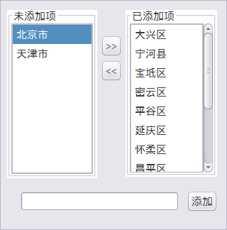

　　在图层管理器中单击单值专题图右键，选择“修改专题图”选项，在弹出的“专题图”面板中可修改单值专题图的各项参数设置，，实现更符合需求的专题图效果。

　　单值专题图的参数分为**属性**和**高级**两大类，具体介绍如下，其中通用参数的详细说明请参见[制作专题图](CreatThematicMap.html)。

### 属性

**可见性设置：**

-   单击工具条中的  图标按钮，可以控制专题值列表中所有选中专题值项对应地图对象的可见性。
-   单击每一个专题值项中的  图标，可以控制该专题值项对应地图对象的可见性。

**符号风格设置：**

　　工具条中的`风格`按钮，可用于设置专题值列表中选中专题值项的风格；用户也可以通过双击每一个专题值项中的符号风格图标，在弹出的对应符号选择器窗口中设置专题值对应地图对象的风格。不同类型矢量数据集创建的单值专题图，符号风格设置按钮的功能有所差异。

　　当需要修改多个专题图子项的风格时，可以通过 Shift 或 Ctrl 键选中多个要修改风格的专题图子项，然后单击工具条中“风格”按钮，弹出“修改专题图项风格”对话框，可在此选择要修改的项进行批量修改，具体操作请参见：[修改专题图](CreatThematicMap.html)。

**添加或删除专题值：**

-   添加：用于管理专题图中的专题值，单击  按钮，在弹出的专题值管理界面中，可在界面内进行添加、删除专题值操作，也可以在下方对话框中添加新的专题值。添加专题值后专题值列表会同步更新，与修改后的专题值相对应。

   

-   删除：用于删除专题值列表中所有选中的专题值项。选中专题值列表中待删除的专题值，单击工具条中的  按钮，即可删除所选专题值对应项。删除专题值后，原专题值对应的对象将使用默认风格进行显示。

**子项排序和颜色方案反序：**

-   单击  按钮，可将颜色方案按照相反的顺序进行调整，即将颜色方案中的各个颜色位置进行反序排列，重新形成新的颜色表。

　　专题值列表中，除了可设置单值项的可见性、符号风格外，还可设置抓题图子项的单值和标题，具体的说明如下：

-   **单值：**用于显示和修改子项的单值，可直接在“单值”列的单元格中编辑修改。若修改后的单值已经存在，则设置无效，恢复原来的值。
-   **标题：**用于显示和修改子项的标题，可直接在“标题”列的单元格中编辑修改。

　　**注意**：单值专题子项的“缺省风格”用于显示专题值列表中未添加项的风格。

### 高级

　　“偏移参数设置”区域：该区域用于设置单值专题图中点、线、面对象的偏移量。 
- **偏移量单位**：用于设置偏移量数值的单位，应用程序提供了"坐标系单位"和"0.1毫米"两种偏移单位。`0.1毫米`：表明符号的偏移量以0.1毫米为单位；`坐标系单位`：则所设置的偏移量与地图的坐标系的单位保持一致。 
- **水平偏移量**：用于设置标签相对于其表达对象的水平偏移量。可以直接输入数值设置偏移量；也可以选择该图层的一个数值型的字段，使用字段值作为偏移量。 
- **垂直偏移量**：用于设置标签符号相对于其表达对象的垂直偏移量。可以直接输入数值设置偏移量；也可以选择该图层的一个数值型的字段，使用字段值作为偏移量。 

