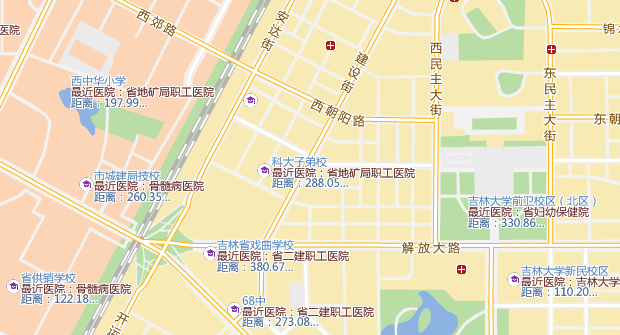

title: 距离计算应用实例
---

**主题：计算长春市与学校最近的医院及距离**

数据准备：长春市学校和医院点数据

操作步骤：

1.  通过“距离计算”选项，计算出里学校最近的医院ID和距离，具体操作如下图所示：

图：距离计算对话框

2.  得到结果为属性表数据，记录了学校ID、与其最近的医院ID及距离信息。通过“追加列”功能，将结果属性表中的Hospital\_ID 和 Distance 字段信息追加到学校的点数据集中。

图：距离结果属性表

图：追加学校最近医院的ID及距离

3.  再根据医院的ID号，将相应的医院名称追加到学校的点数据集中，具体参数设置如下：

图：追加医院名称至学校数据中
      -----------------------------------
4.  完成以上的追加列操作之后，学校点数据中有医院的ID、名称和它们之间的距离信息，对School
数据集制作矩阵标签专题图，可直观体现学校最近的医院名称和距离等信息，结果如下所示：

图：离学校最近的医院及其之间的距离

