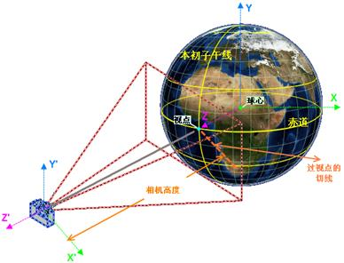

---
title:三维场景
---

　　三维 GIS 通过 x，y，z 来表示空间位置，可仿真模拟地貌地物和自然现象，三维GIS相对二维GIS更能表现出客观实际。二维 GIS 需要将其投影到平面上，通过符号的方式表现，且无法表达地形的高低起伏、无法表现高空或地下的地物，也无法模拟光照、烟雾、流水等自然现象。三维 GIS 无需投影即可描述真实世界面貌，表达二维 GIS 无法表达的地物和自然现象，更加形象直观，更加有利于将 GIS 推向大众化。

　　SuperMap iDesktop Cross 8C 目前提供的三维场景功能主要为二三维数据、配制好的场景模型的浏览和基础操作等功能，在使用三维场景之前，我们先来了解一下场景的基本概念：

###  三维窗口

　　SuperMap 所有的三维可视化操作都在三维窗口中进行，每一个三维窗口可以保存为一个场景，并保存到工作空间中。三维场景的主体是一个模拟地球的三维球体，该球体具有地理参考，球体上的点采用经纬度进行定位，同时，使用全球的遥感影像图作为背景覆盖在球体表面，增强三维球体模拟的逼真性；除此之外，三维场景还模拟了地球所处的环境，包括：宇宙的星空、地球的大气环境、地球表面的雾环境等。三维场景还提供了相机的设置，相机可以用来控制对球体的观测角度、方位和观测范围，从而以不同的视角呈现球体的不同部位。

　　

### 相机

　　在三维场景中通过相机来控制显示的视图，相机对象实际是三维场景中的一个虚拟镜头，通过指定这个虚拟镜头的位置和方向来指定视图，SuperMap 三维 GIS 采用大地空间直角坐标系，所有数据都在一个坐标系下组织和管理。地球是椭球体，但我们为了方便和快速地进行坐标换算和空间定位，我们定义地球为一个球体且半径为6378137米。大地空间直角坐标系是以球心为原点，以起始大地子午面与赤道面的交线为 Z 轴，以赤道面上与 Z 轴正交的直线为 X 轴，以 X 轴与 Z 轴都正交的直线为 Y 轴，构成右手坐标系，如图下所示：

　　

　　默认状态下，相机的位置在经度和纬度都为0的位置，即在赤道和本初子午线相交的位置处，通过鼠标或导航条操作即可改变相机的位置和方向，从而获取不同的视图。

### 导航工具条

　　三维窗口右侧默认会显示导航工具条，导航工具提供了放大、缩小、倾斜、拉起、旋转等浏览操作，配合键盘操作可以快速实现浏览操作。工具条的具体说明如下：

　　

 浏览功能 | 鼠标操作 | 键盘操作 | 导航工具条
 :------ | :------ | :------ | :------
 漫游 | 按下鼠标左键拖动  | 上下左右光标键 | 单击上下左右按钮
 放大/缩小 | 滚动鼠标中键或按下鼠标右键上下拖动 | PageUp键和PageDown键 | 单击加减号按钮
 拉起 | 按住鼠标中键上下拖动 | Shift键+上下光标键 | 拖动蓝色圆点
 旋转 | 按住鼠标中键左右拖动 | Shift键+左右光标键 | 拖动`N`
　　

