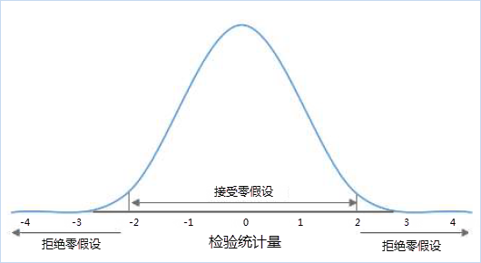
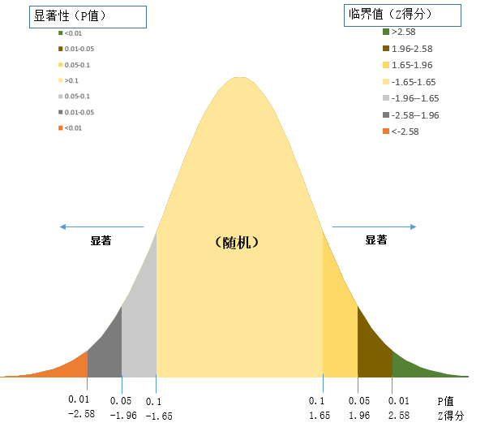
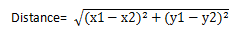
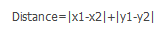

title: 空间统计分析基本词汇
---
 
　　空间统计分析的理论基础是建立在统计学之上的，在使用空间统计分析功能之前，了解一些统计学基本词汇和概念有利于理解空间统计分析功能。

### 零假设

　　统计学术语，又称原假设，指进行统计检验时预先建立的假设。 零假设成立时，有关统计量应服从已知的某种概率分布。当统计量的计算值落入否定域时，可知发生了小概率事件，应否定原假设。在空间统计分析中的零假设设定为空间随机性，即空间数据呈空间随机分布，或者是与空间数据相关联的值呈空间随机分布。如下图所示，如果你的计算结果落在-2到2之间，就表示你的假设是可以接受得，但是不在这个范围内，就说明消息小概率事件了。

　　

　　例如：某一城市在2月份一共发生了 N 起犯罪事件，在没有任何附加条件下，应该是均匀分布在城市的每个区域，这就是所谓的“零假设”，在空间统计中，零假设指的就是空间位置在一定区域里面呈现完全随机（均匀）分布。犯罪事件也可能是随机分布的，有的区域一起都没有，有的区域发生了好几起，我们需要通过分析得到的P值和Z值，来判断是接受零假设还是拒绝零假设。

### P值

　　p 值代表的是概率。它是反映某一事件发生的可能性大小。在空间统计分析中，p 值表示所观测到的空间模式是呈空间随机性的概率。当 p 值很小时，代表所观测到的空间模式不太可能产生于随机过程（小概率事件），因此可以拒绝零假设。

### Z得分

　　Z 得分，表示标准差的倍数。标准差能反映一个数据集的离散程度。Z 得分和p 值都与标准正态分布相关联。在正态分布的两端出现非常高或非常低（负值）的 z得分，这些得分与非常小的 p 值关联。当您运行分析并由得到很小的 p 值以及非常高或非常低的 z得分时，就表明观测到的空间模式不太可能反映零假设所表示的理论上的随机模式，从而可以拒绝零假设。Z 得分和P 值的临界值如下图所示：

　　

　　如上图所示，P值和Z得分一般一起出现。z得分和 P值都与标准正态分布相关联，在正态分布的两端出现非常高或非常低（负 值）的 z 得分，这些得分与非常小的 p 值关联。当您运行分析并得到很小的P值以及非常高或非常低的 z 得分时，就表明观测到的空间模式不太可能反映零假设所表示的理论上的随机模式，从而可以拒绝零假设，即数据呈聚合或是离散状态。

### 置信度

　　空间统计分析采用推论式统计，会在进行统计检验时预先建立"零假设"，假设要素或要素之间相关的值都表现为随机空间模式。 
　　P值用来表示"零假设"的正确概率，用以判定是接受"零假设"还是拒绝"零假设"。
　　Z得分用来表示标准差的倍数，用以判定数据是呈聚类、离散或随机。
   典型的置信度为 90%、 95% 或 99%。例如，当计算的结果中P小于0.1，表示数据有10%的概率是随机的，有90%的概率是聚类或是离散的，此种情况可以拒绝“零假设”，认为数据具有聚类或是离散特征。

　　下表显示了不同置信度下未经校正的临界 p 值和临界 z 得分（可以应用错误发现率 (FDR) 使用校正后的临界 p 值。这些临界值等于或小于下表所示的值。）

 Z得分(标准差)  |P值(概率)     | 置信度 
 :----------- | :--------- | :------------
 \*<-1.65 或\*>1.65 | \*<0.10   | 90% 
 \*<-1.96 或\*>1.96 | \*<0.05   | 95% 
 \*<-2.58 或\*>2.58 | \*<0.01   | 99% 

### 莫兰指数

　　莫兰指数（Moran's I）是用来度量空间相关性的一个重要指标。莫兰指数是一个有理数，经过方差归一化之后，它的值会被归一化到-1.0——1.0之间。Moran's I >0表示空间正相关性，其值越大，空间相关性越明显，Moran's I <0表示空间负相关性，其值越小，空间差异越大，否则，Moran's I = 0，空间呈随机性。

### 质心

　　空间统计分析某些功能输入的数据集类型可以是点、线、面。但是，在反距离或固定距离等空间关系中需要用到实际的空间距离来计算空间权重。所以，对于点、线和面对象，在距离计算中会使用对象的质心。对象的质心为所有子对象的加权平均中心。点对象的加权项为1（即质心为自身），线对象的加权项是长度，而面对象的加权项是面积。

### 自身权重

　　空间统计分析某些功能允许用户提供一个数值字段，用于表示自身的权重值。自身权重是要素和其自身之间的距离或权重。在通常的情况下，该权重值为0。但在用户指定了自身权重字段的情况下，该值将会代替自身参与到计算当中。

### 距离

　　空间统计分析中有两种距离，分别是欧几里得距离和曼哈顿距离。

　　欧式距离是直角坐标系中最常用的距离量算方法，即两点之间平面直线距离，如果两点的坐标分别为（x1，y1）和（x2，y2）,则欧几里得距离计算公式为：

　　

　　曼哈顿距离是与欧式距离不同的一种丈量方法，两点之间的距离不再是直线距离，而是投影到坐标轴的长度之和。就是在欧式距离固定直角坐标系上，两点所形成的线段对轴产生的投影的距离总和，计算公式为：

　　

### 回归分析

　　回归分析（regression analysis)是确定两个或多个变量间相互依赖的定量关系的一种统计分析方法。按照自变量和因变量之间的关系类型，可分为线性回归分析和非线性回归分析。如果在回归分析中，只包括一个自变量和一个因变量，且二者的关系可用一条直线近似表示，这种回归分析称为一元线性回归分析。如果回归分析中包括两个或两个以上的自变量，且因变量和自变量之间是线性关系，则称为多元线性回归分析。

### 空间权重矩阵

　　

###  相关主题

[地理度量分析](MeasureGeographicDistributions.html)

[聚类分析](Clusters.html)

[空间关系建模](SpatialRelationshipModeling.html)

[分析模式](AnalyzingPatterns.html)

