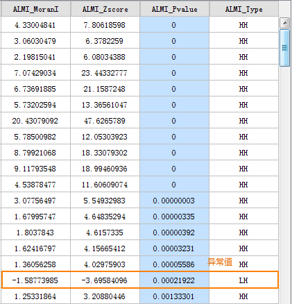
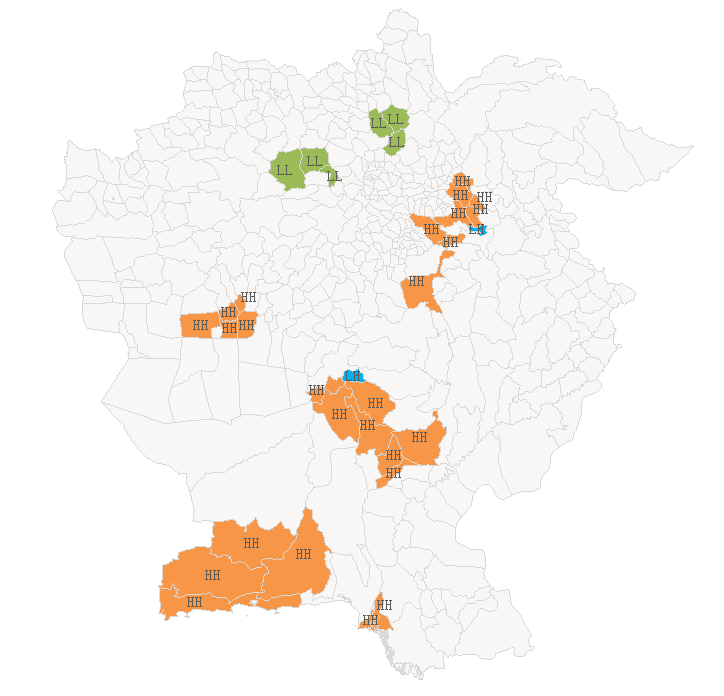

title: 聚类与异常值分析
---

　　聚类和异常值分析可识别具有拥挤显著性的热点、冷点、空间异常值，使用 Anselin Local Moran‘s I（局部莫兰指数） 统计量，对加权要素进行分析。

##### 　　应用案例

- 研究区域中的富裕区和贫困区之间的最清晰边界在哪里？
- 研究区域中存在可以找到异常消费模式的位置吗？
- 研究区域中意想不到的糖尿病高发地在哪里？

##### 　　操作说明

　　Cross 提供了两个功能入口，如下所述：

- 在“空间分析”选项卡的“空间统计分析”组中，单击“聚类分布”中的“平均中心”，即可弹出“平均中心”对话框。
- 在“可视化建模”选项卡中单击“新建”调出“工具箱”，双击“空间统计分析”→“度量地理分析”→“平均中心”，即可弹出“平均中心”对话框。

##### 　　主要参数
- **源数据**：设置待分析的矢量数据集，支持点、线、面三种类型的数据集。
- **评估字段**：将分析要素分类别的字段，分类后每一组的对象分别会有一个中心要素，分组字段可以是整型、日期型或字符串类型。若分组字段中我字段值为空，则会将该要素从分析中排除。
- **概念化模型**：选择应反映要分析的要素之间的固有关系，设置要素在空间中彼此交互方式构建的模型越逼真，结果就越准确。
  - 固定距离模型：适用于点数据、及面大小变化较大的面数据。
  - 面邻接模型(共边、相交)：适用于存在相邻边、相交的面数据。
  - 面邻接模型(邻接点、共边、相交)：适用于有邻接点、相邻边、相交的面数据。
  - 反距离模型：所有要素均被视为所有其他要素的相邻要素，所有要素都会影响目标要素，但是随着距离的增加，影响会越小，要素之间的权重为距离分之一，适用于连续数据。
  - 反距离平方模型：与"反距离模型"相似,随着距离的增加，影响下降的更快，要素之间的权重为距离的平方分之一。
  - K最邻近模型：距目标要素最近的K个要素包含在目标要素的计算中（权重为1）,其余的要素将会排除在目标要素计算之外（权重为0）。如果想要确保具有一个用于分析的最小相邻要素数，该选项非常有效。当数据的分布在研究区域上存在变化以致于某些要素远离其他所有要素时，该方法十分适用。当固定分析的比例不如固定相邻对象数目重要时，K 最近邻方法较适合。
  - 空间权重矩阵：需要提供空间权重矩阵文件，空间权重是反映数据集中每个要素和其他任何一个要素之间的距离、时间或其他成本的数字。如果要对城市服务的访问性进行建模，例如要查找城市犯罪集中的地区，借助网络对空间关系进行建模是一个好办法。分析之前使用生成网络空间权重工具创建一个空间权重矩阵文件 (.swm)，然后指定提供所创建的 SWM 文件的完整路径。
  - 无差别区域模型：该模型是"反距离模型"和"固定距离模型"的结合，会将每个要素视为其他各个要素的相邻要素，该选项不适合大型数据集，在指定的固定距离范围内的要素具有相等的权重（权重为1）；在指定的固定距离范围之外的要素,随着距离的增加，影响会越小。
- **中断距离容限**："-1"表示计算并应用默认距离，此默认值为保证每个要素至少有一个相邻的要素；"0"表示为未应用任何距离，则每个要素都是相邻要素。非零正值表示当要素间的距离小于此值时为相邻要素。
- **反距离幂指数**：控制距离值的重要性的指数，幂值越高，远数的影响会越小。
- **相邻要素数目**：设置一个正整数，表示目标要素周围最近的K个要素为相邻要素。
- **距离计算方法**：目前支持欧式距离的计算方式，即两要素间的直线距离。
- **标准化**：当要素的分布由于采样设计或施加的聚合方案而可能偏离时，建议使用行标准化。选择行标准化后，每个权重都会除以行的和（所有相邻要素的权重和）。行标准化的权重通常与固定距离相邻要素结合使用，并且几乎总是用于基于面邻接的相邻要素。这样可减少因为要素具有不同数量的相邻要素而产生的偏离。行标准化将换算所有权重，使它们在 0 和 1 之间，从而创建相对（而不是绝对）权重方案。每当要处理表示行政边界的面要素时，您都可能会希望选择“行标准化”选项。
- **是否进行FDR校正**：若进行FDR（错误发现率）校正，则统计显著性将以错误发现率校正为基础，否则，统计显著性将以P值和Z得分字段为基础。
- **自身权重字段**：设置距离权重值，仅支持数值型字段。
- **距离计算方法**：目前只支持欧式距离的计算方式，即两要素间的直线距离。
- **保留统计字段**：在字段列表框中设置结果数据的保留字段，及字段值的计算方式。列表中显示的字段即为结果数据要保留的字段，字段支持删除、添加、全选、反选等操作，选中字段即可设置其保留值的统计类型。
- **结果设置**：设置结果数据所要保存在的数据源，及数据集名称。　　

##### 　　结果输出

　　聚类和异常值分析的结果数据集中，将会包含四个属性字段：局部莫兰指数、z 得分和 p 值、聚类和异常值类型，分别为ALMI_MoranI 、 ALMI_Zscore、ALMI_Pvalue 、ALMI_Type 四个字段。如下图所示：

　　

- 由于聚类和异常值分是基于置信度95%做的运算，因此只有P值小于0.05时，ALMI_Type字段中才具有值。如果应用错误发现率 (FDR) 校正，统计显著性将会以校正的置信度（将p 值阈值从 0.05 降低到某个新值）为基础, 以兼顾多重测试和空间依赖性。

- 在P值小于0.05的前提下，莫兰指数大于0的地方，表现为高值或是低值聚类，ALMI_Type字段值为HH或是LL，莫兰指数小于0的地方，为异常值，ALMI_Type字段值为HL或是LH。

- 在P值小于0.05的前提下，Z得分为较高正值时，则表示周围的要素拥有相似值（高值或低值），高值聚类ALMI_Type字段值为HH，低值聚类ALMI_Type字段值为LL；Z得分为较低负值时，则表示有一个具有统计显著性的空间数据异常值，低值围绕高值ALMI_Type字段值为HL，高值围绕低值ALMI_Type字段值为LH。

  例如，下图为巴基斯坦和阿富汗地区2014-2016年恐怖袭击事件的分析结果，图中橘色区域为高值聚类，绿色区域为低值聚类，蓝色区域为异常值。

  

###  相关主题

　　[热点分析](HotSpotAnalyst.html)

　　[分析模式](AnalyzingPatterns.html)

