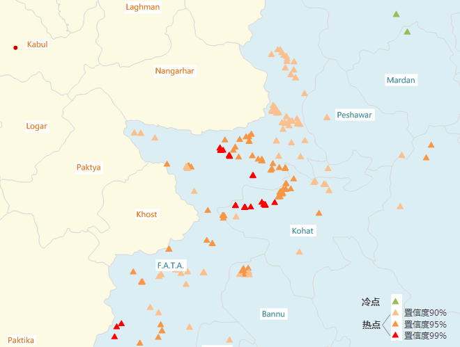

空间关系建模
---

　除了分析空间模式之外，GIS 分析还可用于挖掘或量化要素间关系。“空间关系建模”可利用回归分析建立空间关系模型。从而使您可以对未知值进行预测或更好地理解可对要建模的变量产生影响的关键因素。

​    可以解决以下类型的问题：为什么某一现象会持续的发生,是什么因素导致了这种情况？对某种现象建模以预测其他地点或者其他时间的数值？      

### 地理加权回归分析

　　地理加权回归是近年来提出的一种新的空间分析方法， 为局部回归模型，它通过将空间结构嵌入线性回归模型中，以此来探测空间关系的非平稳性。通过回归分析，我们可以对空间关系进行建模、检查和探究，还可以解释所观测到的空间模式背后的诸多因素，还可以对这些现象进行预测。

##### 分析原理

　　地理加权回归(GWR) 是若干空间回归技术中的一种，越来越多地用于地理及其他学科。通过使回归方程适合数据集中的每个要素，地理加权回归(GWR) 可为您要尝试了解、预测的变量或过程提供局部模型。地理加权回归(GWR )构建这些独立方程的方法是：将落在每个目标要素的带宽范围内的要素的因变量和解释变量进行合并。带宽的形状和大小取决于用户输入的核类型、带宽方法、距离以及相邻点的数目参数。是一种用于建模空间变化关系的线性回归的局部形式。

　　地理加权回归方程是一个可利用一个或多个解释变量对因变量进行最佳预测的数学公式。回归方程中的因变量总是标记为 **y**，自变量或解释变量总是标记为 **X**，这种表示方式对于那些将 x 和 y 视为坐标的地理学界的专业人员来说可能有些不便。每个自变量都与一个描述该变量与因变量之间关系强度和符号的回归系数相关联。回归方程的可能形式如下，其中，y 是因变量，X 是解释变量，β 是回归系数。

　　地理加权回归分析首先要确定一个研究区域，利用每个要素的不同空间位置，去计算衰减函数，这个是一个连续的函数，有了这个衰减函数，当你把每个要素的空间位置（一般是坐标信息（x,y))和要素的值带入到这个函数里面之后，就可以得到一个权重值（β），这个值就可以带入到回归方程里面去。如下衰减函数中的W(ui，vi）是空间权重矩阵。

　　

##### 应用案例

　　应用领域包括：犯罪分析、流行病学、投票模式分析、经济地理学、零售分析、交通事故分析以及人口统计学。其中的一些应用示例包括： 

- 疾病集中爆发在什么位置？ 
- ​

##### 操作说明

　　Cross 提供了两个功能入口，如下所述：

- 单击菜单栏中的“工具箱”菜单，在“空间统计分析”的二级菜单中，选择“空间关系建模”中的“地理加权回归分析”，即可弹出“地理加权回归分析”对话框。
- 在“可视化建模”面板中，双击“空间关系建模”→“聚类分布”→“地理加权回归分析”，即可弹出“热点分析”对话框。

##### 主要参数

- **源数据**：设置待分析的矢量数据集，支持点、线、面三种类型的数据集。
- **解释字段**：解释变量是自变量，即回归方程里面的X，用于对因变量的值进行建模或预测。例如，我们想研究肥胖的诸多原因，想找到肥胖与收入、健康食品摄入、教育水平等因素是否有关联。在这个例子中，肥胖就是因变量（Y），收入、健康食品摄入、教育水平等这些因素即为解释变量(（)X）。
- **核函数类型**：指定核是否构建为固定距离，或者指定是否允许核在作为要素密度函数的范围内进行变化。
  - 二次核函数：
  - 盒状核函数：
  - 高斯核函数：用来解决各局部回归分析的空间环境
  - 立方体核函数：
- **概念化模型**：选择应反映要分析的要素之间的固有关系，设置要素在空间中彼此交互方式构建的模型越逼真，结果就越准确。
  - 固定距离模型：适用于点数据、及面大小变化较大的面数据。
  - 面邻接模型(共边、相交)：适用于存在相邻边、相交的面数据。
  - 面邻接模型(邻接点、共边、相交)：适用于有邻接点、相邻边、相交的面数据。
  - 反距离模型：所有要素均被视为所有其他要素的相邻要素，所有要素都会影响目标要素，但是随着距离的增加，影响会越小，要素之间的权重为距离分之一，适用于连续数据。
  - 反距离平方模型：与"反距离模型"相似,随着距离的增加，影响下降的更快，要素之间的权重为距离的平方分之一。
  - K最邻近模型：距目标要素最近的K个要素包含在目标要素的计算中（权重为1）,其余的要素将会排除在目标要素计算之外（权重为0）。如果想要确保具有一个用于分析的最小相邻要素数，该选项非常有效。当数据的分布在研究区域上存在变化以致于某些要素远离其他所有要素时，该方法十分适用。当固定分析的比例不如固定相邻对象数目重要时，K 最近邻方法较适合。
  - 空间权重矩阵：需要提供空间权重矩阵文件，空间权重是反映数据集中每个要素和其他任何一个要素之间的距离、时间或其他成本的数字。如果要对城市服务的访问性进行建模，例如要查找城市犯罪集中的地区，借助网络对空间关系进行建模是一个好办法。分析之前使用生成网络空间权重工具创建一个空间权重矩阵文件 (.swm)，然后指定提供所创建的 SWM 文件的完整路径。
  - 无差别区域模型：该模型是"反距离模型"和"固定距离模型"的结合，会将每个要素视为其他各个要素的相邻要素，该选项不适合大型数据集，在指定的固定距离范围内的要素具有相等的权重（权重为1）；在指定的固定距离范围之外的要素,随着距离的增加，影响会越小。
- **中断距离容限**："-1"表示计算并应用默认距离，此默认值为保证每个要素至少有一个相邻的要素；"0"表示为未应用任何距离，则每个要素都是相邻要素。非零正值表示当要素间的距离小于此值时为相邻要素。
- **反距离幂指数**：控制距离值的重要性的指数，幂值越高，远数的影响会越小。
- **相邻要素数目**：设置一个正整数，表示目标要素周围最近的K个要素为相邻要素。
- **距离计算方法**：目前支持欧式距离的计算方式，即两要素间的直线距离。
- **是否进行FDR校正**：若进行FDR（错误发现率）校正，则统计显著性将以错误发现率校正为基础，，否则，统计显著性将以P值和z得分字段为基础。
- **自身权重字段**：设置距离权重值，仅支持数值型字段。
- **距离计算方法**：目前只支持欧式距离的计算方式，即两要素间的直线距离。
- **保留统计字段**：在字段列表框中设置结果数据的保留字段，及字段值的计算方式。列表中显示的字段即为结果数据要保留的字段，字段支持删除、添加、全选、反选等操作，选中字段即可设置其保留值的统计类型。
- **结果设置**：设置结果数据所要保存在的数据源，及数据集名称。

##### 结果输出

　　设置好以上参数后，单击对话框中的“运行”按钮，即可执行热点分析，下图为巴基斯坦发生恐怖袭击事件的热点分析结果图，图中的橘色和红色点为热点，绿色点为冷点。

　　

　　热点分析返回的结果数据集将会包含四个属性字段：z 得分和 p 值、置信度、Gi_ConfInvl。 

　　如果要素的 z 得分高且 p 值小，则表示有一个高值的空间聚类。如果 z 分低并为负数且 p 值小，则表示有一个低值的空间聚类。z 得分越高（或越低），聚类程度就越大。如果z 得分接近于零，则表示不存在明显的空间聚类。

　　在具有空间聚集性的前提下，Z得分为负值，则表示该处为一个冷点，对应的 Gi_ConfInvl 字段为负数；Z 得分为正值，则表示该处为一个热点，对应的 Gi_ConfInvl 字段为正数。

　　Gi_ConfInvl 字段会识别统计显著性的热点和冷点。Gi_ConfInvl 为+3 和-3 的要素反映置信度为 99%的统计显著性；Gi_ConfInvl 为+2 和-2 的要素反映置信度为 95% 的统计显著性；Gi_ConfInvl 为+1 和-1 的要素反映置信度为 90%的统计显著性；而Gi_ConfInvl 为 0 的要素的聚类则没有统计意义。  

　　如下表所示：

|   Z 得分(标准差)    | P 值(概率) | 置信度  | Gi_ConfInvl 值 |
| :------------: | :-----: | :--: | :-----------: |
| <-1.65 或 >1.65 |  <0.10  | 90%  |    -1 , 1     |
| <-1.96 或 >1.96 |  <0.05  | 95%  |    -2 , 2     |
| <-2.58 或 >2.58 |  <0.01  | 99%  |    -3 , 3     |

###  相关主题

[生成单重缓冲区](SingleBuffer.html)

[缓冲区分析应用实例](BufferAnalyst_Example.html)

