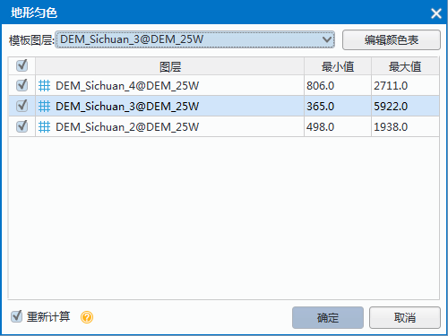

　　当多个栅格数据添加到同一个地图中时，由于每个数据的颜色表和颜色表值域范围不一致，则很可能会出现栅格镶嵌处的像元颜色脱节、不均匀的情况。此时，可以通过地形匀色功能，使地图中相邻的栅格图层之间过渡无缝显示。
    
地形匀色原理：将地图中的图层颜色表设置为同一个，则像元值相同的栅格将使用同一个颜色表示，从而达到相邻数据镶嵌处像元显示连贯、均匀的效果。

**应用实例**  
  
四川地区有的DEM数据由3个相邻的数据集组成，其中一个栅格数据的颜色表与另外二个数据的颜色表不一样，还有一个数据的地势比较高，最大高程值相较于其他二个都要高很多，所以栅格像元颜色脱节比较明显，如下图所示：  

　　  
 
 通过“地形匀色”功能可以使地图中的栅格数据颜色均匀，具体操作步骤如下：

　　1.  将相邻的栅格数据添加到一个地图中，在“地图”选项卡的“制图”组中，单击Gallery中的“地形匀色”，弹出如下图所示的对话框：  
　　    
　　  

　　2.  设置模板图层：单击“模板图层”处的下拉按钮，选中一个图层作为颜色表模板，将该图层的颜色表应用于图层列表中勾的图层。若图层的颜色表需要做调整，可单击“编辑颜色表”按钮，在弹出的“颜色表”对话框中进行设置，具体操作方式请参见颜色表设置页面。 

　　3.  对话框的图层列表中勾选需要参与匀色的栅格数据，同时列表中会对应显示各个图层的最大最小像元值，用户在选择模板图层是可以参考数据像元值的值域范围。 

　　4.  重新计算颜色表：不勾选该复选框，则表示小于模板图层的最小值的像元，用最小像元的颜色表示，大于模板中最大值的像元用最大值像元的颜色表示；若勾选了该复选框，则表示将所勾选的图层像元值的并集作为颜色表的值域范围，重新计算颜色表，使颜色表中的像元值和对应颜色重新进行分配。 

　　5.  单击“应用”按钮，即可对地图中的栅格数据进行匀色处理，得到的结果如下图所示： 

　　　　

