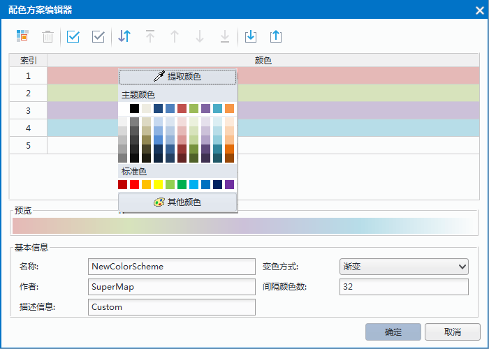

　　颜色方案管理器是管理颜色方案的工具，为用户获得满意的颜色方案提供条件。颜色方案管理器提供了多种管理功能，方便用户对颜色方案进行操作。

### 关于颜色方案管理器  
  
颜色方案管理器用来对程序中的颜色方案进行定制和管理。SuperMap 在颜色管理器中保存了一系列常用的颜色方案。其中有些颜色方案是为特定的领域准备的，比如用于显示高程的颜色方案。同时也支持用户创建自定义的颜色方案，以满足不同的应用需求。

系统一共提供了190多种默认颜色方案。每一种默认颜色方案的配色方案文件单独保存在文件夹中。默认的保存位置为："安装目录\Templates\ ColorScheme \"下的 Default 子文件夹中。
  
**启用颜色方案管理器**

在“开始”选项卡上的“颜色管理”组中，单击“颜色方案”按钮，进入颜色方案管理器。通过颜色方案管理器，可以对颜色方案进行添加、编辑、删除、导入、导出、自定义、收藏等操作。下图为颜色方案管理器的主界面。  
  
　　  

颜色方案管理器根据数据的适用情况，将颜色方案分为适用DEM、适用聚合图、适用统计专题图、适用范围分段专题图、适用单值专题图、适用标签分段专题图、适用标签单值专题图、全部渐变色、全部随机色九个分组，便于用户根据使用情况选择颜色方案。  
  
### 新建颜色方案分组  
 
用户可单击“添加颜色方案分组”创建新的颜色方案分组，自定义颜色方案分组的名称，建好后的分组可在自定义分组中查看。用户可将常用的颜色方案添加进新的分组中。  
    
### 添加颜色方案  
  
创建新的颜色方案。  
  
**操作步骤**

1. **激活颜色方案编辑器**：在“颜色管理器”中，单击“添加颜色方案”按钮 ，进入“配色方案编辑器”对话框中。  
   
2. **添加颜色**：在“颜色方案编辑器”中，单击“添加颜色”按钮 ，系统默认颜色将自动添加至颜色列表中。若需要对已添加颜色进行编辑，单击列表中需编辑的色带，在弹出的颜色面板中选择需要的颜色即可。至少要保证列表中存在两种颜色。    
  
　　     
3. **管理颜色**：通过工具栏中的删除、置顶、上移、下移、颜色置底按钮，对添加的颜色进行管理。  
4. **基本信息**：完善颜色方案的基本信息，包括名称、作者、描述信息、变色方式及间隔颜色数。   
  
  +  **选择变色方式**：设置变色方式。系统提供渐变和随机两种方式选择，默认为渐变。    
   
    +  渐变是指多种颜色间的逐渐混合，即从色 A 值色 B 间插入多种颜色逐渐从色 A 过渡至色 B，而这些插入的颜色称为渐变色。    
    +  随机是指多种颜色间的跳跃混合，即从色 A 值色 B 间插入多种颜色跳跃地从色 A 过渡至色 B，这些中间色每次都是随机生成。  
  
  +  **设置间隔颜色数**：颜色间隔数：指定两个相邻关键色之间中间色数目。间隔颜色数的取值范围为0-255，默认为32。如果用户想要颜色方案中的相邻颜色的过渡更自然一些，可以适当的增大间隔颜色数。 

5. 预览：在预览区域可以及时查看颜色方案的效果，如果对颜色效果不满意可以继续修改，直到满意为止。 完成添加颜色：单击“确定”按钮，完成此颜色方案的添加。

### 编辑颜色方案  
  
编辑功能用来对已有的颜色方案进行修改和调整。  
  
**操作步骤**   
  
1. 在“颜色方案管理器”中，选中一种颜色方案，单击“编辑颜色方案”按钮，进入“配色方案编辑器”对话框，或者选中一种颜色方案，双击鼠标也可进入“颜色方案编辑器”，对颜色方案进行编辑。  
2. 在“配色方案管理器”中可对颜色方案的颜色进行编辑，也可对基本信息中的描述信息进行修改。有关“配色方案管理器”的描述请参见“创建新的颜色方案”。

### 删除颜色方案    
  
在“颜色方案管理器”中，选中一种或多种颜色方案，单击“删除颜色方案”按钮 ，即可从“颜色方案管理器”中移除选中的颜色方案。将不常用的或者不用的颜色方案从颜色管理器中移除，方便对其他颜色方案的管理和操作。  
  
### 导入/导出颜色方案  
  
SuperMap 支持将外部的配色方案文件导入到颜色方案管理器中，同时也支持将新建颜色方案或者编辑过的颜色方案导出，方便下次使用。导出的颜色方案文件以单独的配色方案文件（*.scs）文件保存，因此一次导出多个颜色方案时，会分别生成多个 scs 配色方案文件。  
  
**操作方式**  
  
在“颜色方案管理器”对话框中，通过工具栏中的导入、导出按钮完成颜色方案的导入和导出操作。用户还可在选中需要导出的颜色方案右键鼠标，在右键菜单中选择“导出”，进行导出操作。

  

  
