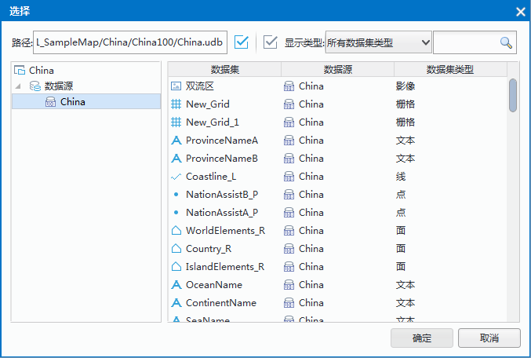
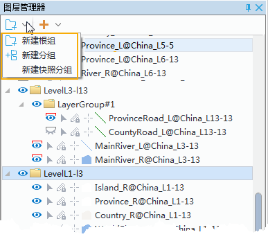
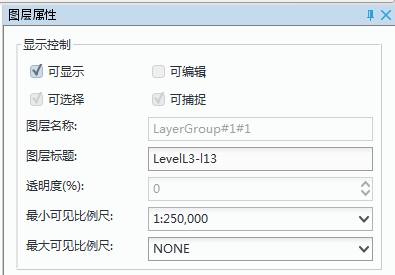

  
### 添加图层  
  
SuperMap iDesktop Cross 支持向地图窗口添加数据集，您可以非常便捷地选择某个数据集添加至当前地图。  
  
有三种添加方式：  
  
+ 方式一：在工作空间管理器中选中需要添加的数据集，可选择直接拖拽至地图窗口的方式添加数据；或鼠标右键，在右键菜单栏中选择“添加至新地图”或“添加至当前地图”。支持一次选择多个数据集。   
+ 方式二： 新建或打开一个地图窗口后，单击功能区“地图”选项卡的“数据”组“添加数据”，弹出如下图的对话框。在对话框左侧为当前打开的工作空间中的所有的数据源，选择预添加的数据集所在的数据源，然后，在右侧区域选择数据集（可以配合使用 Shift 键同时选中多个数据集），然后点击“确定”按钮。添加数据完成。   
+ 方式三：在图层管理器中单击“添加”按钮，弹出“选择”对话框，在对话框中选择预添加的数据集。  
+ 方法四：若用户需要在地图中某一图层之后插入图层，可选择图层，鼠标右键，在右键菜单中选择“插入数据”按钮，即可弹出“选择”对话框，在对话框中选择预插入的数据集。
  
  
　　       
  
**注意事项**：若向地图中添加的影像数据太大，会弹出“提示”对话框，建议用户创建影像金字塔后添加到地图窗口显示，以加快显示速度。同时加载多个影像数据集时，若用户勾选了“之后数据集均执行此操作”，则此时添加的所有大内存影像数据集都会创建影像金字塔，并加载至地图窗口中。   
  
### 添加在线地图  
  
支持向地图添加多种在线地图服务，您可在”开始”选项卡的“数据源”组中，通过打开 Web 数据源的功能添加。根据需求点击相应选项，即可加载相应的地图服务。有关打开Web数据源的具体描述，请参见打开数据源。   
  
### 移除地图图层  
  
“移除”命令，用来将该矢量图层从地图中移除。右键点击选中图层管理器中的矢量图层结点，在弹出右键菜单中选择“移除”命令。  
按 Delete 键也可以移除图层。

### 重命名图层  
  
“重命名”命令，用来修改矢量图层的标题。  
    
操作步骤：  
1. 右键点击选中图层管理器中的矢量图层结点，在弹出右键菜单中选择“重命名”命令。  
2. 此时，选中的矢量图层结点的显示名称变为可编辑状态，用户可以输入新的名称来修改图层的标题。   
3. 修改名称后，在图层管理器中任意位置单击鼠标，选中的矢量图层结点的显示名称变为不可编辑状态。   
  
**注意事项**  
  
1. 图层既有名称，又有标题。这两个属性比较相似，但其作用是不同的。

  + 名称是图层在地图中的唯一标识,是系统自动生成的，不可修改，其格式是:数据集名@数据源别名，如Continent@world#1。

  + 标题是图层在图例中的显示名称,默认情况下，图层的标题与名称相同，但标题可以修改为有意义的标题，如世界大洲。  
    
2. 按 F2 键也可以实现图层重命名。     
  
### 使用图层分组  
  
“图层分组”功能可用来对图层进行分组管理，并可以实现同组图层的统一控制，如可见性、可见比例尺范围。分组图层也是图层的一种，其主要功能是统一管理图层。同时，分组图层可以嵌套，即图层分组中还可以包含图层分组。  
  
下面详细介绍图层分组的创建、删除、属性设置等操作：

####  创建图层分组

1. 在图层管理器的工具栏中，单击“新建根组”按钮，即可创建一个图层根组。  
2. 单击某个图层分组右键，选择“新建分组”，即可在该图层分组中创建一个子图层分组。 
新建的图层分组默认名称为“LayerGroup”，单击图层分组右键选择“重命名”项，或按 F2 键，修改图层分组名称。   
  
#### 添加图层  
  
1. 在图层管理器中，选中一个或多个图层，将图层拖拽到图层分组处，即可将选中图层添加至指定图层分组中。   
2. 在图层管理器中，选择一个或多个图层分组，将其拖拽到另一个图层分组处，即可将选中的图层分组移动到指定图层分组中。  
　　         
  
#### 图层属性

在图层管理器中选中一个或多个图层分组，单击右键选择“图层属性”，或者在“地图”选项卡的“属性”组中，单击“图层属性”按钮，弹出“图层属性”面板。  

　         

1. 可见性：在图层属性面板中，可统一设置图层分组中所有图层的可见性。若勾选“可显示”复选框，则选中图层分组下的所有图层可见；若不勾选“可显示”复选框，则选中图层分组下的所有图层都不可见。  
2. 图层名称：用来显示选中图层分组的名称。不可对图层分组名称进行修改，图层分组的名称在分组所在的地图中唯一标识此图层分组。  
3. 图层标题:右侧的文本框用来显示选中图层分组的标题。可以对图层分组标题进行修改，修改后该图层分组在图层管理器中的显示名称发生变化，但是图层分组的名称不会随之改变。   
4. 最小可见比例尺:组合框用来设置图层分组中所有图层的最小可见比例尺。图层分组设置最小可见比例尺后，若地图的比例尺小于该图层分组设置的最小可见比例尺，则图层分组中的所有图层将不可见。可通过在“最小可见比例尺”右侧的数字调整框输入比例尺数值，如 1：500000，或将当前地图比例尺设置为最小可见比例尺。也可单击右侧下拉按钮选择比例尺设置为最小可见比例尺，下拉项可选比例尺为默认 1:5000 至 1:1000000 的 8 个比例尺；若地图设置了固定比例尺，则下拉项可选比例尺为固定的比例尺。 
5. 最大可见比例尺:组合框用来设置图层分组中所有图层的最大可见比例尺。图层分组设置最大可见比例尺后，若地图的比例尺大于该图层分组设置的最大可见比例尺，则图层分组中的所有图层将不可见。可以通过在“最大可见比例尺”右侧的数字调整框输入比例尺数值，如 1：500000，或将当前地图比例尺设置为最大可见比例尺。也可单击右侧下拉按钮选择某个比例尺设置为最大可见比例尺，下拉项可选比例尺为默认 1:5000 至 1:1000000 的 8 个比例尺；若地图设置了固定比例尺，则下拉项可选比例尺为固定的比例尺。      
  
  
### 使用快照图层  

快照图层是一种特殊的图层组，快照图层分组中的图层都为地图的一个快照图层。快照图层的绘制方式比较特殊，只在第一次显示时进行绘制，此后浏览地图时，如果地图显示范围未发生变化，快照图层将不会重新绘制，也就是快照图层不随地图刷新而重新绘制；如果地图显示范围发生变化，将自动触发快照图层的刷新绘制。快照图层是提高地图显示性能的方式之一。  

由于快照图层是特殊的图层分组，快照图层中可以添加分组图层对象（LayerGroup），但是快照图层中不可以再添加快照图层，并且分组图层对象（LayerGroup对象）中也不可以添加快照图层。

**应用场景**：配图过程中，有的图层数据量较大，会影响地图的刷新效率，此时，可将刷新频率低、数据量较大，必须显示的图层添加到快照图层中，在不改变地图窗口显示范围的情况下，快照图层分组中的图层将不会刷新，提高了地图的显示的性能。

**操作步骤**  

1. 在图层管理器的空白区域中，单击鼠标右键，选择“新建快照图层”选项，即可创建一个快照图层分组。   
2. 选中一个或多个图层，将其移动至快照图层分组中，这些图层即可作为快照图层，地图窗口范围不变的情况下，不刷新快照图层分组下的图层。 

--------------------------------------------------------------------------------

 

 

