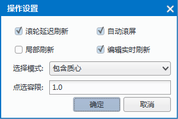

“地图”选项卡上的“浏览”组中组织了地图浏览的工具，包括选择对象、放大缩小地图、地图漫游、全幅显示地图、查找定位等功能。

 
### 选择对象  

“选择”下拉按钮提供了在当前地图窗口中进行对象选择的功能，包括点选和矩形框选择、圆形选择、多边形选择及画线选择等多种对象选择方式。该按钮包含两个部分：一是按钮部分，单击该部分可以直接执行相应的功能；二是下拉按钮部分，单击该部分将弹出下拉菜单，通过选择下拉菜单中的项来进一步实现相应的功能。有关选择对象的详细描述，请参见“对象操作”页面。  
  
**选择模式**  

支持在“浏览”组中，设置对话框中对“选择模式”进行设置。“选择模式”提供了三种选择模式：包含质心、面积相交和包含对象。  
  
+ 包含质心：当对象的质心被临时矩形框所包含时，对象被选中。   
+ 面积相交：当临时矩形框与对象之间存在相交部分时，对象被选中。   
+ 包含对象：当临时矩形框完全包含对象时，被包含的对象被选中。 
  
以绘制临时矩形框选择对象的方式为例，对三种对象选择模式的解释如下图所示。图中的虚线矩形框表示选择对象的临时矩形框，多边形表示地图上的几何对象。

　　   

**点选容限**  

“点选容限”主要用来控制选择对象的精确度，即在选对象时，通过设定一个容限值，当光标与地图对象的距离小于设置的选择容限（以像素为单位）时，对象被选中。用户直接在文本框中输入容限值即可。 
  
### 放大地图
  
“放大地图”按钮，用来实现放大浏览当前地图窗口中地图的功能。

单击“地图”选项卡中“浏览”组的“放大”按钮，当前地图窗口的操作状态变为放大显示地图的状态，并且鼠标在当前地图窗口中的状态变为  。  
  
+ 单击放大：在地图窗口中单击鼠标，地图就会以鼠标单击的位置作为地图的中心点放大显示，放大倍数为2倍。   
+ 矩形框选放大：单击鼠标左键并按住不放，沿对角线拖动鼠标，可以看到一个临时矩形框，其大小随着鼠标移动而变化。在适当位置松开鼠标左键，可按临时矩形区域确定的范围放大地图。放大后的显示效果为：以临时矩形的中心点所在位置为地图放大显示的中心点，放大倍数为当前地图窗口的宽度和高度分别与临时矩形框的宽度和高度的比值中较小的一个值。  
+ 此外，按下键盘中的字母 “Z” 键也可将当前地图窗口的状态切换为放大显示地图窗口的操作状态。  
  
### 缩小地图  
  
“缩小地图”按钮，用来实现缩小浏览当前地图窗口中地图的功能。

单击“地图”选项卡中的“浏览”组的“缩小”按钮，当前地图窗口的操作状态变为缩小显示地图的状态，并且鼠标在当前地图窗口中的状态变为  。  

+ 单击缩小：在地图窗口中单击鼠标，地图就会以鼠标单击的位置作为地图的中心点缩小显示，缩小倍数为2倍。 
+ 矩形框选缩小：单击鼠标左键并按住不放，沿对角线拖动鼠标，可以看到一个临时矩形框，并且其大小随着鼠标移动而变化。在适当位置松开鼠标左键，可按临时矩形区域确定的范围缩小地图。缩小后的显示效果为，以临时矩形的中心点所所在位置为地图缩小显示的中心点，缩小倍数为地图窗口的宽度和高度分别与临时矩形框的宽度和高度的比值中较小的一个值。
+ 此外，按下键盘中的字母 “X” 键也可将当前地图窗口的状态切换为缩小显示地图窗口的操作状态。  
  
### 缩放地图  

**自由缩放**  
 
单击“缩放”下拉按钮，在弹出的下拉菜单中单击“自由缩放”项，当前地图窗口中的操作状态变为自由缩放状态，并且鼠标在当前地图窗口中的状态变为。  
  
+  在当前地图窗口中按住鼠标左键进行拖动即可放大或缩小地图；松开鼠标左键即停止自由缩放操作，并且地图进行一次刷新。
+  由于在按住鼠标左键自由缩放地图的过程中，地图并没有进行实时刷新，因此，缩小地图时地图窗口中会出现空白的地图部分。只有松开鼠标左键停止自由缩放操作之后，地图才会进行刷新。
+  如果需要在地图自由缩放的过程中进行实时刷新，可使用“实时自由缩放”功能。 
此外，按 C 键也可以当前地图窗口中的操作状态变为自由缩放状态。

**实时自由缩放**  

单击“缩放”下拉按钮，在弹出的下拉菜单中单击“实时自由缩放”项，当前地图窗口中的操作状态变为实时自由缩放状态，并且鼠标在当前地图窗口中的状态变为 。

+ 在当前地图窗口中按住鼠标左键进行拖动即可放大或缩小地图，当松开鼠标左键即停止实时自由缩放操作。在按住鼠标左键自由缩放地图的过程中，地图进行实时刷新，从而使地图的缩放过程显得十分流畅。  
  
### 漫游地图
“漫游”下拉按钮提供了在当前地图窗口中，通过连续平移地图浏览地图内容的功能。该按钮包含两个部分：一是按钮部分，单击该部分可以直接执行相应的功能，二是下拉按钮部分，单击该部分将弹出下拉菜单，通过选择下拉菜单中的项来进一步实现相应的功能。

**漫游**  

单击“漫游”按钮，或在该下拉按钮菜单中选择“漫游”项，当前地图窗口中的操作状态变为漫游状态，并且鼠标在当前地图窗口中的状态变为  。

+ 在当前地图窗口中按住鼠标左键进行拖动，则地图窗口中的地图会朝着鼠标拖动的方向进行平移。松开鼠标左键即可停止平移操作，此时地图窗口中的地图进行一次刷新操作。
+ 由于在按住鼠标左键平移地图的过程中，地图并没有进行实时刷新，因此，地图窗口中会出现空白的地图部分。只有松开鼠标左键停止平移操作之后，地图才会进行刷新。 
如果需要在地图平移过程中进行实时刷新，可使用“实时漫游”功能。 
+ 此外，按下键盘中的字母 “A” 键，或按住鼠标中键，也可将当前地图窗口的状态切换为平移浏览地图的操作状态。

**实时漫游**  

单击“漫游”下拉按钮，在弹出的下拉菜单中选择“实时漫游”项，当前地图窗口中的操作 状态变为实时漫游状态，并且鼠标在当前地图窗口中的状态变为  。 
  
+ 在当前地图窗口中按住鼠标左键进行拖动，则地图窗口中的地图会朝着鼠标拖动的方向进行平移，当松开鼠标左键即可停止平移操作，并且在地图平移的过程中，地图实时进行刷新，从而使地图平移浏览过程显得十分流畅。
  
**全球连贯漫游**  

全球连贯漫游是指浏览世界地图时显示为东西半球无缝漫游，实现了在平面上浏览世界范围的地图跟在球体上浏览地图的相同体验。开启全球连贯漫游之后，所显示的世界地图范围的起止经度不限制在-180到+180经度范围，随着鼠标的平移起止范围发生变化。

该功能主要用于一些需要跨越东西半球的特殊场景，如绘制全球航海或航空的航线，进行跨域东西半球的距离测量等。单击“地图”选项卡“浏览”组中的“漫游”下拉按钮，选择“全球连贯漫游”选项即可开启改功能。

全球连贯漫游对地图的参考坐标系有一定的要求，目前支持全球连贯漫游的坐标系有以下两种：经纬度投影坐标系中的 WGS 1984 和 投影坐标系中的 World Mercator。  
  
参数名称|参数值   
:-:|:-:  
大地参照系|D_WGS_1984
参考椭球体|WGS_1984
椭球长半轴|6378137
椭球扁率|0.00335281066474748  
  

参数名称|参数值   
:-:|:-:  
大地参照系|D_WGS_1984
参考椭球体|WGS_1984
椭球长半轴|6378137
椭球扁率|0.00335281066474748
地理坐标系|GCS_WGS_1984
投影方式|Mercator
中央经线|0
原点纬线|0
标准纬线(1)|0
标准纬线(2)|0
水平偏移量|0
垂直偏移量|0
比例因子|0.9996
方位角|0
第一点经线|0
第二点经线|0  
  
**全幅显示地图**   

“全幅显示”按钮，用来全幅显示当前地图窗口中的地图。  

+  单击“地图”选项卡中“浏览”组的“全幅”按钮，当前地图窗口中的地图变为全幅显示的状态，即将当前地图窗口中的地图根据当前地图窗口的大小调整放缩比例，使地图在当前地图窗口中完全并且最大化显示。   
+  此外，按 F6 键也可以全幅显示当前地图窗口中的地图。  
  
### 地图浏览设置  

地图浏览设置提供了刷新、自动滚屏、局部刷新及选择模式等地图相关的操作设置功能。  
  
单击“地图”选项卡中“浏览”组的“操作设置”按钮，弹出“操作设置”对话框。  
  
　　

**滚动延迟刷新**  

“滚轮延迟刷新”，用于控制当前地图窗口中的地图是否随着滚动鼠标滚轮延迟刷新，启用滚轮延时刷新功能，在滚动鼠标滚轮0.4秒后整体刷新地图。在对大数据量的地图数据进行刷新时，如果未启用滚轮延迟刷新功能，地图实时刷新显示速度较慢，为优化显示效果，建议启用该功能，以提高浏览速度。系统默认开启“滚轮延迟刷新”的设置。

**自动滚屏**  

当用户在地图窗口中操作时，如果想平移地图以便查看没有显示在地图窗口中地图部分，并且不方便切换地图窗口中的操作状态为漫游地图状态，可选中“自动滚屏”选项，实现自动滚屏，即当鼠标靠近地图窗口的边界时鼠标自动变化为自动滚屏的状态，此时，单击鼠标左键，将实现地图的一次平移。

注意：当地图窗口中的操作状态为“放大”、“缩小”、“自由缩放”、“漫游”时，自动滚屏功能不可用。

**局部刷新**  

局部刷新功能在对地图进行漫游操作过程时，只刷新发生平移的区域，保证大幅地图浏览流畅，减少用户的等待时间。这在频繁浏览大幅地图时是非常有意义的。  
  
**编辑实时刷新**    
    
编辑实时刷新功能是在对当前地图中选中的对象进行编辑时，对背景地图（即当前地图非选中编辑的对象）进行实时刷新。  
  

  

    
  

