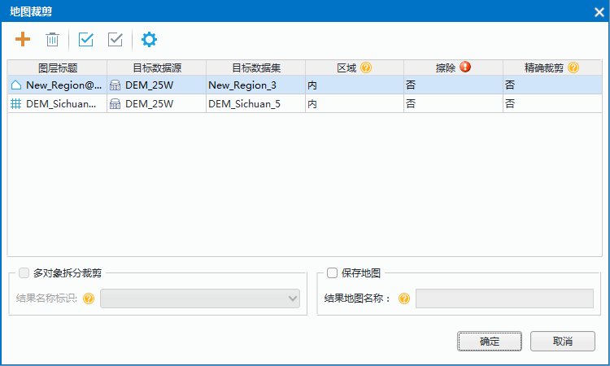

实际应用中，用户可能只需要对地图中的某一块区域进行研究，此时，可以通过“地图裁剪”功能提取该区域的地图或数据。同时可以减小数据量，提高数据处理的效率。
  
### 概述
当地图窗口中存在一个或者多个图层时，可通过绘制矩形、圆形、多边形或者选中某一图层中的面对象对被裁剪图层进行裁剪操作。裁剪结果可以保存输出为一个新的数据集。被裁剪图层可以为点、线、面、CAD 图层、文本图层或者栅格图层，裁剪图层（或者绘制的裁剪区域）必须是面图层。裁剪结果的类型最终和被裁剪图层保持一致。

　　  

**裁剪方式**：在进行地图裁剪时，可以对裁剪的方式进行设置，区域外还是区域内。如果选择区域内的裁剪方式，则裁剪区域范围内的地图将被保留输出。如果选择区域外的裁剪方式，则裁剪区域范围外的地图将被保留并输出。  
  
　　   
   
**擦除裁剪区域**  

对被裁剪图层进行擦除裁剪区域的操作。操作后被裁剪图层的裁剪区域部分数据将被擦除。目前只能对矢量格式的地图数据进行擦除裁剪区域的操作，栅格地图不支持擦除操作。

如下图所示：黄色区域为被裁剪图层，蓝色区域为裁剪图层，选中圆形区域对黄色多边形进行地图裁剪，裁剪方式为区域内，地图裁剪完成后，对被裁剪图层的擦除结果如下所示：  
  
　　   
  
**精确裁剪**  
 
裁剪栅格或影像数据时，可在精确裁剪下拉框中选择是否进行精确裁剪。 精确裁剪与默认裁剪的区别在于（以区域内裁剪为例）： 

1. 得到裁剪结果的栅格数据量不同，区别主要是裁剪区域边界数据的处理:   
  
  + 精确裁剪：裁剪区域边界处的数据处理单元是像元，若裁剪区域压盖的像元的中心点，则保留该像元。反之不保留。如下图1所示，保留了中心点位于裁剪区域内的像元，舍弃了中心点位于裁剪区以外的像元，得到最终的实际存储数据，数据量较小。 
  + 默认裁剪：裁剪区域边界处的数据处理单元是栅格块，若裁剪区域与栅格块相交，则保留整个栅格块。如下图2所示，若栅格块大小是256*256，裁剪区域与栅格块2、栅格块3、栅格块4相交，则三个栅格块全部保留，得到最终的实际存储数据，数据量较大。     
  
　　     
   
2.显示效果不同，产生的原因是得到裁剪结果的栅格数据量不同,显示效果是对裁剪得到的实际存储数据按照裁剪区域进行显示。

   + 精确裁剪：由于结果数据裁剪边界像元的取舍，显示结果会出现保留部分不满一个像元和舍弃部分少量空白的情况，如上图3所示。  
   + 默认裁剪：由于结果数据保留了与边界相交的整个栅格块，显示结果严格按照裁剪区域进行显示，如上图4所示。   
     
3.裁剪效率不同:默认裁剪边界区域的处理单元是栅格块，精确裁剪边界区域的处理单元是像元，因此默认裁剪效率比精确裁剪效率高，当裁剪较大数据并且只关注显示效果时，优先选择默认裁剪。 当需要比较精确的实际存储数据时，采用精确裁剪。  
  
### 裁剪方式  
   
通过指定的裁剪范围对地图窗口中的指定图层进行区域裁剪。目前支持以绘制矩形、圆形、多边形和选中对象的方式，指定裁剪范围进行地图裁剪操作。
  
操作步骤  
  
1. 在当前地图窗口中加载待裁剪图层。  
2. 在“地图”选项卡上的“操作”组中，单击“地图裁剪”下拉按钮，在弹出的下拉菜单中选择具体绘制方式：   
  
  + 矩形裁剪：通过绘制矩形来设置裁剪范围。 
  + 圆形裁剪：通过绘制圆形来设置裁剪范围。 
  + 多边形裁剪：通过绘制多边形来设置裁剪范围。 
  + 选中对象区域裁剪：通过在被裁剪图层上选择一个或者多个面对象来设置裁剪范围。也可以在执行“选中对象区域裁剪”功能前，先在地图中选中一个或者多个面对象，此时再次执行该功能，将以当前选中对象范围直接打开地图裁剪对话框进行进一步的参数设置。   
    
3. 绘制完裁剪区域后，在弹出的“地图裁剪”对话框中，分别设置地图裁剪数据和裁剪区域的参数。    
  
　　       
 
  + 裁剪方式：设置裁剪方式。如果选择区域内，得到的结果为裁剪区域内的地图；如果选择区域外，得到的结果为裁剪区域内的地图。   
  + 擦除：是否擦除被裁剪图层的裁剪区域。如果勾选此复选框，操作后被裁剪图层的裁剪区域部分数据被擦除；取消勾选此复选框，操作后被裁剪图层数据不发生变化。默认为不勾选。   
  + 精确裁剪：此选项适用于 GRID、DEM、MrSid、ECW、影像数据集。有关精确裁剪和默认裁剪裁剪详细描述请参看 精确裁剪。   
   	+ 若选择“是”为精确裁剪，精确裁剪是逐像元对数据进行精确裁剪，并舍弃像元中心点不在裁剪区的像元，裁剪后的结果数据较小。   
   	+ 若选择“否”为默认裁剪，默认裁剪是按照存储块整块裁剪数据，裁剪性能快。 
  + 多对象拆分裁剪：若地图中选中了多个矢量对象作为裁剪区域，并且需要把每个对象都做为一个单独的裁剪区域裁剪图层，实现批量裁剪的操作，可勾选“多对象拆分裁剪”复选框，在“结果名称标识”设置一个字段，每个矢量对象裁剪结果都会以目标数据集名称+“_”+ 字段值的方式进行命名，便于用户辨识每个裁剪结果的区域范围。   
  + 保存地图：选中此项，输入地图名称，就可以将裁剪结果以地图的形式保存。例如，如果对专题图图层进行地图裁剪，使用保存地图后，裁剪结果中会保留专题图的风格。   
      
4.完成上述参数设置，即可执行裁剪操作，选择不同的裁剪方式，得到如下图结果。 

　　       
   
**注意事项**  

1. 不支持对网络数据、路由数据和三维数据（三维点、线。面数据集）进行裁剪。  
2. 支持裁剪地图中不可见图层，可根据需要设置该图层是否参与裁剪。  
3. 对于文本图层的裁剪，只要文本对象的锚点在裁剪区域范围内该文本对象将被裁剪。  
4. 对于文本图层和栅格图层进行裁剪时，是不能选择“擦除裁剪区域”的。   
5. 对于只读的数据源中的数据集，或者只读的数据集，不能进行“擦除裁剪区域”。  
6.  在“地图裁剪”对话框中勾选了“保存地图”复选框后，结果地图会重新关联裁剪后数据集，若显示效果有误，需重新设置“图层显示过滤条件”、“专题图表达式”或“图层关联属性表”等参数。 

    
  

