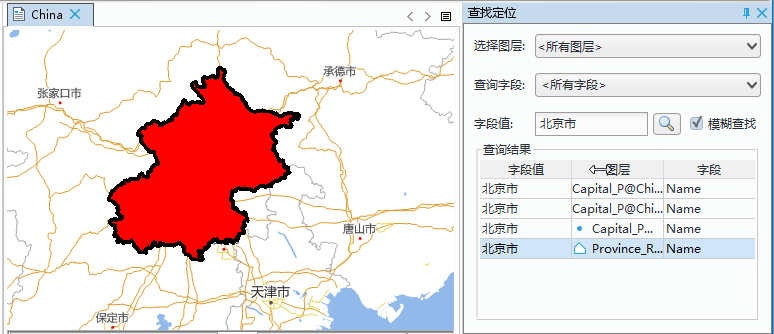

查找定位，支持查询当前地图中某一属性值的功能。用户可以查找当前地图中所有图层的任意属性值，也可设置具体的查询范围，选择固定图层或图层中的某一具体字段中进行查询。支持精确查询和模糊查询。

**操作步骤**    
  
以查询示例数据中 China 地图中北京市行政区界为例：
  
1. 在当前工作空间中打开 China 地图，在“地图”选项卡的“浏览”组中，单击“查找定位”按钮，在地图窗口的右侧弹出“查找定位”对话框。     
2. 在“查找定位”对话框中，可输入以下参数：
	+ 选择图层：设置查找的图层范围，点击图层范围右侧下拉按钮，可选择所有图层、可见图层、当前选中图层及指定某一特定图层。   
		+ 所有图层：根据用户输入的查询内容，遍历当前地图中的所有图层，匹配与之对应的属性值。   
		+ 可见图层：根据用户输入的查询内容，只在当前地图中的可见图层进行查询，在可见图层中匹配与之对应的属性值。   
		+ 当前选中图层：用户可在图层管理器中选择一个或多个图层，只在当前选中的图层中查询与之对应的属性值。   
		+ 指定某一特定图层：下拉菜单中将罗列当前地图中的全部图层名，用户可指定某一特定图层进行查询。   
	+ 查询字段：点击右侧下拉按钮，下拉菜单中显示的即为设置的搜索图层范围中所有图层字段。可选择搜索全部字段也可搜索某一字段。   
	+ 字段值：即所要查询的内容。在此输入“北京市” 。   
	+ 模糊查询:勾选该复选框，将对输入的查询内容进行模糊查询，即将包含查询内容的属性值均作为查询结果，不需要完全匹配属性值；如若不勾选改复选框，将执行精确查询，即只将与查询内容完全匹配的属性值作为查询结果。 
3. 输入以上查询信息，单击键盘 Enter 键或单击“查询”按钮 ，执行查询功能。   
4. 查询出的结果以列表的形式显示，双击某一查询结果，地图将定位至该要素。如下图所示：   
  
  　　  

   + 字段值：即与查询条件中“字段值”匹配的属性值结果。
   + 图层标题：属性值所在图层的标题。   
   + 字段：属性值所在的图层字段。 

  

    
  

