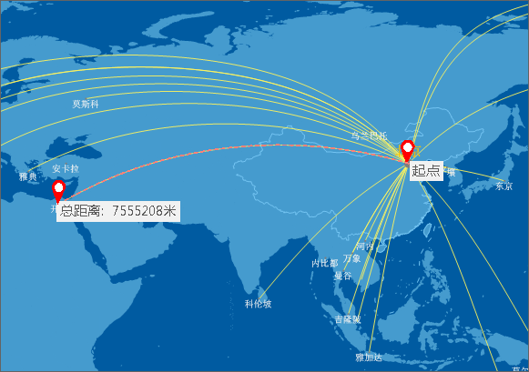
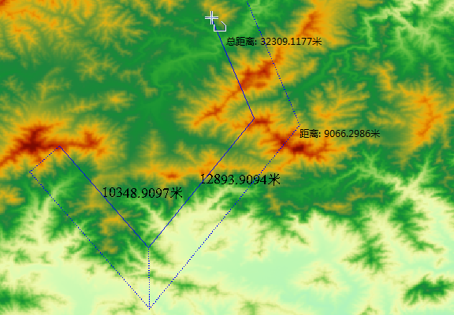

　　地图量算功能包括在地图上的距离、面积和角度量算。针对栅格数据支持量算栅格表面的距离、面积以及体积。在量算时，用户可以打开智能捕捉功能，便于精确获取感兴趣的位置。在量算过程中，可通过使用 Ctrl+Z 按键，撤销上一步的量算记录。同时支持设置量算单位、清除量算结果。  
　　在进行距离量算操作前，首先需要确定量算的单位。在“地图”选项卡的的“操作”组中，单击“单位”按钮，弹出“量算设置”对话框，可分别设置距离、面积、角度的单位。

### 距离量算　　　　

　　距离量算包括直线和测地线两种距离，直线距离是指地图中的平面距离。  
　
操作步骤

　　1.  在“**地图**”选项卡的“**操作**”组中，单击“**地图量算**”下拉按钮选择“**量算距离**”，当前地图窗口的操作状态变为距离量算状态。

　　2.  在地图窗口中待量算距离的起点位置单击鼠标左键，确定量算距离的起点；移动鼠标，屏幕上会出现连接鼠标当前点和起点的一条长度不断变化的临时线段，同时还显示了这条线段的距离值。

　　3.  量算过程中，地图窗口会同时显示两个结果数值：当前鼠标点与前一点之间的线段长度和当前鼠标点与量算距离的起点间折线段的总长度。在鼠标单击第二个点之前，地图窗口中显示的这两个数值相等；当鼠标单击第二个点后，移动鼠标，地图窗口中显示的两个数值发生变化，当前鼠标点与前一点之间的线段长度始终小于当前鼠标点与起点间折线段的总长度。

　　4.  用户可以单击一系列的点来连续进行距离量算，不仅可以获得当前两点间的距离，还可以获得总距离。

　　5.  单击鼠标右键即可结束距离量算，同时整条折线段的相应位置出现各条线段的数值注记，输出窗口中也显示出整条折线段的总距离值。

　　6.  单击“**操作**”组中的“**清除**”项，即可清除当前地图窗口中临时折线和长度量算的数值注记。此外，按 `Esc` 键也可实现“清除”功能。

　　

　**测地线距离**  
  
　　测地线距离是指曲面上两点之间的短程线，是地球椭球面上两点间的最短曲线。测地线更符合现实世界的客观逻辑，可用于测量飞机航线的距离。同时支持跨越东西半球进行量算。  
　　距离较小的情况下，测地线的曲线距离接近于直线距离，两种量算方式的结果基本一致，距离较远时结果会有差异。用户可根据实际需求选择相应的功能。  
　　操作步骤：测地线距离量算同直线距离量算的步骤相同，量算操作请参考直线距离量算。   
   
　　

### 面积量算

　　1. 在“**地图**”选项卡的“**操作**”组中，单击“**地图量算**”下拉按钮选择“**量算面积**”，则当前地图窗口的操作状态变为面积量算状态。
 
　　2. 在当前地图窗口中，鼠标单击待量算面积的区域边界的某位置，即可确定用来量算面积的临时多边形边界的起点。当鼠标单击待量算面积的区域边界上的第二个点时，移动鼠标，当前鼠标点与前两个点构成一个临时面域（不共线的三点即可构成一个面），并且该面随着鼠标的移动而变化。同时，鼠标旁边会显示出当前临时面的面积。

　　3. 沿着待量算面积区域的边界线连续单击鼠标，绘制用于量算的临时多边形，即可获得多边形圈定区域的面积。
 
　　4. 单击鼠标右键即可结束面积量算，同时临时多边形的相应位置出现其面积的数值注记，输出窗口中也显示出面积量算的数值。

　　5. 单击“**操作**”组中的“**清除**”项，即可清除当前地图窗口中的临时多边形和面积量算的数值注记。此外，按 `Esc` 键也可实现 “清除” 功能。

　　

### 角度量算

　　1.  在“**地图**”选项卡的“**操作**”组中，单击“**地图量算**”下拉按钮选择“**角度量算**”，则当前地图窗口的操作状态变为角度量算状态。

　　2.  在当前地图窗口中，鼠标单击待量算角度的位置确定待量算角度一条边的起点，同时该点处形成一条指向正北方向的虚线，移动鼠标即可从起点处形成一条射线，同时显示该射线与正北方向虚线之间的夹角，即该射线的方位角。

　　3.  当鼠标单击待量算角度一条边的另一个端点时，即可确定一条边，移动鼠标可由第二个鼠标点引出一条射线，并与第一条边组成一个角度。此时，可显示两个角度量算值：这条射线与第一条边的夹角值以及这条射线的方位角值。

　　4.  连续单击鼠标，绘制用于量算角度的边，即可获得各条边确定的方位角和夹角。

　　5.  单击鼠标右键即可结束角度量算，同时临时折线的相应位置出现各个角度的数值注记，输出窗口中也显示出最后绘制的线段的方位角和夹角的数值注记。

　　6.  单击“**操作**”组中的“**清除**”项，即可清除当前地图窗口中的临时折线和角度量算的数值注记。此外，按 `Esc` 键也可实现“清除”功能。

　　
  
### 地表距离   
  
地表距离量算是用来量算栅格数据中的表面距离，即量算在栅格数据集拟合的三维曲面上沿指定的线段或折线段的曲面距离。地表距离所量算的距离是曲面上的，因而要比平面上的值要大。

操作步骤  
1. 在地图窗口中打开要进行地表距离量算的栅格数据集。注意：当前工作空间中，如果不存在打开的栅格数据时，该功能不能使用。   
2. 在“**地图**”选项卡的“**操作**”组中，单击“**地图量算**”下拉按钮选择“**地表距离**”，则当前地图窗口的操作状态变为地表距离量算状态。  
3. 在地图窗口中待量算距离的起点位置单击鼠标左键，确定量算距离的起点；移动鼠标，屏幕上会出现连接鼠标当前点和起点的一条长度不断变化的临时线段，同时还显示了这条线段的距离值。  
4. 量算过程中，地图窗口会同时显示两个结果数值：当前鼠标点与前一点之间的线段长度和当前鼠标点与量算距离的起点间折线段的总长度。在鼠标单击第二个点之前，地图窗口中显示的这两个数值相等；当鼠标单击第二个点后，移动鼠标，地图窗口中显示的两个数值发生变化，当前鼠标点与前一点之间的线段长度始终小于当前鼠标点与起点间折线段的总长度。  
5. 用户可以单击一系列的点来连续进行距离量算，不仅可以获得当前两点间的距离，还可以获得总距离。   
6. 单击鼠标右键即可结束地表距离量算，同时整条折线段的相应位置出现各条线段的数值注记，输出窗口中也显示出整条折线段的总距离值。  
7. 单击“**操作**”组中的“**清除**”项，即可清除当前地图窗口中临时折线和长度量算的数值注记。此外，按 `Esc` 键也可实现“清除”功能。  
8. 应用程序会在地图窗口和输出窗口显示分析的表面距离大小。 
 
  
　  
  
### 地表面积  
  
地表面积用来量算栅格表面面积，即量算所绘临时多边形区域内的栅格数据集拟合的曲面的总的表面面积。  
    
操作步骤  
1. 在地图窗口中打开要进行地表面积量算的栅格数据集。注意：当前工作空间中，如果不存在打开的栅格数据时，该功能不能使用。   
2. 在“**地图**”选项卡的“**操作**”组中，单击“**地图量算**”下拉按钮选择“**地表面积**”，则当前地图窗口的操作状态变为地表距离量算状态。  
3. 在当前地图窗口中绘制一个多边形，单击鼠标右键，完成操作。应用程序会在地图窗口以及输出窗口显示分析的临时多边形栅格表面的面积大小。默认的面积单位为平方米。按住 Esc 键可以清除地图窗口中绘制的临时多边形。   
4. 应用程序会在地图窗口和输出窗口显示分析的地表面积大小。 

  
　    
  
### 地表体积  
  
地表体积用来量算栅格地表体积，即量算所选多边形区域内的栅格数据集拟合的三维曲面与一个基准平面之间的空间上的体积。
  
    
操作步骤  
1. 在地图窗口中打开要进行地表距离量算的栅格数据集。注意：当前工作空间中，如果不存在打开的栅格数据时，该功能不能使用。   
2. 在“**地图**”选项卡的“**操作**”组中，单击“**地图量算**”下拉按钮选择“**地表体积**”，则当前地图窗口的操作状态变为地表距离量算状态。  
3. 在当前地图窗口中绘制一个多边形，单击鼠标右键，此时弹出“表面体积参数设置”对话框。 在对话框中输入基准高程。其中基准高程为量算表面体积的起始高度。 单击“计算”按钮，计算临时绘制的多边形覆盖的体积。 
    
　      
4. 应用程序会在地图窗口和输出窗口显示分析的地表体积大小，默认的体积单位为立方米。

  
