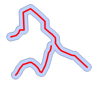
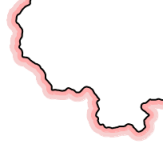
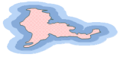

缓冲区分析（Buffer）是GIS的基本空间操作功能之一，是指根据指定的距离，在点、线、面几何对象周围自动建立一定宽度的区域的分析方法。例如，在环境治理时，常在污染的河流周围划出一定宽度的范围表示受到污染的区域；又如在飞机场，常根据健康需要在周围划分出一定范围的区域作为非居住区，等等。

用户可以使用应用程序中的“**缓冲区**”按钮或者“**多重缓冲区**”按钮，对一个或者多个几何对象生成指定距离的缓冲区。

缓冲区分析支持对点数据集、线数据集、面数据集生成缓冲区。不仅可以整个数据集的所有对象生成缓冲区，也可以只对选中的对象生成缓冲区。

    [1. 单重缓冲区](#1)

    [2. 多重缓冲区](#2)

### [单重缓冲区](#1)

点缓冲区分析

为点对象创建缓冲区。比如，对两个广播发射站分别创建缓冲区，可以分析这两个发射站发射的信号能覆盖的居民区范围，以及都能覆盖的区域范围。

线缓冲区分析

为线对象创建缓冲区。比如，某相邻的两条街道需要扩建20米，对它们创建一个缓冲区，结合综合查询可以分析到街道拓宽之后街道两旁需要拆迁的楼房。

面缓冲区分析

为面对象创建缓冲区。比如，对河流、湖泊创建缓冲区，分析洪水最容易泛滥的区域。

### [多重缓冲区](#2)

点多重缓冲区分析

为点对象创建多重缓冲区。比如，分析污染源由近及远扩散的区域范围。

线多重缓冲区分析

为线对象创建多重缓冲区。比如，通过对国界线生成单方向的多重缓冲区，制作国界线的晕线效果。

面多重缓冲区分析

为面对象创建多重缓冲区。比如，对我国某一沙漠进行的20公里和50公里的多重缓冲区分析，可以分析该沙漠的风沙扩展分布状况，从而为防沙、治沙提供了参考。

###  相关主题

 [生成单重缓冲区](buffer/SingleBuffer.html)

 [生成多重缓冲区](buffer/MutilBuffer.html)

------------------------------------------------------------------------

