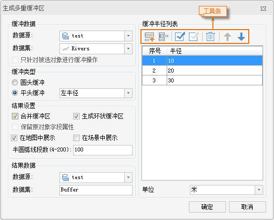
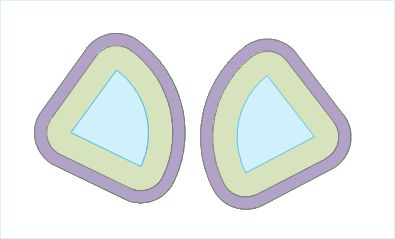
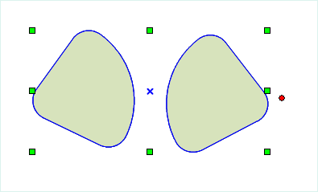

### 使用说明

多重缓冲区是指在几何对象周围的指定距离内创建多个缓冲区。生成的缓冲区结果可以继续参与后面的分析操作。

-   目前，应用程序不支持对 CAD 数据集和网络数据集生成多重缓冲区。
-   对线数据生成多重缓冲区，可以选择圆头缓冲或平头缓冲两种缓冲类型；而对点/面数据系统默认只能生成圆头缓冲。

### 操作步骤

在“**分析**”选项卡上的“**矢量分析**”组中，单击“**缓冲区**”按钮，在弹出的下拉菜单中选择"多重缓冲区"项,弹出“生成多重缓冲区”对话框。

  
  图：“生成多重缓冲区”对话框

设置缓冲数据。

**数据源：**选择要生成多重缓冲区的数据集所在的数据源。

**数据集：**系统支持对点、线、面数据生成多重缓冲区，故“数据集”下拉列表中，显示出所选择数据源中的所有点、线、面数据集。此处，选择一个需要生成多重缓冲区的数据集。

**只针对被选中对象进行缓冲操作：**若在当前地图窗口中，已选中了点、线或面对象，“只针对被选中对象进行缓冲操作”复选框被勾选。勾选该项，表示只对选中的对象生成多重缓冲区，此时，不能设置生成多重缓冲区的数据源和数据集；取消勾选该项，表示对该数据集中的所有对象生成多重缓冲区，并且可以更改生成多重缓冲区的数据源和数据集。

在对话框右侧的缓冲半径列表中，设置多重缓冲区的缓冲半径。

可使用工具条中的批量添加、插入、删除等按钮进行缓冲半径的设置。在缓冲区半径列表中，从上到下依次排列的缓冲半径对应多重缓冲区的。缓冲区半径列表中，单击“半径”列中的数值，即可修改缓冲半径。

**批量添加：**单击工具条中的 
按钮，弹出“批量添加”对话框，可设置具有一定递增/递减规则的缓冲半径值，各级缓冲半径都是以缓冲对象为基准生成缓冲区。系统默认为创建10-30米的间隔为10米的缓冲区。已添加的缓冲半径值会依次显示在缓冲半径列表中。

“批量添加”对话框说明

-   **起始值：**设置最内层缓冲区的半径值。
-   **结束值：**设置最外层缓冲区的半径值。
-   **步长：**设置各级缓冲区之间的间隔距离，即缓冲半径差。
-   **段数：**设置生成多重缓冲区的层级数。
-   **自动更新结束值：**勾选该复选框，则系统自动根据输入的起始值、步长和段数，计算生成的多重缓冲区中最外层缓冲区的半径值。若不勾选该复选框，则系统默认按照输入的结束值生成最外层缓冲区的半径值。

单击“单位”标签右侧的下拉按钮，设置缓冲半径的单位。

可供选择的缓冲半径单位包括：毫米、厘米、分米、米、千米、英寸、英尺、英里、度、码等。

设置多重缓冲区的缓冲类型。

若对线对象生成缓冲区，缓冲类型区域中的参数设置为可用状态，可设置对线对象生成多重缓冲区的类型。

**圆头缓冲：**生成多重缓冲区时，在线的两边按照缓冲距离绘制平行线，并在线的端点处以缓冲距离为半径绘制半圆，连接生成缓冲区域。默认缓冲类型为圆头缓冲。

**平头缓冲：**生成多重缓冲区时，以线对象的相邻节点间的线段为一个矩形边，以左半径或者右半径为矩形的另外一边，生成形状为矩形的缓冲区域。
线数据在生成平头缓冲时，可以生成单个方向的多重缓冲区。

-   **左半径：**基于缓冲半径在线数据的左边区域生成多重缓冲区。
-   **右半径：**基于缓冲半径在线数据的右边区域生成多重缓冲区。

设置结果选项。

在结果设置区域，设置生成的多重缓冲区是否合并、是否保留原对象字段属性、是否添加到当前地图窗口以及半圆弧线段数值大小等。

**合并缓冲区：**勾选该项，表示对缓冲半径相同的缓冲区进行合并运算。取消勾选该项，表示保留生成的缓冲区结果，不进行合并操作。如下图所示，对两个扇形（蓝色）生成多两重缓冲区。为了更直观的显示缓冲区效果（图1），对生成的结果按照缓冲半径制作专题图。将生成的结果移动，发现相同缓冲半径的缓冲区合并为一个复杂对象，图2为其中一组合并后的缓冲区。注意：在不勾选合并缓冲区的情况下，相同缓冲半径的缓冲区不会进行合并，为单独的两个简单对象。

图1：多重缓冲区结果

图2：一组合并的缓冲区

**保留原对象字段属性：**勾选该项，表示生成的每一个缓冲区会保留相应的原对象的非系统属性字段信息。取消勾选该项将会丢失原对象的非系统字段属性信息。默认为勾选该项。注意：当勾选“合并缓冲区”时，该项不可用。

**生成环状缓冲区：**勾选该项，表示生成多重缓冲区时外圈缓冲区是以环状区域与内圈数据相邻的。取消勾选该项后的外围缓冲区是一个包含了内圈数据的区域。默认为勾选该项。

**在地图窗口中显示结果：**勾选该项，表示生成多重缓冲区后，会将缓冲分析结果添加到当前地图窗口中。取消勾选该项，则不会自动将缓冲分析结果添加到当前地图窗口中。默认为勾选该项。

**半圆弧线段数(4-200)：**用于设置生成的缓冲区边界的平滑度。数值越大，圆弧/弧段均分数目越多，缓冲区边界越平滑。取值范围为4-200。默认的数值为100。

设置结果数据。

**数据源：**选择生成的多重缓冲区结果要保存的数据源。

**数据集：**输入生成的多重缓冲区结果要保存的数据集名称。如果输入的数据集名称已经存在，则会提示数据集名称非法，需要重新输入。

设置完以上参数后，单击“确定”按钮，执行生成多重缓冲区的操作。

### 相关主题

[关于缓冲区分析](buffer/HowBufferWork)

[生成单重缓冲区](buffer/SingleBuffer)

------------------------------------------------------------------------

