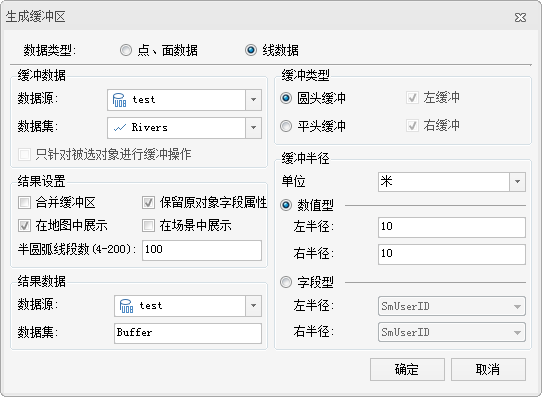
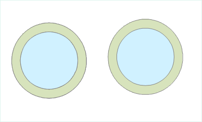

### 使用说明

单重缓冲区是指在点、线、面实体周围自动建立的一定宽度的多边形。生成的缓冲区结果可以继续参与后面的分析操作。

-   目前，只支持对点、线、面数据集生成缓冲区，不支持对 CAD 数据集、网络数据集和路由数据集生成缓冲区。
-   由于数据类型的不同，在生成缓冲区时的参数设置也完全不相同。对线数据生成缓冲区，可以选择圆头缓冲或平头缓冲两种缓冲类型；而对点/面数据只能生成圆头缓冲。在缓冲类型为平头缓冲时，可以对线数据集生成左右半径不等或者只有左缓冲或者右缓冲的缓冲区。
-   通过“数值型”方式指定缓冲区距离时，面数据集允许使用负值，点、线数据集只能为正值。但是点、线、面数据集都不允许缓冲距离为0。
-   通过“字段型”方式指定缓冲区距离时，如果对象指定的字段值为空或者0时，不会对该对象生成缓冲区；当指定的字段为负值时，点、线数据集按照正值处理；对线数据生成平头缓冲时，如果线数据左（右）半径字段为负值，则按该数值的绝对值作为右（左）半径进行处理。

### 操作步骤

在“**分析**”选项卡上的“**矢量分析**”组中，单击“**缓冲区**”按钮，在弹出的下拉菜单中选择"缓冲区"项，弹出“生成缓冲区”对话框。

  
  图：“生成缓冲区”对话框

选择需要生成缓冲区的数据的类型。

可以对点/面数据集或者线数据集生成缓冲区。对线数据生成缓冲区时需要设置缓冲类型，可以是圆头缓冲或者平头缓冲，而对点/面数据生成缓冲区时则不需要。所以，在对线数据生成缓冲区时，“生成缓冲区”对话框中会多出一些选项。下面以对线数据生成缓冲区为例，对“生成缓冲区”对话框中的参数予以说明。

设置缓冲数据。

**数据源：**选择要生成缓冲区的数据集所在的数据源。

**数据集：**选择要生成缓冲区的数据集。

系统根据生成缓冲区的数据类型，自动过滤选中的数据源下的数据集，只显示该数据源下的线数据集。如果是对点/面数据生成缓冲区，则只会显示相应的数据源下面的点或者面数据集。

**只针对被选中对象进行缓冲操作：**在选中某一数据集中的对象情况下，“只针对被选中对象进行缓冲操作”前面的复选框可用。勾选该项，表示只对选中的对象生成缓冲区，同时不能设置数据源和数据集；取消勾选该项，表示对该数据集下的所有对象进行生成缓冲区的操作，可以更改生成缓冲区的数据源和数据集。

设置缓冲类型。缓冲类型的不同，需要设置的参数也不大相同。

**圆头缓冲：**在线的两边按照缓冲距离绘制平行线，并在线的端点处以缓冲距离为半径绘制半圆，连接生成缓冲区域。默认缓冲类型为圆头缓冲。

**平头缓冲：**生成缓冲区时，以线数据的相邻节点间的线段为一个矩形边，以左半径或者右半径为矩形的另外一边，生成形状为矩形的缓冲区域。

线数据在生成平头缓冲的时候，可以生成左右缓冲距离不等的缓冲区，或者生成单边的缓冲区。

-   **左缓冲：**对线数据的左边区域生成缓冲区。
-   **右缓冲：**对线数据的右边区域生成缓冲区。

只有同时勾选“左缓冲”和“右缓冲”两项，才会对线数据生成两边缓冲区。默认为同时生成左缓冲和右缓冲。

设置缓冲单位。

缓冲距离的单位，可以为毫米、厘米、分米、米、千米、英寸、英尺、英里、度、码等。

选择缓冲距离的指定方式。

-   **数值型：**
-   **字段型：**勾选“字段型”，表示通过数值型字段或者表达式设置缓冲距离大小。

设置结果选项。需要对生成缓冲区后是否合并、是否保留原对象字段属性、是否添加到当前地图窗口以及半圆弧线段数值大小等项进行设置。

**合并缓冲区：**勾选该项，表示对多个对象的缓冲区进行合并运算。取消勾选该项，表示保留生成的缓冲区结果，不进行合并操作。如下图所示，对两个圆（蓝色）生成多缓冲区。生成的缓冲区结果如图1所示，将生成的结果移动，发现两个缓冲区合并为一个复杂对象，图2为合并后的缓冲区。注意：在不勾选合并缓冲区的情况下，不同对象的缓冲区不会进行合并，为单独的两个简单对象。

图1：单重缓冲区结果

图2：合并后的缓冲区

**保留原对象字段属性：**勾选该项，表示生成的每一个缓冲区会保留相应的原对象的非系统属性字段信息。取消勾选该项将会丢失原对象的非系统字段属性信息。默认为勾选该项。注意：当勾选“合并缓冲区”时，该项不可用。

**在地图窗口中显示结果：**勾选该项，表示在生成缓冲区后，会将其生成的结果添加到当前地图窗口中。取消勾选该项，则不会自动将结果添加到当前地图窗口中。默认为勾选该项。

**半圆弧线段数(4-200)：**用于设置生成的缓冲区边界的平滑度。数值越大，圆弧/弧段均分数目越多，缓冲区边界越平滑。取值范围为4-200。默认的数值大小为100。

设置结果数据。

**数据源：**选择生成的缓冲区结果要保存的数据源。

**数据集：**输入生成的缓冲区结果要保存的数据集名称。如果输入的数据集名称已经存在，则会提示数据集名称非法，需要重新输入。

设置好以上参数后，点击“确定”按钮，执行生成缓冲区的操作。

### 备注

关于缓冲半径的说明：缓冲半径有两种设置方式，数值型和字段型。

-   **数值型**
    -   点、线数据不支持负半径，面数据支持负半径。
-   **字段型**
    -   此种方式只对数据集和记录集进行缓冲分析时有效，且需指定除系统字段之外的合法字段。
    -   对于点和线数据集，当缓冲半径字段中包含了负值，则取其绝对值生成缓冲区。
    -   缓冲半径为字段或字段表达式时：对于面数据，若合并缓冲区，则取其绝对值，若不合并，则按照负半径处理。

### 相关主题

 [关于缓冲区分析](buffer/HowBufferWork.html)

 [生成多重缓冲区](buffer/MutilBuffer.html)

------------------------------------------------------------------------

