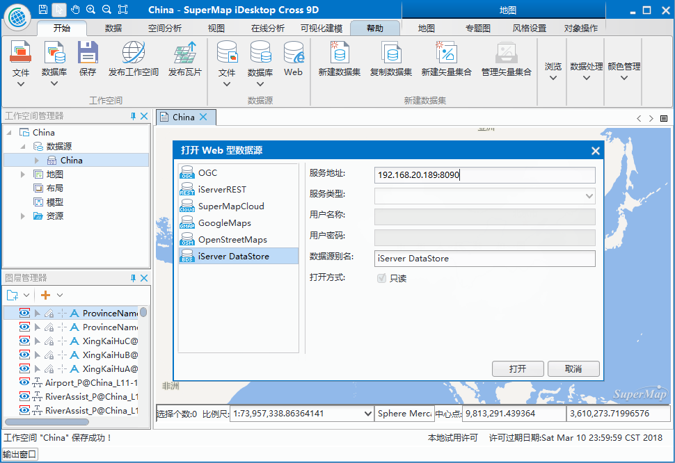
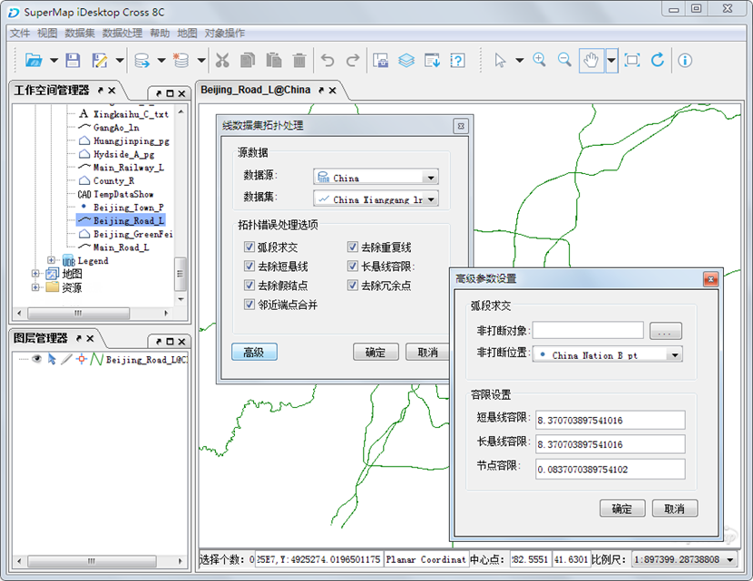
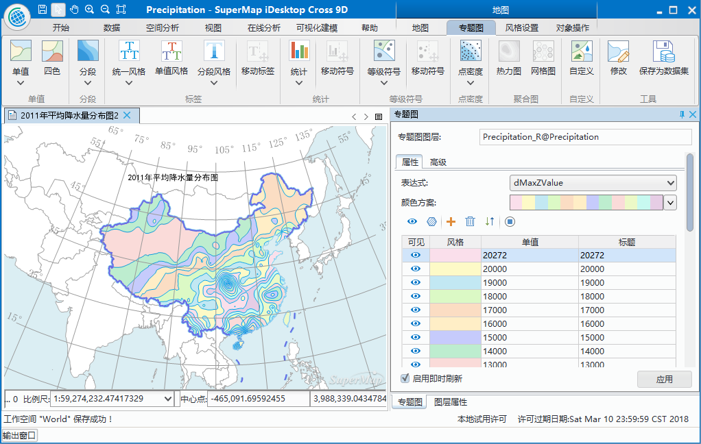

title: SuperMap iDesktop Cross 8C 产品介绍
---

　　SuperMap iDesktop Cross 8C 是一款支持跨平台、全开源、可扩展的桌面GIS应用与开发平台系统，也是超图新一代的开源GIS桌面产品，可在Windows和Linux系统上运行，实现了GIS数据在跨平台环境下的展示。

　　SuperMap iDesktop Cross 8C 是基于 SuperMap iObjects Java 8C、Eclipse 和 OSGI 等平台，通过 Java 语言开发的插件式、跨平台GIS应用软件，提供了地图制图、数据管理、数据处理、数据分析等功能，同时提供了灵活的开发框架和辅助控件，便于用户二次开发。SuperMap iDesktop Cross 8C的开源库地址为：[*http://git.oschina.net/supermap/SuperMap-iDesktop-Cross*](http://git.oschina.net/supermap/SuperMap-iDesktop-Cross)。

## 产品简介

　　SuperMap iDesktop Cross 8C 是一套运行在桌面端的专业GIS软件，是基于 SuperMap iObjects Java 8C、Eclipse 和 OSGI 开发的跨平台 GIS 应用软件。SuperMap iDesktop Cross 8C 提供了适用于不同平台的版本，分为 Windows 和 Linux 两个版本，其中，Windows版本包括 32 位和 64 位两个，分别提供了绿色包和安装包，Linux 版本提供了 64 位的绿色包。

　　SuperMap iDesktop Cross 8C 是一款免许可的应用软件，只要有 SuperMap iObjects Java 8C 的许可，即可使用 SuperMap iDesktop Cross 8C 提供的相应模块的功能。

## 提供功能

### 数据管理

　　提供了工作空间管理、数据源管理、数据集管理功能；支持文件型、数据库型、Web型数据引擎；提供对空间数据及其属性的全面操作和处理，包括创建、编辑、管理、访问等功能。

-   **数据引擎**：支持打开不同数据引擎，如 Oracle、SQLPlus、DB2、MySQL 等数据库，其中，Linux 版本不支持 SQLPlus 数据引擎；同时支持打开Web地图数据，即谷歌地图、百度地图、超图云服务、天地图服务、OGC服务、REST服务、OpenStreetMap 等Web地图。

-   **工作空间管理**：支持打开、保存、另存、关闭、删除工作空间，支持打开的工作空间有文件型、Oracle、SQLServer 三种类型，Linux 版本不支持打开 SQL Server 工作空间。

-   **数据源管理**：支持打开文件型、数据库型、Web型数据源，同时支持新建文件型、数据库型和内存数据源。

-   **数据集管理**：支持数据集进行新建、复制、关闭、删除等操作。

 

### 数据转换

　　SuperMap iDesktop Cross　8C 支持导入其他格式的数据，并将其他格式数据转为 SuperMap 可操作的数据格式，同时也可以将SuperMap格式的数据导出为其他数据格式。

-   **数据导入**：支持将其他格式的数据导入到应用程序中，包括多种矢量、栅格、模型数据格式，如\*.dwg、\*.e00、\*.shp、\*.gdb、\*.mif、\*.xlsx、\*.tif、\*.img、\*.dem 等。

-   **数据导出**：支持将数据集导出为兼容其他软件的数据格式，可导出为以下格式的数据\*.dwg、\*.e00、\*.shp、\*.gdb、\*.mif、\*.xlsx、\*.tif、\*.img、\*.sit、\*.3ds、\*.kml 等。

### 数据处理

　　数据处理是GIS的基础功能，SuperMap iDesktop Cross 8C 目前提供的数据处理功能有：投影设置、数据编辑、数据融合、拓扑处理、追加行、追加列等。
-   **投影设置**：支持对矢量、栅格、模型等数据集进行投影转换。

-   **数据编辑**：提供了丰富、全面的对象绘制和对象编辑功能，便于对数据进行编辑调整。

-   **空间索引**：支持对矢量数据创建空间索引，对栅格数据创建影像金字塔，以提高数据的浏览效率。

-   **矢量数据处理**：提供丰富的矢量数据处理功能，如：数据融合、拓扑检查、拓扑处理、SQL 查询、追加行、追加列、属性更新等。

### 地图制图

**地图相关功能**：提供地图显示、渲染、编辑等功能；提供了二三维点、线、面图层风格设置功能；支持制作及修改单值、分段、标签、统计专题图。

-   **地图选择**：支持地图对象选择操作，支持点选和框选两种方式。

-   **地图浏览**：支持在地图窗口中，通过漫游、放大、缩小、全副显示等操作来浏览地图。

-   **风格设置**：提供了丰富的符号资源，支持设置二三维点、线、面图层风格，可设置点、线、面符号、颜色、透明度等属性，增强地图的美观性。

-   **地图编辑**：提供了地图编辑功能，支持地图复制、粘贴、剪切、删除等操作。

-   **图层可见性**：支持对图层设置可见比例尺，控制图层在不同比例尺下显示，提供地图的美观性和显示效率。

-   **制作专题图**：支持矢量和栅格图层专题图的制作与修改，矢量图层支持单值、分段、标签、统计专题图类型，栅格图层支持单值和分段两种专题图。
  

### 数据分析

　　数据分析模块提供了缓冲区分析功能，可根据指定的缓冲半径对点、线、面数据集进行缓冲区分析。

## 主要特色

### 跨平台、全开源、可定制

-   基于 Java 组件采用 Java 语言开发，具有跨平台的特性，支持在 Windows 和 Linux 系统中运行。

-   采用稳健的 Eclipse 插件框架，实现了插件式桌面及源代码的开源。

-   遵循 OSGI 国际扩展标准，将应用程序分为多个模块单元，统一管理各模块单元及用户开发的模块单元之间的交叉依赖关系，实现GIS数据的展示。

-   界面采用 Swing 图形风格，界面支持跨平台，安全性高，易于界面定制和二次开发。

### 稳定、易用、高效、美观

-   基于Java语言，采用 Eclipse 框架，极大地提高了应用系统的通用性、高效性和稳定性。

-   使用 Swing 图形界面风格，利用 Swing 丰富、灵活的功能和模块化组件，来创建美观、易用的菜单和工具条界面。

-   “功能就在您手边”的设计理念，提供了丰富的右键菜单和鼠标动作的响应功能，提高了软件的易用性。“所见即所得”的呈现方式，用户的操作会实时地应用，保证用户在第一时间看到操作的工作成果，方便设计和修改。

-   模板化的应用，供了多种图层风格模板、地图模板、专题图模板等，用户可通过自己设计模板及系统提供的模板，提高工作成果的重用性和工作效率。
