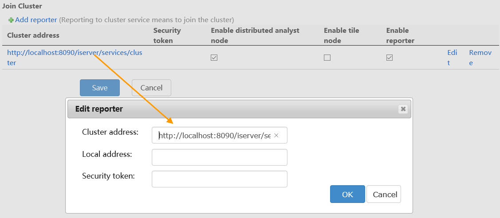
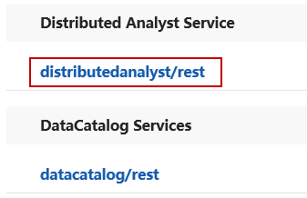

title: Environment Configuration for Big Data Analysis
---

　　New feature of big data analysis, performs online analysis effectively to data of great amount or multiple objects. Big data online analysis relies on iServer service. Based on Spark computing platform, distributed storage of data which is stored in HDFS, BigDataStore, or UDB can be analyzed. The features including big data of management, analysis, mapping and outputting map have been provided by Cross. For online analysis function, there are some features to be provided, including: simple point density analysis, kernel density analysis, vector clip analysis, single object query, mesh aggregation analysis, polygon aggregation analysis, range summary analysis.
 
　　Follwing details environment configuration and operation of Big data online analysis.

- Analysis service environment configuration
- Preparing data
- Big data online analysis

### Big data online analysis service configuration

　　Before performing big data online analysis, if there aren't available analysis environment and data, you need to configure iServer service environment and data. The detail operation in Windows is as follow:

1. Start iServer service.
2. First access [http://localhost:8090/iserver/](http://localhost:8090/iserver/), second create manager account, and then click System environment > Check License > Configure sample service, last click "Next".
3. Click "Service manager" address in "Configure Completely" page, and then select "Clusters" option after login. 
4. Switch to "Configure Cluster" panel, check "Enable the Spark" and select "Enable local Spark cluster service (default)", finally click "Save".
5. Redirect to "Join Cluster" panel, click "Edit" located in "Cluster address" to modify the default address "anotherclusterservice" to native ip. After that, check "Enable distributed analyst node" and "Enable reporter", and click "Save".
　　
6. Head to "Distributed analyst Service" panel, then check "Enable service" and click "Save" button.
7. After completing the configuration, you can check whether the distributor analysis service has been added successfully by accessing [http://localhost:8090/iserver/services](http://localhost:8090/iserver/services).
　　
8. Succeed to configure environment, then [prepare data](DataPreparation.html) (BigDataStore, HDFS or UDB) to execute the operation.

###  Related topics

　　 [Data Preparation](DataPreparation.html)

　　 [Density Analysis](DensityAnalysis.html)

