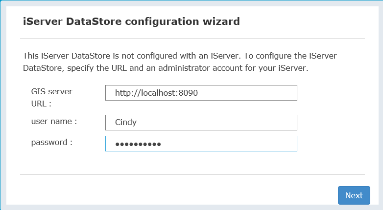
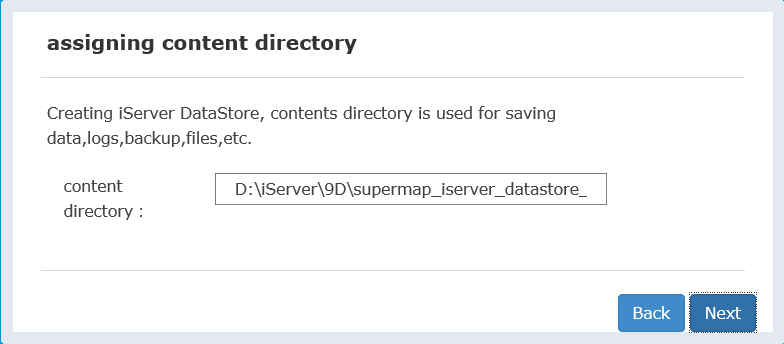
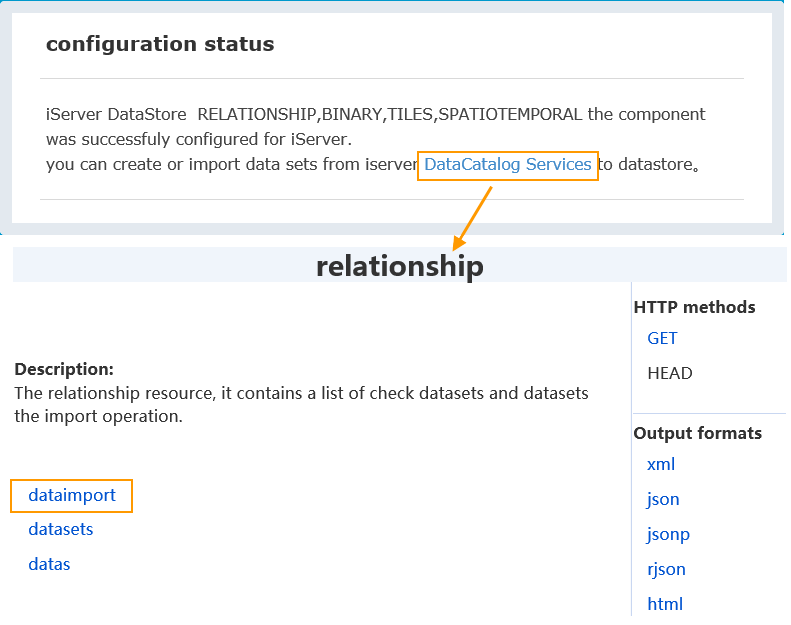
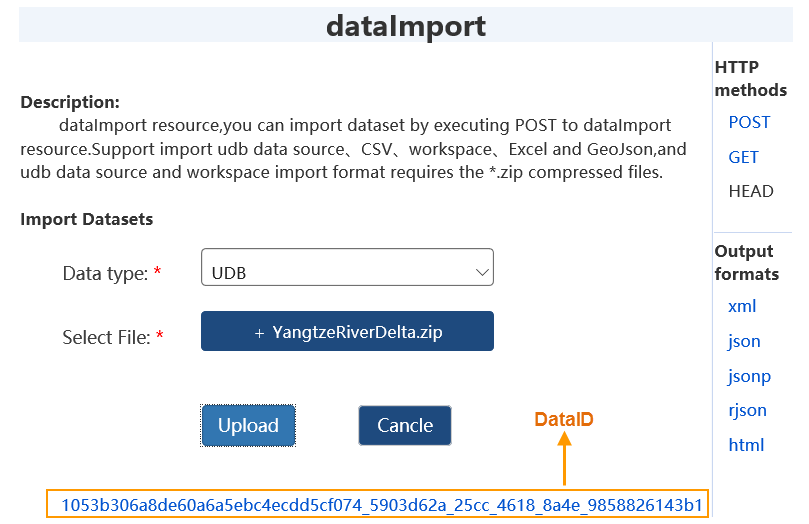
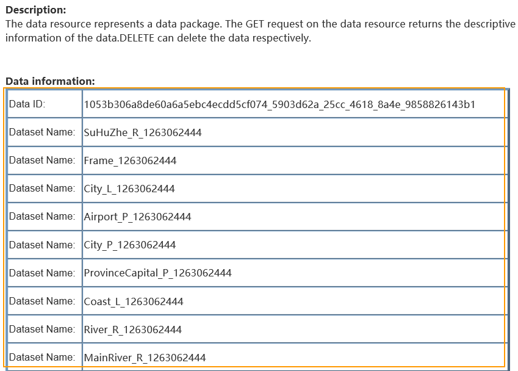
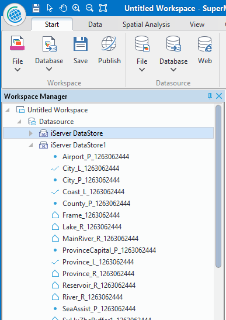
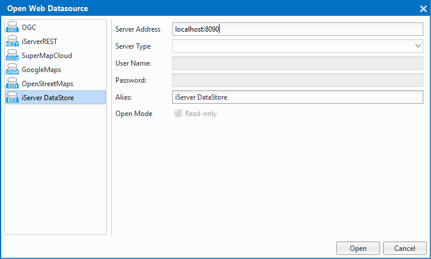
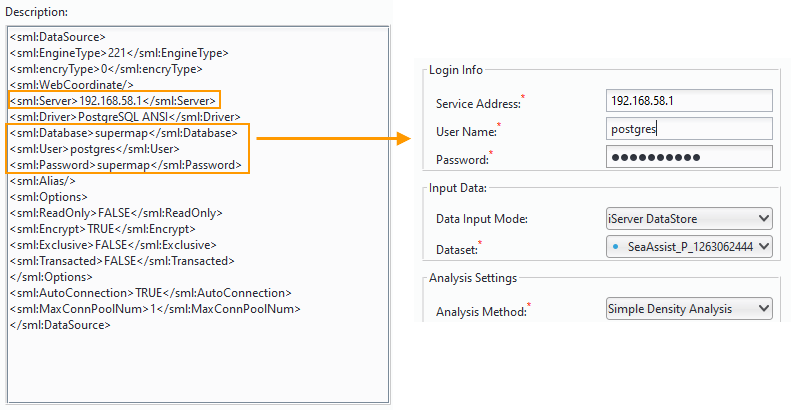

title: Data Preparation
---

　　After big data is ready, iServer will list all datasets which meet the analysis condition when creating big data analysis tasks. All supported data sources are listed by big data online analysis service as follows.

- Data stored in BigDataStore
- Data stored in HDFS
- UDB data

### BigDataStore

　　New application program DataStore is provided, you can create data storage quickly through iServer DataStore, and associate data storage with iServer. When configuring relational data storage in DataStore, a PostgreSQL database will be created automatically which is used to store dataset. Through iServer big data service, you can download, upload data, and analyze data.

- **Build Environment**

　　Configure a Firewall for DataStore access by default port 8020. If DataStore is installed in Windows, please confirm whether vcredist 2013 is installed, if not, the installation file is at DataStore product package\support\vcredist\vcredist_x64-2013.exe.

1. Start service at d bin folder of iServer DataStore product package.
2. Access DataStore configuration guide by entering address: http://{ip}:8020, then input iServer username and password.
　　
3. Specify contents directory which is used to store data, log and backup file. Default is [DataStore installation directory]\data. Note: path which includes Chinese characters or spaces is not supported on DataStore content directory.
　　
4. Select data type to be created, including: relational data, binary file, slice cache, spatial data. For binary file and tile data, you need to install MongoDB. After selecting binary storage data or slice data storage of creating style, specify MongoDB installation path, such as: D:\mongodb.
5. Click OK.
6. After configuring successfully, a prompt that relational component of iServerDataStore has been configured to iServer successfully will be shown in "Configuration State" page, click on "Data Directory Service", after login successful, click "dataimport" to upload data.
　　 
7. Select corresponded data and click on "Upload" button to upload data into DataStore. The supported file includes: udb datasource, csv file, workspace, Excel file and GeoJson file, importing format of udb datasource or workspace must be *.zip.
　　 
8. After uploading data successfully, the only dataID will be returned, which is used to represent the uploaded data package. You can view the detailed description information of the data package by clicking the DataID. The uploaded dataset will be displayed in "Dataset List" of relationship/datasets resource.
　　 
9. Open the configured BigDataStore datasource in Cross to view the uploaded data.

　　 

- **Using BigDataStore Data**
　　
　　After configuring iServer DataStore successfully, the data can be opened by opening web datasource in Cross, at the same time, PostgreSQL datasource which saves the same data will be opened. The detail operations are shown as follow:

1. Open SuperMap iDesktop Cross, right-click mouse in **Datasource** node of "Workspace Manager", and then select "Open Web datasource...".
2. Select "BigDataStore" in the pop-up dialog box, and enter server IP and port number as follows, click "Open" to open datasource configured in the server.
　　
3. PostgreSQL datasource will be opened when opening BigDataStore datasource, the PostgreSQL datasource name is **BigDataStore_database name**, when performing big data online analysis, selecting data in PostgreSQL as source data.
4. About the settings of parameter "Input Data" of big data online analysis, choose **BigDataStore** for "Data Input Mode", and set server address, database name, username, password, you can view these parameters settings by right-clicking dataset under **BigDataStore** datasource and selecting Property, as follows:
　　
5. Select dataset of corresponded PostgreSQL datasource for "Source Data" which will participate in analysis.

### HDFS

　　HDFS(Hadoop Distributed File System) is recommended for GIS application of large scale data. HDFS can be used to store these data: csv, sci, udb, workspace and so on.

1. Install configuration and start HDFS.
2. Open Supermap iDesktop Cross, click "Online analysis" > "Data Management", open window **FormHDFSManager**, and enter HDFS address, such as: http://192.168.20.189:50070/webhdfs/v1/.
3. Through these functions: new folder, upload data, etc., you can upload local data into HDFS for managing.
4. A meta file which corresponds with the uploaded scv data must be generated for performing online analysis operation, the detail step is: select the scv file, right-click mouse and select "Property", and then set data's object type, storage format, encode type, coordinate system name, field name and field type, click "Save" and a *.meta file with the same name will be generated.

### UDB

　　Big data online analysis can be performed based on data from server UDB data, just saving data which will be analyzed to UDB. During analyzing, you must ensure UDB is not opened or occupied.

###  Related topics

　　 [Environment Configuration](BigDataAnalysisEnvironmentConfiguration.html)

　　 [Density Analysis](DensityAnalysis.html)

